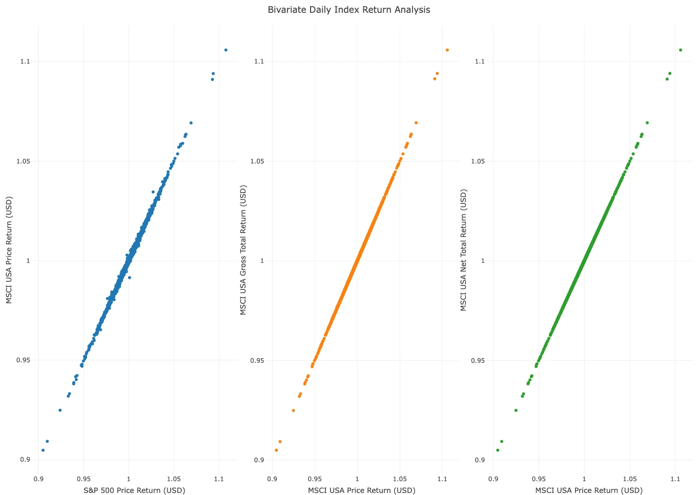
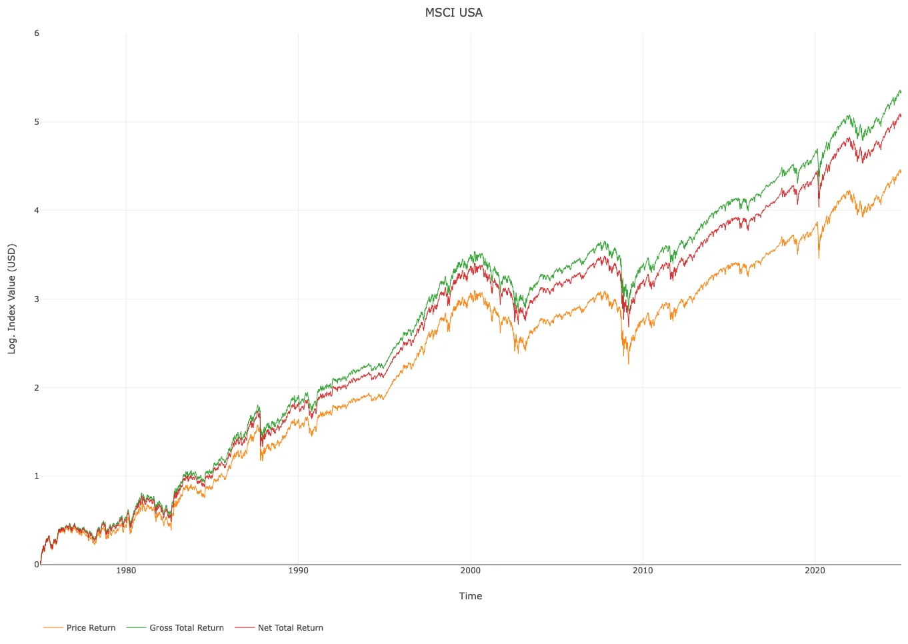
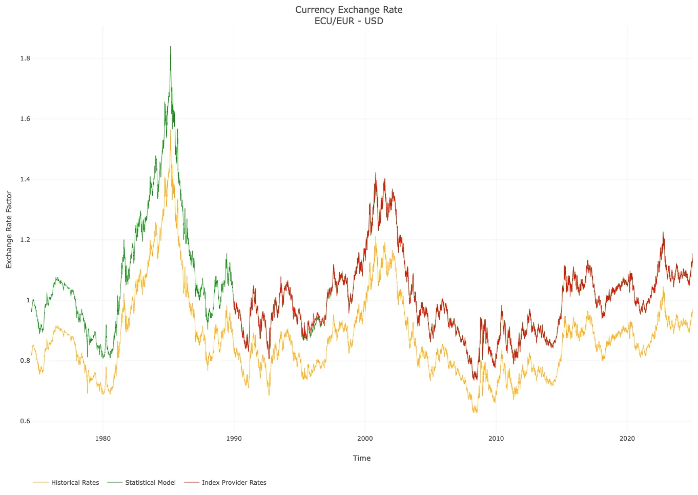
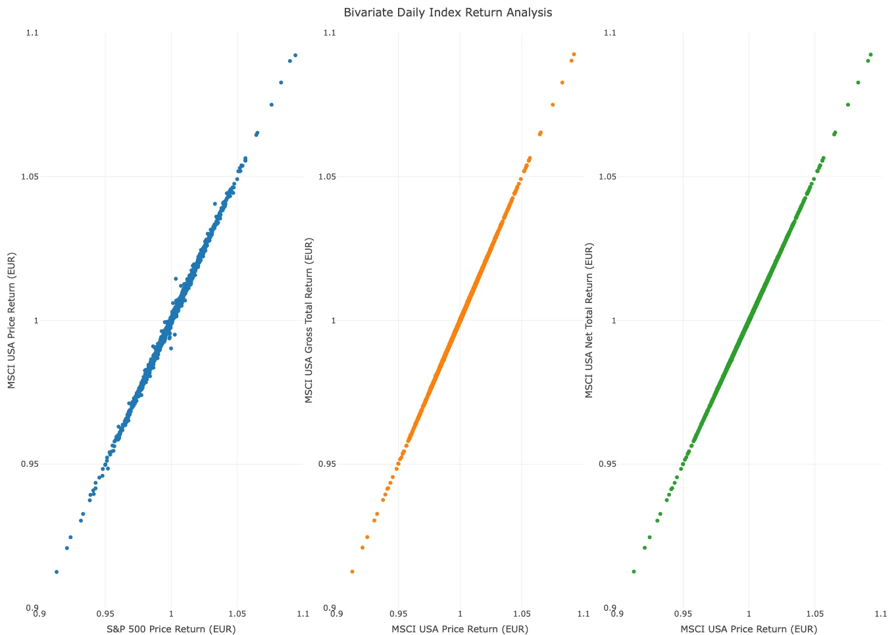
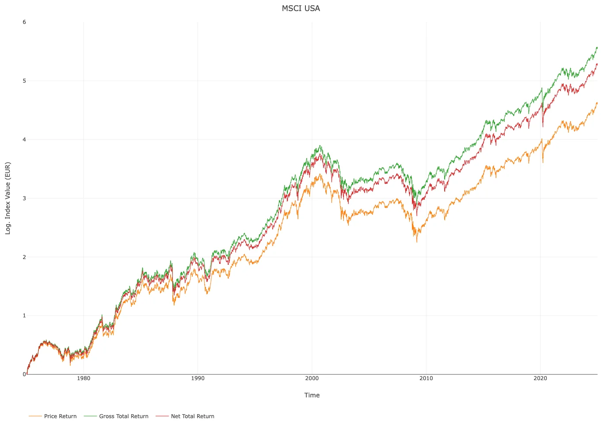
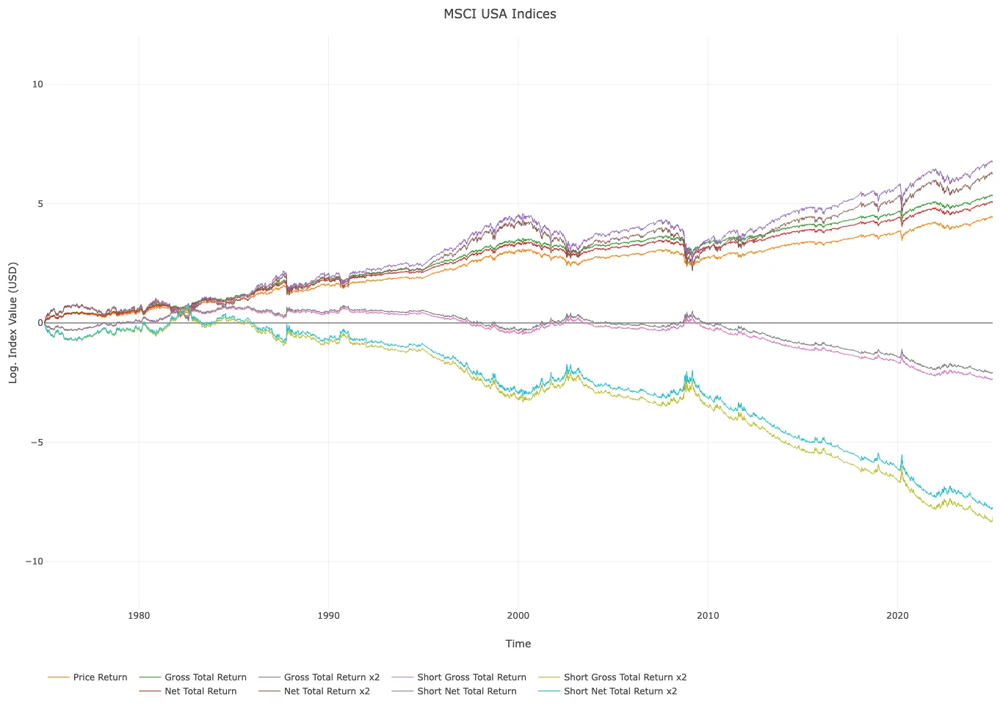
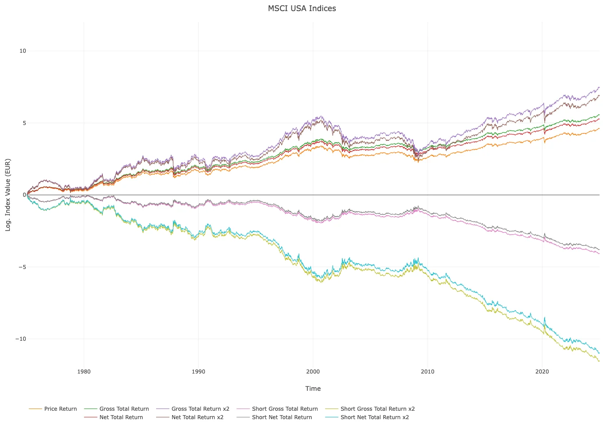

# ChemStats Archiv: Strahlende Bullen, düstere Bären – Principia Amumbo (Teil I)

Liebe Mitreisende auf der Mauerstrasse, liebe Wegelagerer in den Finanzgassen,

eigentlich wollte ich lediglich ein kleines Projekt für den 
Winter, um Input für die grauen Zellen zu liefern, wenn das Wetter mal 
wieder so schlecht sein sollte, dass man sich lieber in der Bude 
verkriecht – irgendwas praktisches und leicht forderndes, aber nichts zu
 aufwändiges oder komplexes. Soweit der Plan... Jedenfalls trat ich eine
 Reise in die Welt der Hebel und Derivate an, die mir in langen Nächten 
des Grübelns, Codens und ja, auch Phasen des Zweifelns an Strategien, 
viele Ideen und sehr viel Material in die Cloud gespült hat, woraus ich 
euch berichten möchte.

Ich begrüße euch zum ersten Beitrag der Reihe *"Strahlende Bullen, düstere Bären"*,
 in der wir unseren Blick auf den Heiligen Amumbo und seine Schatten – 
die Dunklen oder Inversen Amumben – richten möchten, uns ihre Verläufe 
ab 1975 bis in die Gegenwart ansehen und uns fragen werden, welche 
Strategien sich daraus ableiten lassen und wie sich das deutsche 
Steuerrecht oder die Verwendung von Social Trading auf diese Strategien 
auswirken. Zwar wird unser Fokus auf dem Heiligen Amumbo liegen, jedoch 
klären wir auch, ob sich robuste Strategien auf Short Leverage ETFs 
übertragen lassen, welche Signale sich in aktiven Strategien für 
Privatanleger eignen und wie sich ihre Wirkung erklären lässt.

Wie viele Beiträge es letztlich sein werden und wie schnell ich 
sie abliefere, weiß ich derzeit nicht, daher werde ich diese Reihe wie 
ein kleines Reiseprotokoll führen und neue Inhalte liefern, sobald sich 
kleinere Erzählungen aus der Welt der Amumben aus den Materialien 
ergeben. Und falls es Fragen geben sollte oder etwas unklar geblieben 
ist, zögert bitte nicht nachzufragen. Also, legen wir los...

**ZL;NG**

- Projektziel: Simulation gehebelter Long- und Short-Indizes zur 
Analyse des Heiligen Amumbo und seiner Schatten, den Dunklen Amumben, ab
 1975; Ableitung robuster Strategien.
- Indizes & Zinsen: Rückrechnung von Preis-, Brutto- und 
Nettodividendenvarianten des MSCI USA in US-Dollar und Euro unter 
Einbezug historischer Datenquellen für Zinsen und Proxy-Indizes.
- Interpolation & Modellierung: Interpolation fehlender Werte 
durch Stineman-Splines; Verwendung verallgemeinerter additiver Modelle 
zur Rückrechnung von Indexwerten.
- Zeitreisen & Wechselkurse: Simulation der S&P 
500-Proxy-Zeitreihe in Euro für die Prä-Euro-Zeit durch Analyse und 
Modellierung von ECU und EUA.
- Warnung: Es folgt ein Beitrag, der viele Formeln, lange 
Textpassagen und viele Grafiken, aber keine WKNs enthält – letztere sind
 erst ab Teil II relevant (MSCI-Index-Code: MSCI USA 984000; 2x Long: 
9049149; 1x Short: 9049049).

**Beiträge der Reihe: Teil I –** [**Teil II**](https://redd.it/1iyx0rw) **–** [**Teil III**](https://redd.it/1jvu9gi) **–** [**Teil IV**](https://redd.it/1q4vda5) **–** [**Teil V**](https://redd.it/1tw1in2)

**Einleitung**

In diesem Beitrag erkläre ich euch, 1.) welche Ansätze und Daten 
ich für die Simulation von Preis-, Brutto- und 
Nettodividendenrendite-Varianten des MSCI USA-Index ab 1975 eingesetzt 
habe, 2.) wie ich Indexzeitreihen von US-Dollar in Euro umgerechnet 
habe, obwohl der Euro für weite Teile der Zeitreihe nicht existierte und
 3.) welche Vorgaben und Annahmen von mir hierfür gemacht bzw. getroffen
 wurden. Insgesamt hoffe ich, euch ein robustes Vorgehen vorstellen zu 
können, das es jedem von euch erlauben dürfte, beliebige Indexzeitreihen
 über plausible Proxys so weit in die Vergangenheit zurückzurechnen, wie
 es für eure Projekte möglich, gewünscht, erforderlich oder praktikabel 
ist.

Hierbei ist mir wichtig, dass ich euch *mein* Vorgehen erläutere, aber *keinerlei*
 Anspruch auf analytische Universalität erhebe – mir geht es darum, 
Ansätze und Methoden aufzuzeigen, die sich aus meiner Sicht als relativ 
nützlich, effektiv und robust für Rückrechnungen erwiesen haben. Jede 
Methodik hat ihre Stärken und Schwächen, aber ich hoffe, dass ich euch 
mein Vorgehen so nachvollziehbar wie möglich erläutern kann.

**Zur Natur von Indizes – Preis, Brutto, Netto**

Leider setzt eine Simulation der Amumben voraus, dass wir uns kurz
 vor Augen führen, welche drei Basis-Varianten des MSCI USA-Index es 
gibt, worin ihre Unterschiede liegen und inwiefern sich daraus ihre 
Rolle für die Long- und Short-Seite des Hebelspektrums ergibt – 
vielleicht mag es trivial wirken, jedoch habe ich bei meinen Recherchen 
etliche Analysen gesehen, deren Auswahl falscher Indizes zu unplausiblen
 Ergebnissen und inadäquaten Ableitungen führte, was ich vermeiden 
möchte.

Eigentlich gehen die großen Anbieter wie S&P Global Inc. oder 
MSCI Inc. bei ihren Index-Varianten stets vom Preisindex (Price Return) 
aus, denn er bildet lediglich die Preisbewegung des relevanten Marktes 
oder Marktsegments ab – keine Reinvestition von Dividenden, keine 
Abführung von Steuern. Sobald Dividendenzahlungen in den Index 
einfließen, landen wir beim Bruttodividendenindex (Gross Total Return), 
ziehen wir Steuern von den Dividendenzahlungen ab, erhalten wir den 
Nettodividendenindex (Net Total Return). Daraus folgt, dass diese drei 
Index-Varianten selbst über kurze Zeiträume durch den Zinseszinseffekt 
relativ stark divergieren.

Sobald wir gehebelte Long-ETFs kaufen, liefert uns der Anbieter *nur*
 die Rendite des Nettodividendenindex, denn kein Anbieter wird uns aus 
der Güte seines Herzens die Steuern auf Dividendenzahlungen aus eigener 
Tasche liefern – und ja, das ist eine grobe Vereinfachung. Auf der 
Short-Seite dreht sich das Blatt und der Anbieter liefert uns die 
Nettodividendenrendite, denn Dividenden sind erstmal *nur* 
kleinere Kosten, da er dazu verpflichtet ist, die Dividenden in voller 
Höhe an den Verleiher zu übertragen, woraus sich Kompensationszahlungen 
ergeben – und ja, wieder eine grobe Vereinfachung meinerseits. Was sagt 
uns das?! Während auf der Long-Seite des Hebelspektrums die Anbieter zur
 Zahlung der Steuern auf Dividenden verpflichtet sind, liegt die 
Steuerpflicht für Dividenden auf der Short-Seite bei den Verleihern. 
Insofern würde ein Short Leverage ETF bei Verwendung eines 
Bruttodividendenindex durch Steuerzahlungen belastet werden, deren 
Steuerpflicht bei einem Dritten – dem Verleiher – liegt, weshalb auf der
 Short-Seite Nettodividendenindizes eingesetzt werden.

**Statistische Spielzeuge für Zeitreisende**

Nachdem wir jetzt ein grobes Verständnis davon haben, welche 
Index-Varianten für welche Seite des Hebelspektrums relevant sind, gehen
 wir nun dazu über, das volle Angebot der Basis-Indizes auf den MSCI USA
 in Euro und US-Dollar für das Hebelspektrum von -2 bis +2 zu 
simulieren. Klingt trivial, meint jedoch die Simulation von achtzehn 
Indizes. Dabei möchten wir so wenig Zusatz- oder Proxy-Daten nutzen, um 
das Ausmaß externer Einflüsse auf die Modellierung möglichst gering zu 
halten.

Allerdings lacht uns direkt eine Schwierigkeit an, denn wie bei 
jedem Projekt steckt der Teufel im Detail: Zwar gibt es längere 
Zeitreihen für den Preisindex des MSCI USA in US-Dollar und Euro ab 
31-12-1969 und 31-12-1998, jedoch geben sie lediglich Monatswerte an und
 sind daher für unser Vorhaben, das tägliche Indexwerte benötigt, 
ungeeignet. Entsprechend habe ich mir eine kleine Strategie überlegt, 
die sich auf folgende Datensätze stützt:

| Indizes / Zinssätze | Währung / Einheit | Zeitraum | Quelle |
| --- | --- | --- | --- |
|  |
| MSCI USA Price Return (STRD) | USD | 01-01-1999 bis 03-01-2025 | MSCI Inc. |
| MSCI USA Gross Total Return (GTRD) | USD | 01-01-1999 bis 03-01-2025 | MSCI Inc. |
| MSCI USA Net Total Return (NETR) | USD | 01-01-1999 bis 03-01-2025 | MSCI Inc. |
| MSCI USA Gross Total Return 2x | USD | 29-12-2000 bis 03-01-2025 | MSCI Inc. |
| MSCI USA Gross Total Return -1x | USD | 29-12-2000 bis 03-01-2025 | MSCI Inc. |
| S&P 500 Price Return (GSPC) | USD | 31-12-1927 bis 03-01-2025 | S&P Global Inc. |
| Federal Funds Effective Rate (DFF) | Prozent | 01-07-1954 bis 03-01-2025 | Federal Reserve |
| Secured Overnight Financing Rate (SOFR) | Prozent | 03-04-2018 bis 03-01-2025 | Federal Reserve |
| MSCI USA Price Return (STRD) | EUR | 01-01-1999 bis 03-01-2025 | MSCI Inc. |
| MSCI USA Gross Total Return (GTRD) | EUR | 29-12-2000 bis 03-01-2025 | MSCI Inc. |
| MSCI USA Net Total Return (NETR) | EUR | 29-12-2000 bis 03-01-2025 | MSCI Inc. |
| S&P 500 Price Return (SPXEU) | EUR | 29-12-1989 bis 03-01-2025 | S&P Global Inc. |
| MSCI USA Net Total Return 2x | EUR | 25-12-2012 bis 03-01-2025 | [Investing.com](http://investing.com/) |
| Frankfurter Tagesgeld (ST0101) | Prozent | 01-12-1959 bis 31-05-2012 | Deutsche Bundesbank |
| Euro Overnight Index Average (EONIA) | Prozent | 04-01-1999 bis 29-12-2021 | Federal Reserve |
| Euro Short-Term Rate (€STR) | Prozent | 01-10-2019 bis 03-01-2025 | Federal Reserve |

Im ersten Schritt wird jede Zeitreihe einer 
Stineman-Interpolierung (Stineman 1980) unterzogen, um einerseits die 
spätere Verarbeitung und Simulation zu erleichtern, andererseits die 
Anzahl der Werte pro Zeitreihe durch plausible Schätzung zu maximieren. 
Allerdings ist sowohl die Wahl einer Interpolation als auch die Tatsache
 der Interpolation selbst von subjektiven Präferenzen und methodischen 
Abwägungen geprägt. Letztlich erfolgt eine Schätzung von Werten für 
Tage, an denen keine Handels- oder Zinssignale vorlagen, weshalb ich 
diese spezielle Interpolierung gewählt habe. Einerseits liefert sie bei 
kurzen Sequenzen fehlender Werte (z.B. 1 bis 3 Einheiten) Schätzer, die 
sehr ähnlich zu linearen Interpolationen oder Fortschreibungen sind, 
andererseits weist sie bei längeren Sequenzen weder strikte Linearität 
oder Treppenbildung noch die Tendenz anderer Spline-Ansätze (Wahba 1990)
 zur Über- oder Untersteuerung durch hohe Volatilität auf. Sofern ihr 
jedoch nur tatsächliche Werte nutzen möchtet, könnt ihr die Sequenz im 
Code relativ unkompliziert aus der Zeitreihe entfernen – insgesamt ist 
der Einfluss der Interpolation jedoch sehr gering bis marginal.

Ausgehend von diesen Zeitreihen ist es uns nun möglich, 
statistische Modelle zur Rückrechnung der Index-Varianten über ihre 
Tagesrenditen zu nutzen, wobei wir zunächst bei den Varianten in 
US-Dollar ansetzen – diese verfügen schlichtweg über die längsten 
Primär-Zeitreihen und es gibt keine Währungsproblematik, die uns 
Schwierigkeiten bereiten könnte. Ähm, was heißt das? Konkret heißt das, 
dass wir tägliche Renditen des S&P 500-Preisindex ab 01-01-1999 als 
Prädiktor für ein Modell der täglichen Renditen des MSCI USA-Preisindex 
nutzen, wonach wir dieses Modell zur Rückprojektion des MSCI USA bis 
01-01-1975 nutzen. Indem wir uns auf Tagesrenditen und nicht auf 
absolute Indexwerte stützen, spielen uns latente Annahmen der meisten 
nicht-linearen Ansätze in die Karten und wir haben Zugriff auf Modelle, 
die robuste Schätzung und hohe Flexibilität vereinen.
 

Wie die bivariate Verteilung der Tagesrenditen zeigt, liegt eine 
lineare Beziehung der beiden Indizes vor – wirklich nichts 
Überraschendes, denn letztlich ist die Konstruktion beider Indizes auf 
dem Papier bereits sehr ähnlich, sodass starke Divergenzen oder 
Nicht-Linearität sehr unplausibel wären. Trotzdem gibt es kleinere 
Abweichungen, weshalb ich mich dafür entschieden habe, verallgemeinerte 
additive Modelle (Generalized Additive Models) zu nutzen.

**Kleine Superposition für Indexfreaks**

Diese Gruppe von Modellen beruht auf Ideen von David Hilbert 
(1902) und dem Superpositionstheorem von Andrey Kolmogorov (1957), dass,
 leicht vereinfacht ausgedrückt, besagt, dass eine Zielvariable, deren 
Verteilung f der Exponentialfamilie angehört und multivariat 
kontinuierlich ist, durch endlich linear-additive Komposition 
kontinuierlicher Funktionen der Prädiktorvariablen ausgedrückt werden 
kann:
 

Leider gibt das Theorem lediglich an, dass es diese funktionale 
Relation gibt, jedoch nicht, welche Methoden zu ihrer Konstruktion 
angebracht sind, was oftmals den Einsatz komplexerer Systeme bedeutet. 
Hierbei helfen uns die Arbeiten von Trevor Hastie und Robert Tibshirani 
(1986, 1987), die eine Vereinfachung des Modells erzwingen, indem sie 
schlicht davon ausgehen, dass die Funktion einem Bereich niedrigerer 
Komplexität angehört:
 

In der Praxis reicht nun eine Link-Funktion g, welche die 
Beziehung des Prädiktors und dem Mittelwert der Verteilung f regelt, um 
das Modell in linearer Schreibweise auszudrücken, die Anzahl der 
Prädiktoren zu generalisieren und letztlich durch 
Maximum-Likelihood-Ansätze schätzbar zu machen:
 

Vielleicht ist es nicht auf den ersten Blick ersichtlich, aber 
diese Gruppe von Modellen enthält das lineare Modell als Spezialfall und
 bietet uns die gleiche Robustheit, erlaubt uns jedoch die Flexibilität 
zu entscheiden, ob wir die Beziehung voll-, semi- oder 
nicht-parametrisch schätzen wollen. Aus Gründen der Vereinheitlichung 
setze ich für alle folgenden Modelle kubische Splines, deren Knoten 
gleichmäßig über den Wertebereich der Prädiktoren verteilt werden (Wood 
2017), ein. So sind kleinere Divergenzen oder sequentiell begrenzte 
Nicht-Linearität leichter zu modellieren – sofern der Zusammenhang 
jedoch nahezu linear ist, konvergiert das Modell in Richtung eines 
linearen Modells, weicht er davon ab, haben wir bei nahezu gleicher 
Rechenzeit robustere Ergebnisse.

Anschließend nutzen wir die Tagesrenditen des MSCI USA-Preisindex 
von 01-01-1999 bis 03-01-2025 als Prädiktor für die Tagesrenditen des 
Brutto- und Nettodividendenindex, um die Index-Varianten in US-Dollar zu
 vervollständigen. Wie sich die bivariaten Renditeverteilungen der 
Indizes verhalten, ist ebenfalls in Renditegrafik gezeigt – wenn man 
sich nochmal daran erinnert, dass die Dividendenindizes letztlich nur 
lineare Derivate des Preisindex sind, hätte uns ein anderes Muster 
gewundert.
 

Bevor wir uns jedoch den Index-Varianten in Euro widmen, möchte 
ich ansprechen, dass ich durch diese spezielle Gruppe von Modellen die 
stärkste Annahme unserer Reise gesetzt habe, denn wir gehen implizit 
davon aus, dass sich die funktionale Relation der Tagesrenditen nicht 
ändert. Somit schließen wir aus, dass es z.B. unterschiedliche 
Steuersätze in Abhängigkeit der Dividendenhöhe gab, sich die Dynamik der
 Ausschüttungen auf Indexebene stark vom modellierten Zeitraum 
unterscheidet, etc. Oder anders ausgedrückt, wie in den meisten 
Simulationen, gehen wir davon aus, dass die Gegebenheiten im Zeitraum 
der Modellierung denen vor der Modellierung entsprechen. Im Gegensatz zu
 den meisten Ansätzen (z.B. Verteilung von Dividenden oder Steuerabzügen
 über geometrische Mittelung) besteht bei diesem Vorgehen die 
Möglichkeit, Zeitreihen von Steuersätzen und Dividendendynamiken als 
weitere Prädiktoren in unser Modell zu integrieren, weshalb ich diese 
Gruppe von Modellen gewählt habe.

**Versteckte Codes im Mailverkehr**

Im Wesentlichen soll dieses Vorgehen auch für die Index-Varianten 
in Euro genutzt werden, jedoch haben wir hierbei die Rechnung ohne die 
Realität gemacht, denn der Preisindex des S&P 500 in Euro reicht *lediglich*
 bis 29-12-1989 zurück – ja, sie ist knapp zehn Jahre länger als der 
Euro als Buchgeld existiert, aber 15 Jahre zu kurz für unserer Vorhaben 
und zunächst hatte ich keine Vorstellung davon, wie es von hieraus 
weiter gehen sollte. Irgendwie wollte mir die Abkürzung *"EUC/A"*,
 die in einer Antwort von S&P Global Inc. auf eine meiner vielen 
Fragen verwendet wurde, nicht aus dem Kopf gehen. Ursprünglich dachte 
ich, dass es schlicht ein Tippfehler sei. Wie sich herausstellte, war es
 kein Buchstabendreher, denn der Ticker bezog sich auf die Europäische 
Währungseinheit (Ticker: ECU) und ihren Vorgänger die Europäische 
Rechnungseinheit (Ticker: EUA).

Ab Juni 1974 gab es, zunächst in der Europäischen Gemeinschaft, 
später in der Europäischen Union, diese beiden Vorgänger des Euro zur 
leichteren Abrechnung von Geschäften und Transaktionen im Binnenmarkt, 
die letztlich am 01-01-1999 im Verhältnis 1:1 vom Euro abgelöst wurden. 
In der Datenbank des Statistischen Amtes der Europäischen Union 
(EuroStat) findet sich ein Datensatz der Europäischen Zentralbank (EZB),
 der uns den Wechselkurs beider europäischen Währungen zum US-Dollar 
liefert. Naiverweise bin ich davon ausgegangen, dass das Verhältnis der 
S&P 500-Preisindizes in Euro und US-Dollar grob dem Wechselkurs 
entspricht, aber es liegt relativ stabil um ca. 17.5% über den 
EZB-Wechselkursen, wie sich in der folgenden Grafik ablesen lässt.
 

Wahrscheinlich kriegen Bankiers und Finanzler jetzt eine Krise, 
aber in Ermangelung cleverer Ideen, einem Mangel an Zeit, um zusätzliche
 Materialien aus obskuren Archiven zu bergen, und der Stabilität der 
Abweichung, habe ich die Wechselkurs-Zeitreihe über 
Stineman-Interpolation vervollständigt und anschließend als Prädiktor 
für das Verhältnis der S&P 500-Währungsvarianten in unserem 
Standardmodell verwendet. Wie sich zeigt, ist unsere Brachialmethodik 
relativ präzise und robust:
 

Auf diese Weise ließ sich der Umrechnungskurs für den S&P 500 
Preisindex in Euro bis 01-01-1975 simulieren, sodass wir nun das gleiche
 Vorgehen wie bei den Index-Varianten in US-Dollar umsetzen können:
 

Im Ergebnis liegen uns vollständige Sätze an Basis-Varianten des 
MSCI USA in Euro und US-Dollar vor, die wir für die Simulation 
gehebelter Indizes verwenden werden.

**Langes Hebeln, kurzes Hebeln**

Ausgehend von den Basis-Varianten des MSCI USA ist die Berechnung 
gehebelter Long- und Short-Indizes lediglich die Anwendung von 
Standardformeln, die sich in den meisten Methodologien von 
Indexanbietern finden lassen – manchmal in Kurzform, manchmal in 
Herleitungsform, aber stets äquivalent. So ergeben sich die 
Tagesrenditen für gehebelte Long- und Short-Indizes aus:
 

Hierbei stehen K für den Hebelfaktor, Rₜ₋₁ für die Rendite des 
Referenzindex, r für die Leih- und Verleihzinssätze, T für die Anzahl 
der Tage pro Jahr und 𝚫ₜ für einen Tag. Im Hinblick auf unsere 
Simulation ist die Unterscheidung von Leih- und Verleihzinsen wenig 
zielführend, da wir leider keine Angaben über die genauen 
Rechnungszinsen der Anbieter besitzen und daher auf Übernachtzinsen der 
Zentralbanken zurückgreifen müssen. Aus diesem Grund habe ich einen 
Adjustierungsfaktor p in die Formeln eingefügt, um sowohl Abweichungen 
durch unser Vorgehen (z.B. die Wahl der Splines, Wahl des Modells, 
Einsatz von Rundungen, etc.) als auch die Ungenauigkeit bei der 
Approximation der Zinssätze abzufangen.

Ausgehend von den Vorgaben der MSCI-Methodologie zu 
Finanzierungszinsen stützen wir uns für die US-Indizes auf die Federal 
Funds Effective Rate (DFF) und die Secured Overnight Financing Rate 
(SOFR) der Federal Reserve, wobei wir analog zu MSCI Inc. den 01-08-2021
 für den Wechsel der Zinssätze nutzen. Bei den Euro-Zinsraten nutzen wir
 vom 01-01-1999 bis einschließlich 31-07-2021 den EONIA-Zinssatz (Euro 
Overnight Index Average), während danach die Euro Short-Term Rate (€STR)
 einsetzt. Vor 1999 haben wir das kleine Problem, dass es keine 
täglichen Zinsdaten für den Euro-Raum gibt, weshalb wir auf den 
Frankfurter Tagesgeldzinssatz der Deutschen Bundesbank als funktionales 
Äquivalent zurückgreifen.

**Licht am Ende des Tunnels**

Nachdem wir unsere Zeitreihen für Indizes und Zinssätze berechnet 
haben, wäre es eigentlich leicht möglich, die gehebelten Long- und 
Short-Indizes in Euro und US-Dollar direkt zu modellieren. Allerdings 
habe ich ja bereits angesprochen, dass wir einen Adjustierungsfaktor in 
die Gleichungen eingesetzt haben, um etwaige Ungenauigkeiten der 
Modellierung abfangen zu können. Gerade diese Adjustierung soll uns 
einerseits nun helfen, die Simulation zu überprüfen, andererseits eine 
höhere Robustheit zu erreichen.

Hierfür wird ein Grid Search-Algorithmus eingesetzt, der die 
Adjustierung über die Minimierung klassischer Fehlermetriken (z.B. Root 
Mean Square Error, etc.) ermittelt. Dabei wird die Abweichung unserer 
Modellierungen gehebelter Indizes zu Vergleichsdaten berechnet, wobei 
wir für den zweifach gehebelten Nettodividendenindex des MSCI USA in 
Euro auf eine Zeitreihe von [Investing.com](http://investing.com/)
 zurückgreifen, während wir für den einfachen, inversen 
Bruttodividendenindex in US-Dollar die Zeitreihe von MSCI Inc. selbst 
nutzen können. Insgesamt ist der Adjustierungsfaktor von ca. -1.5*10^-5 bzw. 2.5*10^-5 über alle Metriken in beiden Fällen sehr niedrig.

Vermutlich wird euch aufgefallen sein, dass wir lediglich zwei 
Grid Search-Analysen durchführen, was daran liegt, dass es für den 
US-Dollar keinen gehebelten Nettodividendenindex gibt, während es für 
den Euro keinen gehebelten Bruttodividendenindex gibt. Leider sieht es 
für den Euro auf der Short-Seite des Hebelspektrums noch düsterer aus, 
da es überhaupt keine Indizes in Euro gibt. Aus diesem Grund setze ich 
eine Annahme, die ich leider so nicht statistisch nachweisen kann, weil 
MSCI Inc. nicht alle Indizes in Euro und US-Dollar bereitstellt – ich 
habe lediglich Indizien aus früheren Analysen.

Wie bereits geschrieben, gehe ich davon aus, dass die 
Adjustierungsfaktoren Effekte abbilden, die sich aus der Art meiner 
Modellierung ergeben und folglich ähnliche Größen in beiden 
Währungsräumen haben. Sofern jemand lieber auf diese Annahme verzichten 
möchte, ist das angesichts der kleinen Werte absolut vertretbar, ich 
behalte sie jedoch bei – wofür habe ich mir letztendlich die Mühe 
gemacht, oder?

Aufgrund dieser letzten Annahme ist es mir möglich, alle 
gehebelten Indizes auf Basis ihres Referenzindex über die Formeln unter 
Berücksichtigung des jeweiligen Adjustierungsfaktors vom Zeitpunkt ihrer
 Erstauflage zurückzurechnen. Das Ergebnis seht ihr in den folgenden 
Grafiken:
 

 

Puh, wir haben es geschafft! Eigentlich würde ich euch jetzt gerne
 erklären, wie wir gehebelte Long- und Short-ETFs aus diesen Zeitreihen 
basteln und wie wir eine tagesaktuelle Zinsstrukturkurve für 
Bundeswertpapiere ab 1975 per Akima-Algos (Akima 1970, 1974) simulieren,
 aber ich denke wir haben uns eine kurze Pause verdient. So, und jetzt 
klapp' ich den Bums zu... Wir lesen uns im zweiten Teil!!

**Literatur und Material**

Akima, Hiroshi (1970): A new method of interpolation and smooth 
curve fitting based on local procedures. Journal of the Association for 
Computing Machinery, 17(4): 589–602.

Akima, Hiroshi (1974): A method of bivariate interpolation and 
smooth surface fitting based on local procedures. Communications of the 
Association for Computing Machinery, 17(1): 18–20.

Hastie, Trevor & Tibshirani, Robert (1986): Generalized Additive Models. Statistical Science, 1(3) 297–310.

Hastie, Trevor & Tibshirani, Robert (1987): Generalized 
Additive Models: Some Applications. Journal of the American Statistical 
Association, 82(398): 371–386.

Hilbert, David (1902): Mathematical problems. Bulletin of the American Mathematical Society, 8(10): 461–462.

Kolmogorov, Andrey N. (1957): On the representation of continuous 
functions of many variables by superpositions of continuous functions of
 one variable and addition. Doklay Akademii Nauk SSSR, 14(5): 953–956.

Stineman, Russel W. (1980): A Consistently Well Behaved Method of Interpolation. Creative Computing, 6(7): 54–57.

Wahba, Grace (1990): Spline Models of Observational Data. Society for Industrial and Applied Mathematics.

Wood, Simon N. (2017): P-splines with derivative based penalties 
and tensor product smoothing of unevenly distributed data. Statistics 
and Computing, 27(4): 985–989.

[ChemStats Archiv Github Repository Project Amumbo](https://github.com/chemicalstats/ChemStats-Archiv)
