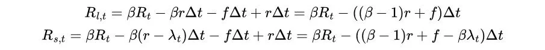
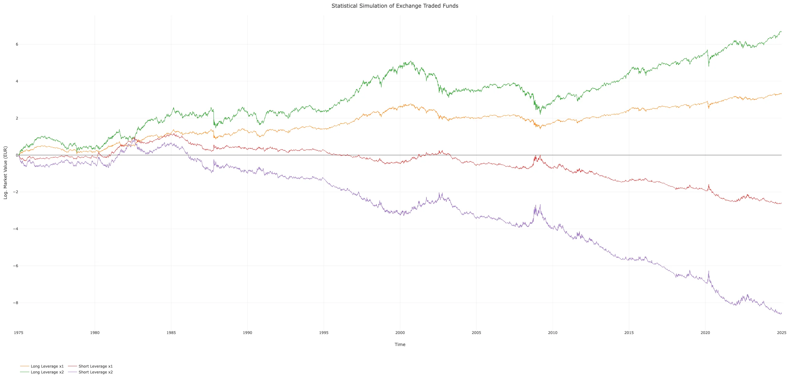
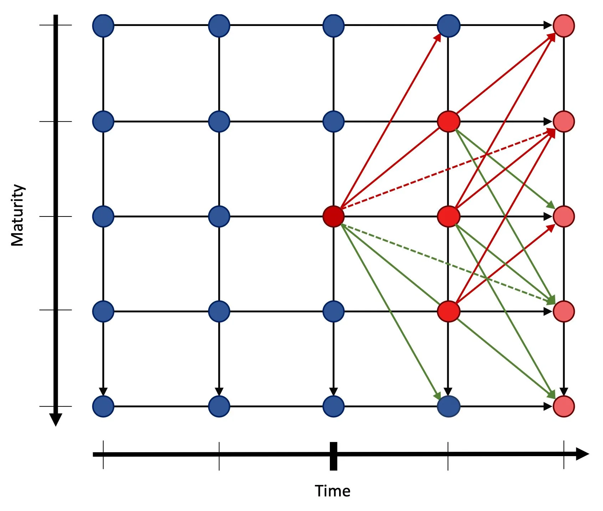
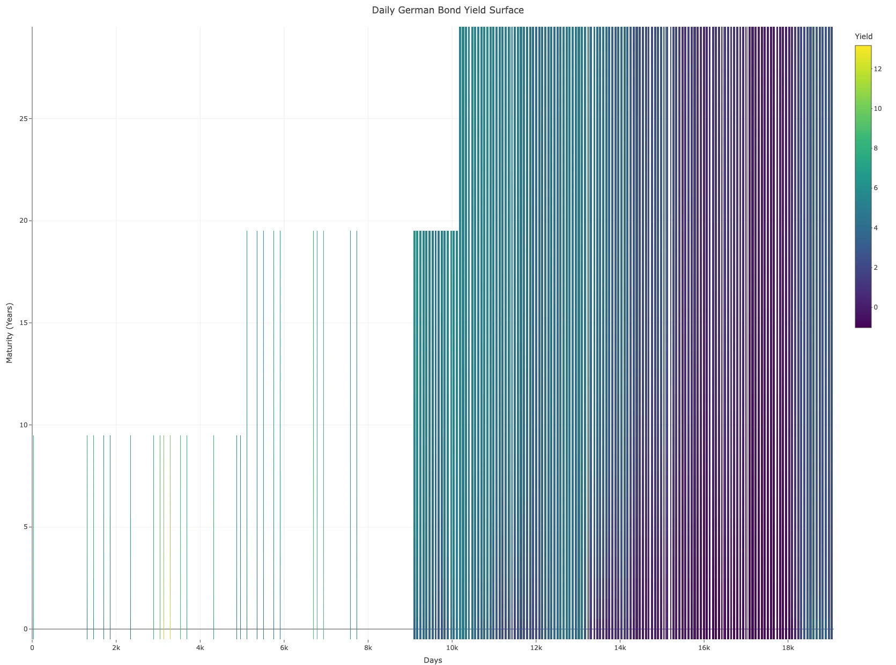
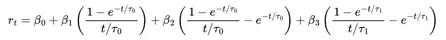
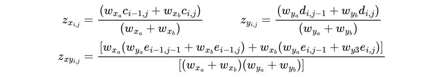
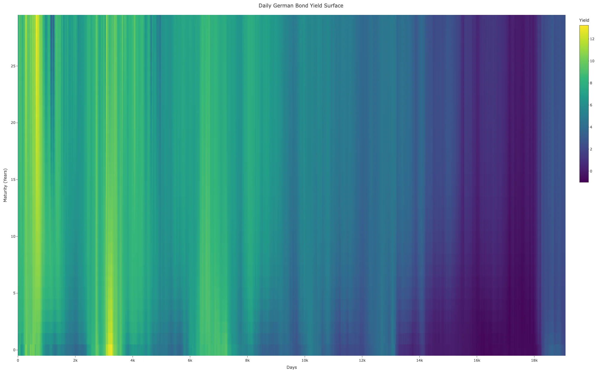
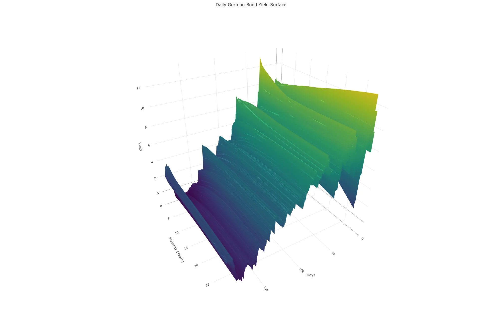

# ChemStats Archiv: Strahlende Bullen, düstere Bären – Principia Amumbo (Teil II)

Liebe Mitreisende auf der Mauerstrasse, liebe Wegelagerer in den Finanzgassen,

ich freue mich, euch zum zweiten Beitrag der Reihe *"Strahlende Bullen, düstere Bären"*
 zu begrüßen und hoffe, dass ihr euch in der Zwischenzeit im Wogen der 
Märkte vom letzten Teil erholt habt, denn wir betreten ein weiteres Mal 
die Welt des Heiligen Amumbos und seiner Schatten. Ein weiteres Mal 
steigen wir in die Untiefen der Statistik herab, in der wir uns arkaner 
Künste und kryptischer Zeichen bedienen, um letzte Materialien für 
unsere Analysen zu erzeugen.

Zunächst knüpfen wir an die Rückrechnung der MSCI USA-Varianten 
aus dem letzten Beitrag an und ziehen Merkmale realer Produkte der 
Amundi S.A. heran, um Long- und Short-ETFs im Hebelspektrum von -2 bis 
+2 für die Zeit vom 01-01-1975 bis 31-12-2024 zu simulieren. Danach 
gehen wir das Problem an, dass wir für Analysen von Strategien neben 
Zeitreihen hypothetischer Produkte auch Angaben zur Berechnung von 
Steuern und Vorabpauschalen brauchen – und wie ihr vermutlich ahnt, gibt
 es größere Löcher in der Zinsstruktur deutscher Bundeswertpapiere, 
weshalb wir nochmal kreativ werden und einen kleinen Methoden-Cocktail 
mixen.

Wie bereits im letzten Teil ist mir wichtig, dass ich euch lediglich *mein* Vorgehen erläutere, aber *keinerlei*
 Anspruch auf analytische Universalität erhebe – alleine zur 
Interpolation von Zinsstrukturen ließen sich ganze Bibliotheken füllen, 
weshalb ich mich auf die Ansätze und Methoden konzentriere, die sich aus
 meiner Sicht als relativ nützlich, effektiv und robust erwiesen haben. 
Und falls es Fragen geben sollte oder etwas unklar geblieben ist, zögert
 bitte nicht, nachzufragen. Also, legen wir los...

**ZL;NG**

- Projektziel: Simulation gehebelter Long- und Short-Indizes zur 
Analyse des Heiligen Amumbo und seiner Schatten, den Dunklen Amumben, ab
 1975; Ableitung robuster Strategien.
- Gehebelte Produkte: Simulation von Long- und Short-ETFs im 
Hebelspektrum -2 bis +2 auf Basis realer Amundi-Produkte (WKN: ETF154, 
A0X8ZS, LYX0UW); Konzeption des Dunklen Amumbos.
- Interpolation & Steuern: Vervollständigung spärlicher 
Zinsstrukturen deutscher Bundeswertpapiere durch die Svensson-Gleichung 
und Interpolierung fehlender Werte über Akima-Splines.
- Vorbereitung: Plausible Schätzung von Basiszinsen des 
Bundesfinanzministeriums ab 1972 bis in die Gegenwart zur robusten 
Ableitung von Vorabpauschalen.
- Warnung: Es folgt ein Beitrag, der viele Formeln, lange Textpassagen und Grafiken enthält!

 

**Beiträge der Reihe:** [**Teil I**](https://redd.it/1ite1u2) **– Teil II –** [**Teil III**](https://redd.it/1jvu9gi) **–** [**Teil IV**](https://redd.it/1q4vda5) **–** [**Teil V**](https://redd.it/1tw1in2)

**Einleitung**

Im ersten Teil steckten wir sehr viel Zeit und Energie in die 
Rückrechnung von MSCI USA-Varianten bis 01-01-1975, um sie in diesem 
Beitrag für die Simulation von Long- und Short-ETFs im Hebelspektrum von
 -2 bis +2 zu verarbeiten. Hierdurch weichen wir deutlich vom Großteil 
der Analysen – akademisch wie hobbyistisch – ab, deren Vorgehen in hohem
 Maße durch ein Modell von Marco Avellaneda und Stanley Zhang (2009) 
sowie seiner Generalisierung zur Integration von Leihkosten für 
Leerverkäufe in volatilen Marktphasen durch Marco Avellaneda und Mike 
Lipkin (2009) geprägt wird – ein Beispiel sind *"ZahlGrafs Exzellente Abenteuer"* ([u/ZahlGraf](https://www.reddit.com/user/ZahlGraf/)
 2022), die ich jedem von euch (nochmals) ans Herz legen möchte, wenn 
ihr überlegen solltet, eigene Analysen anzugehen; besser geht's kaum.

Wenn wir uns das Modell von Avellaneda und Zhang (2009) genauer 
ansehen, wird deutlich, dass darin der Spot-Preis eines ungehebelten 
ETFs anstelle von Referenzindizes sowie eine Komponente zur Abbildung 
von Leihkosten verwendet werden, um gehebelte Long- und Short-ETFs zu 
berechnen. In unserer Schreibweise sieht das Modell so aus:
 

Vermutlich ist es mal wieder nicht direkt ersichtlich, aber 
letztlich sind dieses Modell und unser Vorgehen funktional äquivalent, 
denn einerseits geht die Leihkostenkomponente in Richtung Null, sofern 
der ungehebelte Referenz-ETF über eine hohe Liquidität verfügt, 
andererseits ist sie lediglich für den Fondsmanager relevant und wird in
 der Regel in die Gesamtkostenquote (TER) integriert. Im Vergleich zu 
anderen Ansätzen bietet sich unser Vorgehen an, wenn Simulationen nicht 
auf eine spezielle Gattung von Produkten reduziert sein sollen, sondern 
man sich offen halten möchte, Faktorzertifikate oder andere Derivate auf
 Indizes simulieren zu können. Wahrscheinlich wird dieser Aspekt in 
späteren Serien relevant sein, aber alles zu seiner Zeit...

**Kurzer Blick ins Warenlager**

Eigentlich haben wir durch die Rückrechnung der MSCI USA-Varianten
 eine solide Grundlage für eine Simulation von Long- und Short-ETFs, 
jedoch fehlen uns Angaben realer Produkte, wie Handelskurse oder 
Gesamtkostenquoten, um robuste Resultate zu erhalten. Sofern wir einen 
kurzen Blick auf die deutsche Produktlandschaft werfen und mal von 
Sektor- oder Strategie-Klimbim absehen, ist das aktuelle Angebot 
ungehebelter Long-ETFs auf den MSCI USA Net Total Return (16 ETFs) im 
Vergleich zur großen Alternative, dem S&P 500 Net Total Return (24 
ETFs), gar nicht so schlecht aufgestellt – schließen wir Ausschütter 
aus, bleiben uns 8 Produkte.

Leider ist die Situation sowohl für gehebelte Long- als auch für 
Short-ETFs, abgesehen vom Heiligen Amumbo (A0X8ZS), sehr spärlich, denn 
es gibt lediglich einen einzigen, ungehebelten Short-ETF (LYX0UW) auf 
den MSCI USA Gross Total Return USD, der ebenfalls von Amundi S.A. 
aufgelegt wurde.

Irgendwie hat es mich dazu gedrängt, alle Produkte aus der Hand 
eines Anbieters zu nutzen, weshalb ich mich für drei Amundi-ETFs 
entschieden habe. Allerdings ist unsere Methodik darauf ausgelegt, dass 
ihr grundsätzlich jeden ETF auf eine MSCI USA-Variante nutzen könnt. 
Vielleicht schließen Amundi S.A. und MSCI Inc. ja irgendwann die Lücke 
zur breiten Produktpalette auf S&P 500-Indizes, aber bis es so weit 
ist, gehen wir in unseren Analysen von folgenden ETFs und unserer 
Kreation – dem Dunklen Amumbo, einem zweifachen Short-ETF – aus:

| Name | WKN | TER | Faktor | Index | Auflage bzw. Index |
| --- | --- | --- | --- | --- | --- |
|  |
| Amundi MSCI USA | ETF154 | 0.03 | 1x | MSCI USA Net Total Return USD | 15-01-2020 bzw. 03-09-2024 |
| Amundi Leveraged MSCI USA Daily | A0X8ZS | 0.50 (bis 10-10-2023: 0.35) | 2x | MSCI USA Net Total Return EUR | 16-06-2009 bzw. 16-06-2009 |
| Amundi MSCI USA Daily Inverse | LYX0UW | 0.6 | -1x | MSCI USA Gross Total Return USD | 14-12-2015 bzw. 05-06-2024 |
| ChemStats Leveraged Daily Inverse | – | 0.95 | -2x | MSCI USA Gross Total Return USD | - |

Grundsätzlich sehen die Merkmale unserer Auswahl relativ gut aus 
und deckten das Hebelspektrum ab, aber wie euch sicherlich aufgefallen 
ist, gibt es bei zwei Produkten (ETF154 und LYX0UW) eine deutliche 
Diskrepanz zwischen Auflage- und Indexdatum. In den Mitteilungen an die 
Anleger zeigt sich, dass der einfache Long-ETF (ETF154) als S&P 
500-Tracker das Licht der Welt erblickte und erst am 03-09-2024 auf den 
MSCI-Index umgestellt wurde. Ähnlich sieht es für den einfachen 
Short-ETF (LYX0UW) aus, der vor seiner Umstellung am 05-06-2024 sogar 
eine zweifache Short-Position auf den S&P 500 abbildete. Nun sind 
unsere Produkt-Zeitreihen zwar deutlich kürzer als gedacht, jedoch ist 
dies kein Beinbruch, da wir selbst kurze Zeitreihen durch unsere 
Methodik robust simulieren können.

**Vom Heiligen und Dunklen – Synthesis Amumbo**

Zur Simulation holen wir uns XETRA-Kurse und schätzen fehlende 
Werte in unseren drei Zeitreihen durch Stineman-Interpolierung (Stineman
 1980), sodass unser methodisches Vorgehen konsistent bleibt. Jedoch 
bleibt das kleine Problem, dass sowohl der einfache Long- als auch der 
einfache Short-ETF einem Index in US-Dollar folgen, während uns 
XETRA-Kurse in Euro vorliegen. Ähnlich wie im letzten Teil nutzen wir 
die *"Anbieter-Wechselkurse",* das Verhältnis der Euro- und US-Dollar-Indizes, um die Kurswerte in US-Dollar umzurechnen.

Letztlich zahlt es sich aus, dass wir im letzten Teil so viel Zeit
 in die Methodik gesteckt haben, denn nun reicht es für die Simulation 
der Long- und Short-ETFs aus, eine rückwirkende Verrechnung des 
täglichen Anteils der Gesamtkostenquote und der Tagesrendite von Indizes
 zu realisieren:
 

Hierbei steht R für die Rendite des hypothetischen ETFs (Subskript
 f) und Referenzindex (Subskript i) am Tag t, r für die 
Gesamtkostenquote des Produkts, T für die Anzahl der Tage pro Jahr und p
 für einen Adjustierungsfaktor, den wir durch Grid Search-Algorithmen 
zur Minimierung von Fehlermetriken (z.B. Root Mean Square Error, etc.) 
ermitteln. Insgesamt ist die Abweichung für alle drei Amumben sehr 
niedrig, was daran liegt, dass unsere Index-Produkt-Zeitreihen nur 
äußerst kurz sind und daher wenig Spielraum für größere Tracking Errors 
bieten (Long x1: 1.0*10^−6, Long x2: 2.0*10^−6, Short x1: 7.0*10^−6)
 – sofern ihr andere Produkte in euren Analysen verwendet, dürften die 
Adjustierungsfaktoren leicht höher ausfallen, jedoch trotzdem marginal 
bleiben.

Wie bereits erwähnt, haben wir lediglich drei Amumben, basteln uns
 jedoch vier Simulationen für die nächsten Beiträge, um das 
Hebelspektrum von -2 bis +2 abzudecken. Hierbei haben wir natürlich für 
unsere Eigenkreation, den Dunklen Amumbo, weder die Möglichkeit Grid 
Searches zur Ableitung von Adjustierungen einzusetzen, noch eine reale 
Gesamtkostenquote, weshalb ich einen Wert von 0.95% gewählt habe, der 
sich zwar an vergleichbaren Produkten auf den S&P 500 orientiert, 
jedoch leicht höher ausfällt. Abschließend rechnen wir ihn gemeinsam mit
 den Simulationen der ungehebelten Long- und Short-ETFs in Euro um, da 
wir unsere Strategien in den nächsten Beiträgen lediglich in Euro 
analysieren werden – sofern ihr eigene Analysen in anderen Währungen 
angehen wollt, beachtet bitte, dass ihr Umrechnungen benötigt. Voilà...
 

Puh, wir haben es geschafft! Wir haben vier Long- und Short-ETFs 
für die Zeit von 01-01-1975 bis 31-12-2024 simuliert und haben die 
Grundlage der nächsten Beiträge gelegt. Jedoch ist zu beachten, dass 
unser Vorgehen im letzten Schritt von einer impliziten Annahme ausgeht: 
Konkret legen wir fest, dass es keinerlei Veränderungen der 
Gesamtkostenquote im Zeitverlauf gab, was in einigen Studien kritisch 
gesehen wird, da sich in den letzten Jahren Kostenstrukturen im Zuge der
 Maturitätsphasen von Märkten deutlich verändert haben. Allerdings ist 
es uns nicht möglich zu prüfen, ob und inwieweit aktuelle Relationen 
auch in der Vergangenheit latent waren, da es keine Materialien über 
historische Gesamtkostenquoten für MSCI USA- oder adäquate Proxy-Indizes
 gibt – insofern beachtet bitte, dass wir in diesem Punkt eine sehr
 starke, nicht prüfbare Annahme setzen.

So, und jetzt ein Einschub: Ich habe länger überlegt, ob ich 
diesen Beitrag an dieser Stelle abschließen oder fortführen soll, denn 
es steht ein Abschnitt an, der methodisch nochmal eine deutliche Schippe
 drauflegt. Einerseits habe ich die Befürchtung, dass es für manchen zu 
viel Input sein wird, andererseits würde ich ungern einen weiteren, rein
 theoretischen Beitrag aufsetzen, da mir schreiben selbst nicht gerade 
leicht fällt und ich Strategien analysieren möchte. Aus diesem Grund 
richte ich eine kleine Warnung an diejenigen von euch, die kein größeres
 Interesse an der Vervollständigung der Zinsstruktur deutscher 
Bundeswertpapiere haben oder eine kurze Pause brauchen: Im nächsten 
Abschnitt wird es nochmal sehr theoretisch und mathematisch, weiterlesen
 auf eigene Gefahr!

**Statistische Werkzeuge für Geisteskranke – Zinsen, Steuern, Lücken**

Ah, ihr bleibt am Ball!? Oder seid wieder zurück!? Naja, mir 
soll's recht sein, was uns direkt ins Thema bringt: Vorabpauschalen und 
Kapitalertragssteuern. In den nächsten Teilen sollen diverse Strategien 
im Hinblick auf Risiko, Rendite und Stabilität evaluiert werden, weshalb
 wir eine solide Grundlage für die Simulation von Kapitalertragssteuern 
auf Verkäufe und Vorabpauschalen benötigen.

Es ist mir bereits öfters aufgefallen, dass viele Analysten bei 
der Simulation von Vorabpauschalen auf den Basiszinssatz der Deutschen 
Bundesbank/Europäischen Zentralbank setzen, was inhaltlich eine 
Ausrichtung auf den Basiszinssatz gemäß § 247 BGB bedeutet. Tja, leider 
ist unser Steuerrecht in diesem Punkt relativ deutlich, denn juristisch 
wie inhaltlich richten sich Vorabpauschalen nach dem Basiszins des 
Bundesfinanzministeriums gemäß § 18 Abs. 4 InvStG. Darin wird 
festgelegt, dass sich der Basiszins für unsere Simulationen *"aus der langfristig erzielbaren Rendite öffentlicher Anleihen"* ableiten muss, *"den die Deutsche Bundesbank anhand der Zinsstrukturdaten jeweils auf den ersten Börsentag des Jahres errechnet"*.
 Ein kurzer Blick in die Bundessteuerblätter der letzten Jahre zeigt 
uns, dass wir unseren Basiszins aus dem Zinssatz für Bundeswertpapiere 
mit einer Restlaufzeit von 15 Jahren und jährlichen Kuponzahlungen 
ableiten müssen. Na, so lässt sich doch arbeiten...

**Strukturelle Restriktionen und Schwebende Tücher**

Eigentlich wäre es möglich, dass wir den frühesten Wert für 
15-jährige Bundeswertpapierzinsen als Grundlage unserer Steuersimulation
 nutzen, aber das wäre langweilig und ungenau. Hört es sich nicht viel 
interessanter an, wenn wir die Zinsstruktur von Bundeswertpapieren bis 
1972 zurückrechnen und daraus unseren Basiszins ableiten? Außerdem weiß 
man ja nie, ob es nicht irgendwann mal gehebelte ETFs auf 
Bundeswertpapier-Indizes gibt... Aber bevor wir loslegen, sollten wir 
die beiden Elefanten im Raum ansprechen: Strukturelle Integrität und 
restriktive Dimensionalität. Ähm, bitte was?

Ursprünglich hatte ich einen kleinen Exkurs geplant, aber ich 
denke, dass sich das folgende Beispiel deutlich besser eignet, um zu 
beschreiben, was ich meine: Sobald wir über Zinsstrukturen sprechen, 
meinen wir funktionale Beziehungen von Anleihen, die sich aus den 
Zinssätzen von Bundesanleihen diverser Restlaufzeiten bzw. Maturitäten 
ergeben. Sprechen wir über die Zinssätze von Anleihen zu einem 
beliebigen Zeitpunkt t, liegt eine Zinsstrukturkurve vor, betrachten wir
 jedoch einen Zeitraum t-i bis t+i liegt eine Zinsstrukturfläche vor, 
deren Glätte von der Granularität, also dem Abstand der Zeitpunkte und 
dem Abstand der Maturitäten, abhängt. Stellt euch nun diese 
Zinsstrukturfläche als Tuch vor, das vor euch in der Luft schwebt...

Sobald ihr an einer beliebigen Stelle einen Finger in das Tuch 
drückt, unabhängig davon, ob dies von oben oder unten geschieht, wird 
sich das Tuch ausbeulen oder eindellen – allerdings führt der Druck 
eures Fingers dazu, dass nicht nur der exakte Kontaktpunkt beeinflusst 
wird, sondern auch seine Umgebung. Je stärker der Druck, umso größer ist
 der Flächeneffekt. Soweit klar? Ähnlich verhält es sich bei 
Zinsstrukturflächen - und ja, das ist eine grobe Vereinfachung der 
Zinssetzung durch Märkte und Zentralbanken.

Im Hinblick auf Zinsstrukturflächen spricht dieses Beispiel an, 
dass sich die Zinsrate einer Maturität zu jedem Zeitpunkt in einer 
polydirektionalen Beziehung zu ihrer Umgebung steht, was bedeutet, dass 
sich die Zinsrate ändert, wenn Zinsraten in ihrer Umgebung verändert 
wurden oder sich die Umgebung ändert, wenn die Zinsrate verändert wird –
 dieses Phänomen meine ich, wenn ich von struktureller Integrität 
spreche. Oder in einem Bild ausgedrückt:
 

Nun ist bei Zinsstrukturflächen zu beachten, dass es uns nicht 
möglich ist die Vergangenheit zu verändern, sodass Zinssätze früherer 
Zeitpunkt ihren Einfluss auf die Gegenwart und Zukunft bereits ausgeübt 
haben, selbst jedoch unveränderlich sind. Oder im Bild schwebender 
Tücher: Wenn ihr euren Finger ins Tuch stecht, ist die Fläche rechts von
 eurem Finger flauschig weich und verändert sich druckabhängig, die 
linke Fläche ist jedoch aus Stahl und unbeweglich – dieses Phänomen 
meine ich, wenn ich den Begriff restriktiver Dimensionalität nutze.

**Kreatives Stochern im Statistiknebel**

Im Hinblick auf die Simulation der Zinsstrukturfläche deutscher 
Bundeswertpapiere sollten wir diese beiden Aspekte im Auge behalten, 
denn es gibt ein größeres Problem: Leider gibt es keine Angaben über die
 Zinssätze von Bundeswertpapieren vor 1972 und selbst danach liefert uns
 die Bundesbank für weite Phasen unseres Analysezeitraums lediglich 
Monatsendwerte. Wie so oft, liegt die Ursache in der Geschichte, denn 
eigentlich gab es bis in die 1960er keine deutschen Staatsschuldtitel – 
unser kleiner Streichelzoo setzte in dieser Zeit eher auf kurzfristige, 
zweckgebundene Kredite. Langlaufende Bundeswertpapiere in unserem Sinn 
gab es erst durch Kapitalmarktreformen in den frühen 1970ern – davor gab
 es Wildwuchs im Quadrat durch Anleihen, die Landesbehörden oder andere 
Institutionen auflegten und die kein Bestandteil einer Verwaltung durch 
die Deutsche Bundesbank waren.

Wir ziehen Zeitreihen aus den Zinsstrukturen von 
Bundeswertpapieren mit jährlichen Kuponzahlungen abgeleiteter Renditen 
(S1311) heran, die wir von 30-09-1972 bis 31-12-2024 als Monats- bzw. 
01-08-1997 bis 31-12-2024 als Tageswerte aus dem Datenportal der 
Deutschen Bundesbank beziehen - jeweils über ein Restlaufzeitspektrum 
von einem bis dreißig Jahren. Anschließend fügen wir alle Zeitreihen in 
eine laufende Kalendarmatrix ein und beachten, dass sich die Monatsdaten
 stets auf den letzten Handelstag des Monats beziehen. Im Wesentlichen 
liegt uns eine Zinsstrukturfläche in täglicher Auflösung vor, jedoch 
liegt ein gutes Stück Arbeit vor uns, um diese Lücken zu schließen:
 

Ähm, ja, leicht wird's nicht, oder? Wie ihr seht, liegt uns eine 
wilde Mischung fehlender Werte vor, denn einerseits sind längere 
Laufzeiten von Bundeswertpapieren erst relativ spät aufgesetzt worden, 
andererseits liegen, wie bereits erwähnt, vor 01-08-1997 lediglich 
Monatsendwerte vor – leider führt Reddits Verarbeitung von Grafiken 
dazu, dass die feinen Linien der Zinsstrukturkurven in der ersten Hälfte
 der Grafik zu großen Teilen verschwinden; so krass wie es wirkt, ist es
 nicht, wie die interaktiven Grafiken im [Repository](https://github.com/chemicalstats/ChemStats-Archiv)
 zeigen. Gleichzeitig haben wir beide Aspekte struktureller 
Restriktionen bei der Simulation der Zinsstrukturfläche zu 
berücksichtigen, sodass wir sehr viele, leistungsstarke Methoden 
ausschließen müssen.

**Svenssons Werk, Akimas Beitrag und ChemStats Wahnsinn**

Entsprechend habe ich mir eine kleine Strategie überlegt, die sich
 zunächst der Vervollständigung der Zinsstrukturkurve einzelner Tage 
über alle Restlaufzeiten widmet, bevor eine bidirektionale 
Spline-Interpolation eingesetzt wird. Ursprünglich wollte ich das 
Vorgehen relativ simpel halten, weshalb ich bei der Interpolation der 
Zinsstrukturkurven an den Ansatz von McCulloch (1975), der kubische 
Splines einsetzt, gedacht habe, aber je länger ich ausprobiert habe, 
umso weniger plausibel schien mir diese Wahl – es gibt deutlich 
effizientere Ansätze, wie die Nelson-Siegel-Svensson-Modelle, die wir 
nutzen werden:

Im Wesentlichen geht das Modell von Charles Nelson und Andrew 
Siegel (1987) davon aus, dass sich die latente Struktur von Zinssätzen 
als Differentialgleichungen zweiter Ordnung beschreiben lässt, was in 
zeit-diskreter Schreibweise die folgende Gleichung ergibt:
 

Hierbei steht rₜ für den Zinssatz eines Bundeswertpapiers an einem
 beliebigen Zeitpunkt t, die Parameter β₀ bis β₂ für das Niveau, die 
Steigung und die Krümmung der Kurve und τ für die Geschwindigkeit, in 
der Zinssätze in Richtung des langjährigen Durchschnitts konvergieren, 
steht. Sowohl β₂ als auch τ haben direkten Einfluss darauf, wie gipflig 
die Zinsstruktur ausfällt, wobei β₂ Höhe und Richtung, aber τ die Breite
 des Gipfels definiert. Alle vier Werte sind stets größer als Null.

In seiner Optimierung führt Svensson (1994) Zusatzwerte ein, um 
ein neues Extremum zu integrieren, was eine höhere Flexibilität bieten 
und die Approximationsgüte steigern soll – daher nutzen wir das 
Svensson-Modell, da es sich schlicht besser für komplexere, dynamische 
Zinsstrukturen eignet. In zeit-diskreter Schreibweise ist das Modell 
über diese Gleichung definiert:
 

Analog zur vorherigen Gleichung sorgen τ₀ und τ₁ für die 
Konvergenz der Zinssätze in Richtung des langjährigen Durchschnitts, 
wobei sich der Effekt von τ₁ lediglich auf den Zusatzterm β₃ auswirkt. 
Alle sechs Werte sind stets größer als Null.

Ausgehend vom Svensson-Modell ist es uns möglich, unvollständige 
Zinsstrukturen über das volle Spektrum von Restlaufzeiten zu simulieren,
 sodass wir nun eine bidirektionale Akima-Interpolation (Akima 1970, 
1974) nutzen können, um die restlichen Lücken plausibel zu schließen. 
Grundsätzlich ist dieses Vorgehen für jede rechteckige Fläche 
einsetzbar, denn es beruht auf dem Einsatz bikubischer Polynome, wobei 
jedes Polynom von den Werten einer Funktion z(x,y) und partiellen 
Ableitungen an den Eckpunkten des Rechtecks bestimmt wird:
 

Sofern wir uns für einen beliebigen Punkt i,j auf der 
unvollständigen Zinsstrukturfläche interessieren, sind die Werte der 
partiellen Ableitung an diesem Punkt durch diese partiellen Ableitungen 
erster und zweiter Ordnung definiert:
 

Die Gewichtungskoeffizienten ergeben sich durch:
 

In diesen Gewichtungskoeffizienten gelten die geteilten Differenzen erster und zweiter Ordnung:
 

Sobald wir diese Vorgaben an unseren Rechner übergeben, holen wir 
uns erstmal einen Kaffee, Tee oder irgendwas Hochprozentiges, denn 
leider ist unsere Zinsstrukturfläche so löchrig, dass uns sehr lange 
Rechenzeiten bevorstehen. Allerdings lohnt es sich, wie ihr selbst sehen
 könnt:
 

Oder eine andere Perspektive, falls ihr ein Herz für die dritte Dimension habt:
 

Puh, wir haben es geschafft! Wir haben eine vollständige 
Zinsstrukturfläche ab 30-09-1972 über alle Maturitäten, die wir uns mal 
in Ruhe ansehen und gehebelte ETFs auf Bundeswertpapiere basteln könnten
 – ne, Spaß beiseite, ist nicht geplant, viel wichtiger ist allerdings, 
dass uns diese plausiblen Schätzer eine Simulation des Basiszinses des 
Bundesfinanzministeriums liefern, woraus wir die Höhe der 
Vorabpauschalen für unsere Steuersimulation ableiten können. Gemeinsam 
mit den simulierten ETFs liegen uns nun endlich alle Materialien vor, 
die wir die Simulation und Evaluation von Strategien in den folgenden 
Teilen benötigen. So, und jetzt klapp' ich den Bums zu... Wir lesen uns 
im dritten Teil!

**Literatur und Material**

Akima, Hiroshi (1970): A new method of interpolation and smooth 
curve fitting based on local procedures. Journal of the Association for 
Computing Machinery, 17(4): 589–602.

Akima, Hiroshi (1974): A method of bivariate interpolation and 
smooth surface fitting based on local procedures. Communications of the 
Association for Computing Machinery, 17(1): 18–20.

Avellaneda, M. & Lipkin, M. (2009): A dynamic model for hard-to-borrow stocks. Risk, 22(6): 92–97.

Avellaneda, M. & Zhang, S. (2009): Path-dependence of 
leveraged ETF returns. Society for Industrial and Applied Mathematics 
Journal on Financial Mathematics, 1(1): 586-603.

McCulloch, Huston. J. (1975): The Tax-Adjusted Yield Curve. Journal of Finance, 30(3): 811–830.

Nelson, Charles R. & Siegel, Andrew F. (1987): Parsimonious 
modeling of yield curves. Journal of Business, 60(4): 473–489.

Stineman, Russel W. (1980): A Consistently Well Behaved Method of Interpolation. Creative Computing, 6(7): 54–57.

Svensson, Lars E. O. (1994): Estimating and Interpreting Forward 
Interest Rates: Sweden 1992 - 1994. National Bureau of Economic Research
 Working Paper Series, 4871.

[ZahlGraf (2022): ZahlGrafs Exzellente Abenteuer. Reddit. Mauerstrassenwetten.](https://redd.it/s71qds)

[ChemStats Archiv Github Repository Project Amumbo](https://github.com/chemicalstats/ChemStats-Archiv)
