# ChemStats Archiv: Strahlende Bullen, düstere Bären – Principia Amumbo (Teil III)

Liebe Mitreisende auf der Mauerstrasse, liebe Wegelagerer in den Finanzgassen,

ich freue mich, euch zum dritten Beitrag der Reihe *"Strahlende Bullen, düstere Bären"*
 zu begrüßen und hoffe, dass ihr die Volatilität der letzten Wochen gut 
verkraftet habt, denn wir begeben uns ein weiteres Mal in die Welt des 
Heiligen Amumbos und seiner Schatten.

Aufgrund vieler Diskurse über Sinn und Wert von Strategietests, 
die mir in Subs unter Beiträgen über den Heiligen Amumbo oder 
Alternativen begegnet sind, habe ich die Methodik für diese Reihe leicht
 adaptiert, um Aspekte wie Verzerrungen oder Biases gezielter zu 
diskutieren.

Seht es mir bitte nach, dass ich diese Punkte erläutern möchte, 
bevor wir einen Blick in den Simulator werfen und 
Buy-and-Hold-Strategien für Long- und Short-ETFs auf den MSCI USA im 
Hebelspektrum von -2 bis +2 für die Zeit vom 01-01-1975 bis 31-12-2024 
diskutieren – sofern ihr lediglich Zahlen und Graphen wollt, springt 
gerne direkt zu den letzten Abschnitten des Beitrags oder zieht euch das
 Material aus dem [Repository](https://github.com/chemicalstats/ChemStats-Archiv). Und falls es Fragen geben sollte oder etwas unklar geblieben ist, zögert bitte nicht nachzufragen...

**ZL;NG**

- Projektziel: Simulation gehebelter Long- und Short-Indizes zur 
Analyse des Heiligen Amumbo und seiner Schatten, den Dunklen Amumben, ab
 1975; Ableitung robuster Strategien.
- Gehebelte Strategien: Simulation von Buy-and-Hold-Strategien für 
Long- und Short-ETFs auf den MSCI USA im Hebelspektrum -2 bis +2 auf 
Basis realer Amundi-Produkte (WKN: ETF154, A0X8ZS, LYX0UW) und der 
Konzeption des Dunklen Amumbos.
- Methodische Adaption: Erweiterung des Analyseplans auf 
Resampling-Analysen zur Evaluierung der Überanpassung von Strategien; 
Adaption des Nullhypothesen-Konzepts auf Strategietests.
- Simulation & Interpretation: Erläuterung des 
Strategiesimulators; Interpretation von Buy-and-Hold-Strategien in 
Abhängigkeit von Investitionslängen, Anlagetypen, Steuern und Gebühren.
- Warnung: Es folgt ein Beitrag, der viele Formeln, lange Textpassagen und Grafiken enthält!

 

**Beiträge der Reihe:** [**Teil I**](https://redd.it/1ite1u2) **–** [**Teil II**](https://redd.it/1iyx0rw) **– Teil III –** [**Teil IV**](https://redd.it/1q4vda5) **–** [**Teil V**](https://redd.it/1tw1in2)

**Einleitung**

Vermutlich liegt es in der Natur des Menschen, Stabilität und 
Sicherheit in einer Umwelt zu suchen, deren Wesen oft willkürlich und 
chaotisch ist, selbst wenn wir in der Lage sind zu reflektieren, dass 
dieses Gefühl uns lediglich kurze Zeit begleitet und Unsicherheit eine 
Konstante unserer Existenz ist – oder in anderen Worten: Unsicherheit 
ist eine Quelle der Kreativität und Begleiter auf dem langen Weg zur 
Weisheit. Insofern ist es wenig verwunderlich, dass sich Strategien für 
den Handel auf den Märkten in unserer Blase großer Beliebtheit erfreuen 
und es, wie in allen Aspekten des Lebens, etliche Ansichten über ihren 
Wert und den Nutzen von Analysen, wie sie in dieser Reihe geplant sind, 
gibt.

In den letzten Wochen habe ich viele Beiträge gelesen, die sich – 
manche fundiert, manche emotional, manche skurril – diesen Aspekten 
gewidmet haben und es gab Punkte, die mich deutlich länger als zunächst 
vermutet beschäftigt haben, weshalb ich meinen Analyseplan für diese 
Reihe adaptiert habe – vielleicht ist es mir ja möglich, einige Kritiken
 an der Umsetzung von Strategietests oder Backtests aufzugreifen und 
neuen Input für den Diskurs zu liefern; mal sehen...

Zunächst sollten wir uns nochmals vor Augen führen, dass 
Strategietests lediglich Werkzeuge sind, um Hypothesen über einen 
regelbasierten Handel von Wertpapieren oder Anlagen zu evaluieren, indem
 ihre Prinzipien oder Signale auf historische oder synthetische Daten 
übertragen werden und aufgezeigt werden kann, wie sich einzelne 
Positionen oder Portfolios in der Vergangenheit verhalten hätten. 
Oftmals, aber nicht in jedem Fall, erfolgt dies unter der Annahme, dass 
die Zukunft große Ähnlichkeit, jedoch keine Äquivalenz zur Vergangenheit
 aufweist, woraus abgeleitet wird, dass robuste Strategietests plausible
 Prognosen liefern – statistisch gesprochen ist es eine Wette auf die 
Gültigkeit oder zumindest Plausibilität der Ergodizitäthypothese. An 
diesem Punkt scheiden sich die Geister, denn es gibt den berechtigten 
Einwand, dass sich Wertpapiermärkte in stetigem Wandel befinden, wodurch
 neue Zyklen und Krisen entstehen, deren Merkmale in alten Materialien 
nicht abgebildet werden – entsprechend böten Strategietests keinerlei 
Mehrwert über die Deskription der Vergangenheit hinaus.

Inwieweit man sich diesen Sichtweisen zur Separation von 
Vergangenheit, Gegenwart und Zukunft anschließen möchte, möge jeder 
bitte für sich selbst entscheiden – jedoch habe ich in letzter Zeit 
verstärkt festgestellt, dass letztere Position über den Verweis auf 
methodische Verzerrungen, wie Überanpassung, Selektionsverzerrung und 
ähnliche Aspekte, erfolgt. Ähm, ist doch so, oder!? Naja, ich hoffe, 
dass euch klar ist, dass es keine *"verzerrungsfreien"* Analysen 
gibt und selbst diese Reihe wird daran nichts ändern können, weshalb es 
wichtig ist, den Schlüssen aus Strategietests kritisch zu begegnen und 
ihre Schwachstellen anzusprechen – sei es durch die Offenlegung von 
Annahmen oder anderen Aspekten, die Einfluss auf die Ergebnisse haben 
könnten. Allerdings ist es ebenso kritisch, die Greatest Hits der 
Verzerrungen pauschal für jede Art von Analyse vorzubringen – und ja, 
das ist gerade eine Überspitzung und Vereinfachung meinerseits, aber es 
ist faktisch möglich, das Ausmaß an Unsicherheit in Analysen deutlich zu
 reduzieren und plausible Schlüsse für die kurz- und mittelfristige 
Zukunft zu ziehen, sofern man bereit ist, sich darauf einzulassen. So 
viel dazu...

**Zu Gast bei Keynes und Carnap – Strategischer Dreisprung**

Wie erwähnt, habe ich meinen Analyseplan für diese Reihe 
reflektiert und letztlich adaptiert, wobei ich mich stark an den 
Überlegungen von John Maynard Keynes (1921) und Rudolf Carnap (1950) 
über das Wesen von Wahrscheinlichkeiten und die Zerlegung logischer 
Probleme bedient habe – keine leichte Kost, aber sehr lesenswert! 
Konkret füge ich meinem Vorgehen zwei Phasen hinzu, wobei die letzte 
Phase eine Art *Ultima Ratio Tensio* für die Out-Of-Sample-Validierung der effektivsten Strategien darstellt:

1. In-Sample Descriptions
2. In-Sample Resampling
3. Stochastic Simulations

In dieser Abfolge von Phasen drückt sich meine Überzeugung aus, 
dass robuste Evaluierungen von Strategien lediglich durch die 
Kontrastierung von Methoden erfolgen können, da kein *einzelner* 
Ansatz in der Lage ist, alle Arten von Verzerrungen gleichwertig zu 
adressieren. Jedoch möchte ich nochmals betonen, dass ich euch lediglich
 *mein* Vorgehen erläutere, aber *keinerlei* Anspruch auf 
analytische Universalität erhebe – ich gebe lediglich Ansätze wieder, 
die sich aus meiner Sicht als relativ effektiv, robust und plausibel 
erwiesen haben. Also, ab geht's...

Grundsätzlich ist die erste Phase meiner Analysen darauf 
ausgelegt, zu verstehen, wie sich Strategien in der Vergangenheit 
verhalten und inwieweit sich ihre Freiheitsgrade (z.B. Parameter, 
Einstiegs- und Ausstiegszeitpunkt, etc.) auf Rendite- und Risikometriken
 ausgewirkt hätten, sofern sie zu aktuellen Konditionen (z.B. Kosten für
 Handel und Produkte, Steuergesetze, etc.) über gleitende Zeiträume von 
10, 20, 30 oder 40 Jahren umgesetzt worden wären. Hierbei geht es darum,
 zu beschreiben und zu prüfen, ob das Konzept der Strategie tragfähig 
ist, nicht um eine Optimierung. Was heißt das, Bre?!

Konkret heißt das, dass wir in dieser Phase *lediglich* das
 Grundsignal einer Strategie über die Variation von Einstiegs- und 
Ausstiegszeitpunkten analysieren – keine Puffer, keine Stochastiken, 
keine Blöcke oder Bänder. Warum, das ist doch total wichtig?! 
Vermutlich, aber es wäre schlichtweg die falsche Phase für Adaptionen, 
denn einerseits wird ein Großteil der Strategien in dieser Phase 
scheitern, da sie schlechter als eine ungehebelte Buy-and-Hold-Strategie
 sind, andererseits sind Adaptionen in der Regel darauf ausgelegt, die 
Separation von Signalen aus Rauschen zu optimieren, womit wir – abhängig
 von der Komplexität der Strategie – selbst bei sehr langen Zeiträumen 
relativ schnell in eine Überanpassung oder eine Maskierung laufen.

In dieser Phase spielen uns kognitive Prozesse Streiche, denn es 
ist sehr verlockend, Strategien auf ein In-Sample-Ergebnis zu optimieren
 und zu generalisieren, weshalb es wichtig ist, dass wir im Vorfeld der 
Deskription eine plausible Hypothese über die Wirkungsweise der 
Strategie formulieren. Nunja, seien wir ehrlich, solange wir ein Asset 
betrachten, wird es eine Variante des Separationstheorems sein, aber 
letztlich ist diese Vorarbeit eine Stütze, die uns dabei hilft, die 
Komplexität von Strategien und daraus abgeleitete Probleme der 
Überspezifizierung im Vorfeld einzugrenzen. Alles gut und schön, aber 
wie geht's weiter?

Solange wir lediglich In-Sample-Verläufe ansehen, besteht die 
Möglichkeit, dass unser Ergebnis aus Zufall entstanden ist, weshalb wir 
in der zweiten Phase auf Resampling-Ansätze (z.B. Pitman 1937, 
Quenouille 1956, Tukey 1958, Efron 1979) zurückgreifen, um beliebige 
Strategien ohne Einschränkung der Komplexität testen zu können. Hierfür 
nutzen wir ein Tandem aus Permutations- und Bootstraptests, um zu 
prüfen, ob 1.) sich eine Strategie überhaupt vom Zufall unterscheidet 
(Signal-Resampling), 2.) eine Strategie robust auf Veränderungen des 
Renditesequenz (Sequenz-Resampling) oder 3.) Veränderungen des 
Kursverlaufs (Struktur-Resampling) reagiert. Ähm, heißt konkret was?

Im Wesentlichen wird uns das Signal-Resampling sagen, ob eine 
Strategie in beliebigen Marktphasen besser als der Zufall gewesen wäre, 
wofür es nötig ist, dass wir Zufallsstichproben ohne Zurücklegen 
(Metropolis & Ulam 1949) aus den Kauf- und Verkaufssignalen ziehen 
und unsere Rendite- und Risikomaße für jede Ziehung berechnen. Sofern 
ein Realergebnis deutlich von der Zufallsstichprobenverteilung – positiv
 bei Rendite-, negativ bei Risikometriken – abweicht, widmen wir der 
Strategie einen weiteren Blick und es schließt sich ein Sequenz- oder 
Struktur-Resampling an: Hierfür wählen wir ein Segment der historischen 
Daten und ziehen Zufallsstichproben mit Zurücklegen aus dem Kursverlauf 
zwischen fixierten Einstiegs- und Ausstiegspunkten – eigentlich ziehen 
wir Stichproben aus gekoppelten Verläufen des Produkts und Signals und 
abhängig davon, ob die Sequenz oder die Struktur geprüft wird, gibt es 
noch weitere Punkte zu beachten, aber ich vereinfache mal aus Gründen 
der Verständlichkeit. Sobald wir diesen Prozess öfters ausführen, 
erhalten wir Rauschen, das strukturell vom realen Kursverlauf abweicht, 
jedoch nahezu identische statistische Eigenschaften aufweist, was uns 
hilft das Ausmaß an Überanpassung in einer Strategie über die Verteilung
 der Risiko- und Renditemetriken zu prüfen. Ähm, wie das!?

Nunja, es ist nicht direkt ersichtlich, aber sofern wir davon 
ausgehen, dass eine Strategie valide Signale und Strukturen des Marktes 
nutzt und keinerlei oder lediglich geringe Überanpassung aufweist, dann 
dürfte diese Strategie beim Rauschen versagen, da keine validen Signale 
vorliegen - in anderen Worten: Es dürfte einen Unterschied zwischen dem 
Realergebnis und den Ergebnissen des Resamplings geben, da die Strategie
 besser als der Zufall (z.B. höhere Rendite und/oder niedrigeres Risiko)
 wäre. Würde die Strategie jedoch in kritischem Maße an Überanpassung 
leiden, gäbe es keinen Unterschied. Insofern fragen wir in dieser Phase,
 inwieweit das Ergebnis einer Strategie vom *exakten* Verlauf des Assetrenditen abhängt – bitte beachtet hierzu meine späteren Anmerkungen, denn *schlichte*
 Trend- und Momentum-Strategien sind in dieser Hinsicht ein Sonderfall. 
Ähm, klar, aber die beiden Analysen sind Nullhypothesentests, richtig!?
 
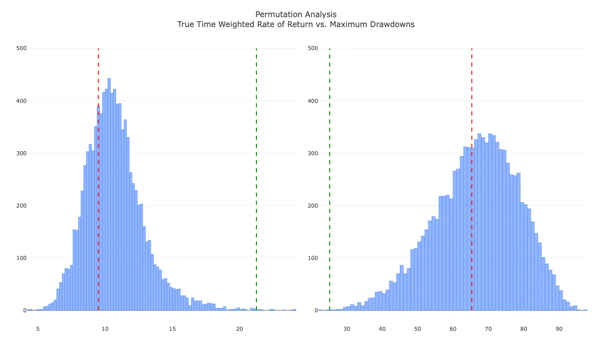

Völlig richtig, die Ergebnisse der beiden Testverfahren liefern 
uns die Verteilung von Rendite- und Risikometriken unter Gültigkeit der 
Nullhypothese (Zufall), womit wir Jerzy Neymans und Egon Pearsons (1933)
 Konzept des P-Werts auf unsere Approximation übertragen und den 
Signalwert/Grad an Zufälligkeit (Signal-Resampling) bzw. den 
Generalisierungswert/Grad an Überanpassung (Struktur-Resampling) 
feststellen können. Zur leichteren Orientierung zeigt die Grafik die 
Verteilungen der Rendite- und Risikometriken (True Time Weighted Rates 
of Return und Maximum Drawdowns) für die Permutation des Kursverlaufs 
eines gehebelten All World-Produkts als hellblaue Histogramme und zwei 
komplexe Strategien, deren Grad an Überanpassung niedrig (grüne Linie) 
und hoch (rote Linie) ausfällt – in beiden Fällen liegt eine Signifikanz
 des Signal-Resamplings vor, d.h. ihr Signal für den Kauf oder Verkauf 
eines Assets ist bei gleichen Umständen besser als der Zufall. 
Allerdings gibt es deutliche Unterschiede im Hinblick auf die 
Generalisierbarkeit beider Strategien im Sinne eines 
Struktur-Resamplings: Während lediglich eine kleine Anzahl an 
Zufallstichproben Renditen (TTWROR) und Risiken (Maximum Drawdown) 
aufweist, die besser oder zumindest gleichwertig zu den Realergebnissen 
der grünen Linie (niedriger P-Wert; Signifikanz) sind, liegen die 
Ergebnisse der roten Linie deutlich in den Ergebnisverteilungen des 
Resamplings (hoher P-Wert; Nicht-Signifikanz).

Im Grunde würde ich Rendite und Risiko stets bivariat analysieren,
 um beide Aspekte gleichwertig zu behandeln, jedoch ist dies eine Sache 
der persönlichen Präferenz – beachtet aber bitte, dass Signifikanz nicht
 das Gleiche wie Relevanz ist und es durchaus Strategien gibt, die zwar 
signifikant besser als der Zufall sind, jedoch kaum besser als die 
Referenzstrategie (ungehebeltes Buy-and-Hold) ausfallen – gerade bei 
Berücksichtigung von Steuern, Gebühren und Spreads.

Abschließend möchte ich anmerken, dass alle Stufen ihre Schwächen 
haben, denn 1.) ist die Out-Of-Sample-Validierung über stochastische 
Simulationen hochgradig komplex, weshalb sie sich lediglich für jene 
Strategien anbietet, die sich in den vorherigen Schritten robust 
erwiesen haben und 2.) setzen wir zwar Monte Carlo-Simulation und 
Resampling ein, was jedoch keine "*echte"* Prüfung auf 
Generalisierbarkeit ist, 3.) brechen Standard-Resamplings latente 
Relationen wie Volatilitätscluster, Selbstähnlichkeit und 
Langzeitdependenzen in realen Kursverläufen, behalten jedoch andere bei 
(Mandelbrot 1997, Kolmogorov 1940), was 4.) kritisch für jede Strategie 
auf Basis von Trend- oder Momentum-Ansätzen (z.B. Moving Averages, 
Relative Strengths) und wenigen Parameter ist, denn es ist methodisch 
nicht möglich, dass diese Art von Strategien rohe 
Struktur-Permutationen, unabhängig von der Anzahl der Zufallsziehungen, *"überstehen" –* ihre Signale sind direkte Derivate des Kursverlaufs, wodurch eine Unterscheidung von *"validem"*
 Signal und Überanpassung auf diesem Weg unmöglich ist. Darüber hinaus 
ist zu beachten, dass 5.) Steueraspekte im Resampling fehlen, da die 
Integration der Renditen von Bundeswertpapieren zur Abbildung des 
aktuellen Steuerrechts in Deutschland einen Grad an Komplexität 
erfordern würde, den ich nicht als zielführend erachte. Tja, insofern 
wir blicken zwar nicht in die Zukunft, haben jedoch ein breites Spektrum
 an Werkzeugen, um die Unsicherheit über Strategien zu reduzieren. Und 
jetzt geht's in den Simulator...

**ChemStats Hebelküche oder Ordo Strategica Analytica**

Nunja, es ist zwar wichtig eine Struktur für die Analyse von 
Strategien zu haben, aber kritischer ist eine Routine für ihre 
Simulation, weshalb ich vor Beginn dieser Reihe ein kleines Paket für 
die Sprache R aufgesetzt und stetig um neue Funktionen erweitert habe. 
Im Grunde gibt mir der Code die Möglichkeit Strategien für einzelne 
Assets oder Portfolios zu prüfen, wobei jede Position die Option auf 
eigene Signale und Parameter (z.B. Strategien mit Moving Averages für 
Long-Positionen, aber Relative Strength Slopes für Short-Positionen) 
besitzt, sofern kein Buy-and-Hold angestrebt wird – ihr findet Settings 
der Simulationen stets als Angabe in den Klammern.

Derzeit ist eine Simulation von Einzelbeträgen (Lump Sum) oder 
Sparplänen (Dollar Cost Averaging), deren Intervalle über einen 
Zahlenwert, die Wahl des Turnus (Standard: Month; Alternativen: Quarter,
 Year) und den Ausführungstag (inkl. Korrektur für Schaltjahre und 
Monatslängen; Standard: 1. Tag des Monats) flexibel geregelt werden, 
möglich. Abhängig von der Strategie ist es möglich, die Sparplanbeträge 
im Sinne des Buy-and-Holds direkt anzulegen oder am Signal der Strategie
 auszurichten (z.B. Ansparen von Sparplanbeträgen bis Signal ausgelöst 
wird). Analog ist die Regelung des Rebalancings für multiple Assets 
aufgebaut, jedoch gibt es für diese Art der Simulation die Option, 
Sparpläne für stetiges Rebalancing zu verwenden (Standard: Off) – sofern
 es nötig ist, füge ich die Option für tägliche Sparpläne und 
Rebalancing ein, jedoch war dies für den Großteil der Strategien bislang
 wenig bis gar nicht relevant.
 

Im Hinblick auf die Simulation des Handels gibt es Optionen zur 
Regelung des Bruchstückhandels (Standard: On), der Abbildung von Splits 
bzw. Reverse Splits (inkl. Grenzwerten; Standard: Off) und einer 
Liquidation des Portfolios zum Ablauf der Simulation (inkl. Steuern und 
Gebühren). Analog zur Definition von Strategien für einzelne Assets, 
verfügt jedes Asset über einen Spread-Wert (Standard: 0.5%) und 
Handelskosten (Standard: 0€) – hierbei ist zu beachten, dass ich den 
Spread gerne leicht höher ansetze, um Variationen bei Ein- und Ausstieg 
(z.B. Handel kurz vor/nach Schließung/Öffnung von EU-Börsen) abzubilden.

Sofern die Simulation von Steuern oder Gebühren relevant ist, 
besteht die Option Vorabpauschalen gemäß Investmentsteuergesetz (InvStG)
 und Kapitalertragssteuern (KapESt) oder Gebühren für eine 
Wikifolio-Anlage zu berechnen. In der Steuersimulation gibt es neben der
 Möglichkeit einen Steuersatz für die Kapitalertragssteuer (Standard: 
26.375%) festzulegen auch die Option einen fixen Basiszins für die 
Vorabpauschale oder historische Daten für einen flexiblen Basiszins 
anzugeben. In den Strategietests nutze ich die Simulation der Zinsen für
 Bundeswertpapiere aus dem letzten Beitrag, um den Basiszins des 
Bundesfinanzministeriums realistisch abzuleiten.

Zur Simulation von Wikifolios gibt es die Option für eine 
Anpassung der Basis- und Bonus-Gebühren (Standard Funds Fee: 1%, Bonus 
Fee: 5%) – wie ersichtlich ist, habe ich die Basis-Gebühr leicht erhöht,
 um abzubilden, dass die Zertifikate selbst gekauft werden müssen, 
jedoch alle Transaktionen im Mantel des Zertifikats steuer- und 
unkostenfrei erfolgen. Es ist wichtig zu beachten, dass der Code davon 
ausgeht, dass alle Steuern oder Gebühren aus dem Portfolio getilgt 
werden, d.h. eine iterative Routine sucht die Minimalanzahl zu 
verkaufender Anteile unter Berücksichtigung von Spreads, Kosten, Steuern
 oder Gebühren und führt Teilverkäufe aus – bitte beachtet, dass ich 
lediglich eine Approximation genutzt habe, um unnötige Optimierungen auf
 höheren Dezimalstellen zu vermeiden. Soweit alles klar? Falls nicht, 
hilft euch vielleicht diese Stichpunktnotation für die Einmal- und 
Sparplan-Anlagen:

| Szenarien | KapESt | InvStG | Gebühren | Spread | Kosten |
| --- | --- | --- | --- | --- | --- |
|  |
| No Taxes | - | - | - | 0.5% | - |
| German Taxes | 26.375% | Historisch | - | 0.5% | - |
| Fund Fees | 26.375% | - | 1% p.a. / 5% p.a. | 0.5% | - |

Bitte beachtet, dass der Handel von Assets in der Simulation stets
 über hypothetische Tagesschlusskurse auf Xetra-Niveau erfolgt und es 
sich bei den folgenden Ergebnissen um konditionale Aussagen auf Basis 
eines Modells handelt – insofern sind es Approximationen, welche 
Renditen und Risiken plausibel gewesen wären, wenn aktuelle Bedingungen 
in der Vergangenheit gegolten hätten. Alles klar, aber es fehlen die 
Kosten, oder? Prinzipiell ja, da Orderkosten bei kurzen Horizonten 
negativ ins Gewicht fallen, aber sobald unser Investment zehn Jahre oder
 länger besteht, sind mögliche Kosten für Kauf und Verkauf selbst bei 
teuren Brokern eine Marginalität. Achja, und alle Angaben gehen von 
Nominalrenditen aus, weil ich den Effekt der Inflation auf gehebelte 
Investments erstmal ausgeblendet habe.

**Kaufen, Halten, Beten – In den Wogen des Marktes**

In früheren Beiträgen lag der Fokus stets auf der Zeit vom 
01-01-1975 bis 31-12-2024 und es hat mich wirklich in den Fingern 
gejuckt, das Material für diese Reihe auf die Kapriolen der letzten Tage
 zu erweitern, aber letztlich wären es bloß 100 Tage, was die 
Stichprobengröße der In-Sample Deskription um 0.062 bis 0.245 Promille 
gesteigert hätte. Ich hoffe, ihr seht es mir nach, aber das habe ich mir
 vorerst gespart, denn seit 1975 gab es eine Vielzahl von Rezessionen 
(Seegrün) und Crashes (Karminrot), deren Spuren im hypothetischen 
Verlauf unserer Long- und Short-ETFs auf den MSCI USA sichtbar sind:
 
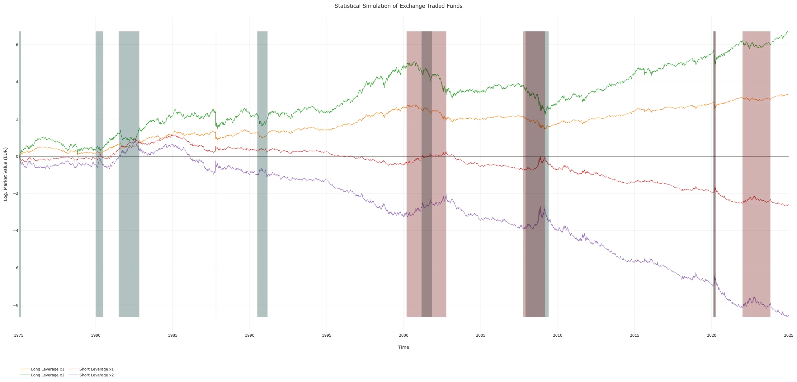

Wie ersichtlich ist, weist der US-Markt – wie ein Großteil der 
Wertpapiermärkte – einen deutlichen Aufwärtstrend auf, der sich positiv 
auf die Entwicklung unserer Long-ETFs (WKN: ETF154 bzw. A0X8ZS) 
ausgewirkt hätte. Jedoch gab es auch stets Marktphasen wie der der Flash
 Crash von 1987 oder der Doppelschlag von Lehman Brothers-Pleite und 
Rezession ab 2007, in denen Short-ETFs (WKN: LYX0UW bzw. ?????) eine 
kurze Blüte erlebten.

In den nächsten Abschnitten sehen wir uns an, wie sich 
Buy-and-Hold-Strategien für die Long- und Short-Seite verhalten hätten 
und welche Phasen vom positiven Markttrend abgewichen wären. Jedoch 
haben wir das kleine Luxusproblem, dass mein Code ein breites Spektrum 
von Metriken (z.B. Anzahl Käufe und Verkäufe, Verteilungsmetriken der 
Renditen, Drawdown-Dezile, etc.) berechnet, deren Interpretation das 
Reddit-Zeichenlimit sprengen würde – entsprechend bemühe ich mich, 
kritische Punkte der gleitenden Fenster und ihrer Ergebnisverteilung 
(True Time Weighted Rate of Return und Maximum Drawdown als Rendite- 
bzw. Risikometrik) durch Boxplots (Spear 1952) zu erläutern; sollte euer
 Interesse anderen Aspekten gelten, findet ihr alle Metriken (z.B. Least
 Partial Moments, o.ä.) und interaktive Grafiken im [Repository](https://github.com/chemicalstats/ChemStats-Archiv).
 
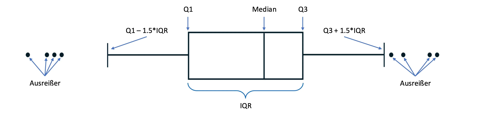

Warum Boxplots? Nunja, einerseits ist es so möglich, die 
Zentralität und Streuung von Verteilung durch eine kleine Anzahl an 
Elementen abzubilden, andererseits ist eine Darstellung relativer 
Aspekte über Horizonte und Parameter in dieser Form deutlich 
verständlicher als es durch viele Streudiagramme der Fall wäre. Beachtet
 bitte ebenso, dass mein Code Kalender- und nicht Handelstage nutzt, 
woraus sich ein kleiner Bias ergibt, da es prinzipiell möglich ist, dass
 ein Handel an Wochenenden oder Feiertagen ausgelöst wird – wie es sich 
gehört, habe ich die Ergebnisse für Handelstage stichprobenartig geprüft
 und dabei lediglich kleinere Abweichungen gefunden, es ist aber 
wichtig, diesen Punkt nochmals anzusprechen.

Sobald wir den Blick auf die Ergebnisse von 
Buy-and-Hold-Strategien für die Long-Seite richten, zeigt sich ein 
klares Muster über die Horizonte gleitender Fenster – unabhängig davon, 
ob es Einmalbeträge oder Sparplanzahlungen gewesen wären, inwieweit wir 
Steuern oder Gebühren beachten und welchen Hebelfaktor wir wählen:
 
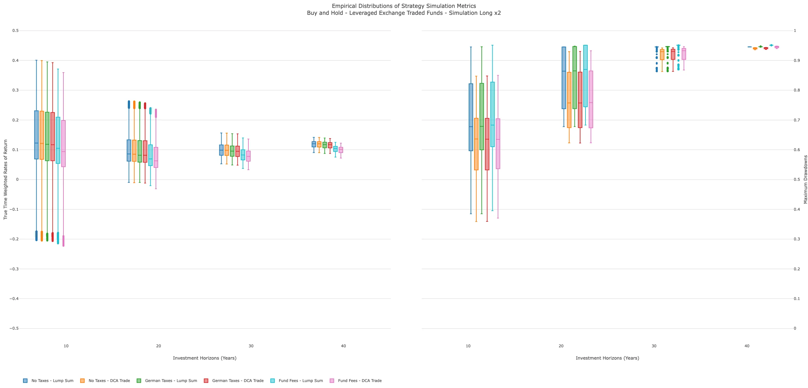
 
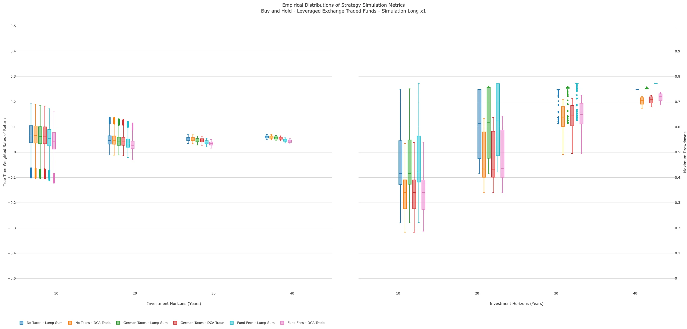

Im Hinblick auf die Rendite ist zunächst ein leichtes Absinken der
 Mediane beim Übergang von 10 Jahre auf 20 Jahre Investitionszeit für 
alle Konstellationen zu bemerken, bevor eine Erholung auf das 
Ausgangsniveau bis 40 Jahre einsetzt. Gleichzeitig reduziert sich die 
Streuung der Renditeverteilung deutlich, was zwei Hauptgründe hat: 
Einerseits ist die Anzahl gleitender Fenster bei 10 Jahren 
Investitionszeit deutlich höher als die anderer Investitionslängen, 
andererseits wirkt sich der Long Bias, insbesondere beim Einsatz von 
Hebeln, umso stärker aus, je länger die Investitionszeiten ausfallen – 
jetzt nichts wirklich bahnbrechendes.

Im Bereich der Maximum Drawdowns sind ähnliche Trends zu 
betrachten: So reduziert sich die Streuung der Risikometrik über die 
Länge der Investitionszeiten für alle Konstellationen, während 
gleichzeitig der Median der Verteilungen stetig steigt – letztlich ist 
es nicht verwunderlich, denn prinzipiell steigt die Wahrscheinlichkeit 
für längere Rezessionen oder größere Crashs mit der Investitionslänge, 
insbesondere bei Buy-and-Hold-Strategien.

Sofern wir jedoch auf die Verteilungen spezieller Konstellationen 
blicken, ergeben sich wichtige Aspekte: Erstens ist der Unterschied von 
Einmalbeträgen und Sparplänen im Hinblick auf alle Investitionslängen, 
Hebelfaktoren und Steuertypen erstaunlich gering – es handelt sich um 
Differenzen auf der 2. bis 4. Dezimalstelle, wovon lediglich 
Wikifolio-Anlagen deutlich abweichen. Zweitens steigt die Differenz von 
Einmalbeträgen und Sparplänen in Bezug auf Maximum Drawdowns beim 
Übergang von 10 Jahre auf 20 Jahre Investitionslänge über alle 
Steuertypen deutlich an – insgesamt sprechen wir über einen Anstieg der 
Differenz von ca. 4% auf 11% p.a. zum Vorteil der Sparpläne durch 
geringeres Risiko für den Heiligen Amumbo, was sich jedoch auf kleinerem
 Niveau auch beim kleineren Bruder findet. Daraus leiten wir ab, dass 
eine Investition über Sparpläne in der Vergangenheit deutliche Vorteile 
gehabt hätte, da bei nahezu identischen Renditen eine deutliche 
Reduktion der Maximum Drawdowns erreicht worden wäre.

Wie sieht das Bild durch Integration von Steuern aus? Sofern wir 
aktuelle Steuergesetze auf unsere Analyse anwenden, wären 
Vorabpauschalen für eine Buy-and-Hold-Strategie angefallen, weshalb es 
nicht verwunderlich ist, dass es einen Negativeffekt bei der Rendite 
gegeben hätte – jedoch wird die Größe des Effekts oft deutlich 
überschätzt. Im Falle eines Einmalbetrags für den Heiligen Amumbo liegt 
eine Differenz der Medianrenditen von 0.43 Prozentpunkten (Keine 
Steuern: 12.26% p.a.; Aktuelle Steuern: 11.83% p.a.) für 10 Jahre 
Investitionslänge vor, im Falle von Sparplänen bei 0.45% (Keine Steuern:
 12.16% p.a.; Aktuelle Steuern: 11.71% p.a.) – bitte beachtet, dass es 
Rundungswerte sind, die realen Differenzen marginal ausfallen und sich 
lediglich auf den Median der Verteilungen beziehen. Sofern wir ein 
Wikifolio für die Anlage simulieren, wird relativ schnell deutlich, dass
 diese Konstellation für Strategien ohne Handel aufgrund der 
Ausgestaltung der Gebühren keinen Sinn gemacht hätte, denn die 
Medianrendite des Heiligen Amumbos wäre um ca. 1 bis 1.25 Prozentpunkte 
in Abhängigkeit der Investitionslänge reduziert worden. Auf niedrigerem 
Niveau finden sich diese Ergebnisse auch für den kleinen Amumbo. Alles 
klar, wie sieht’s auf der Short-Seite aus?
 
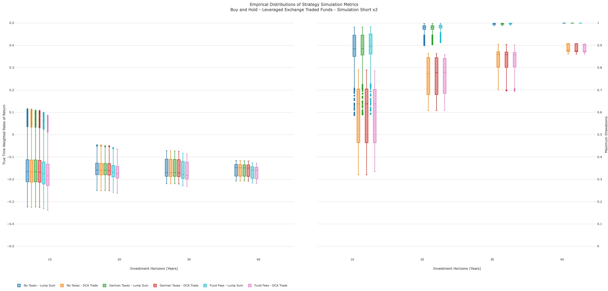
 
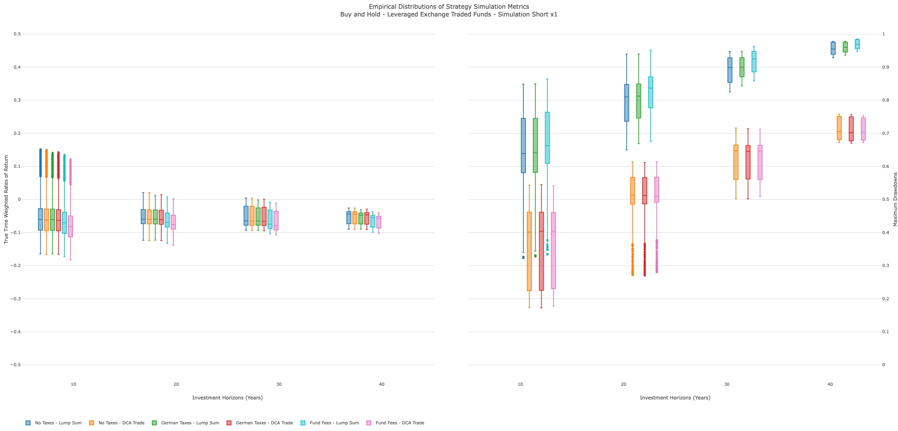

Naja, was habt ihr erwartet? Auf der Short-Seite wirkt sich der 
Long Bias in unerbittlicher Weise aus und hätte Buy-and-Hold-Anleger im 
Hinblick auf die Medianrendite über alle Horizonte zerlegt, wobei es 
jedoch kurze Phasen von 10 Jahren – oder sogar 20 Jahren bei einer 
ungehebelten Anlage – gab, in denen das Halten von Short-ETFs positive 
Renditen eingebracht hätte. Abseits dieser Phasen hätte die 
Medianrendite eines zweifachen Short-ETF bei ca. -15% p.a., eines 
ungehebelter Short-ETF bei ca. -5% p.a. gelegen – naja, war eigentlich 
klar, oder? An dieser Stelle kurz der Hinweis, dass es derzeit keinen 
zweifachen Short-ETF auf den MSCI USA gibt und wir den Dunklen Amumbo 
lediglich als Gegenspieler zum Heiligen Amumbo konstruiert haben.

Im Hinblick auf Rendite und Risiko teilen die Schatten mit ihren 
Lichtbrüdern, dass sich die Streuung über die Investitionslänge 
reduziert und Sparpläne bei ähnlichen Renditen drastische Vorteile beim 
Risiko besitzen – sofern man trotz ansteigender Differenzen der Maximum 
Drawdowns bei Einmalbeträgen und Sparplänen im Kontext negativer 
Renditen von Vorteil sprechen kann. Wie ihr euch sicherlich bereits 
denkt, hätten Steuern im Sinne aktueller Gesetze auf der Short-Seite 
keine größere Rolle gespielt, da lediglich ein kleiner Teil der 10- und 
20-Jahres-Fenster eine Steuerpflicht für positive Renditen erfahren 
hätte – inwieweit Wikifolios durch ihre fixen Basisgebühren eine gute 
Idee gewesen wären, brauche ich sicherlich nicht ausführen, oder? 
Ungünstig.

Naja, so hilfreich wie bunte Histogramme zur Visualisierung von 
Ergebnisverteilungen sind, letztlich gibt es sicherlich viele, die eher 
die *"nackten Zahlen"* bevorzugen, weshalb ich euch die 
Kenntwerte für Rendite und Risiko in Abhängigkeit von Hebelfaktor, 
Investitionsweise und -länge nochmal als Tabellen aufbereitet habe:
 
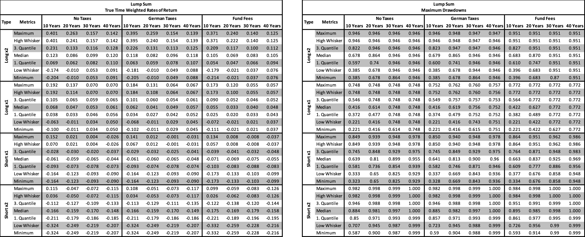
 
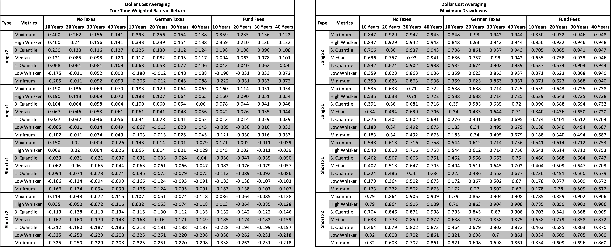

So weit, so gut, jetzt haben wir ein Verständnis davon, wie sich 
Buy-and-Hold für Long- und Short-ETFs geschlagen hätte, aber vielleicht 
gibt es auch ein Interesse daran, wie sich die Strategien relativ zur 
Referenz eines ungehebelten Long-Buy-and-Holds verhalten hätten. Aus 
diesem Grund habe ich gleitende, relative Vergleiche für die Rendite- 
und Risikometriken erzeugt, die 1.) jedes Asset als Einmalanlage im 
Vergleich zu einem ungehebelten Einmalbetrag (linkes Bild), 2.) jedes 
Assets als Sparplan im Vergleich zu einem ungehebelten Einmalbetrag 
(mittiges Bild) und 3.) jedes Assets als Sparplan im Vergleich zu einem 
ungehebelten Sparplan (rechtes Bild) abbilden.

Sofern eine Linie für die Rendite (True Time Weighted Rate of 
Return) über der Nulllinie liegt, hätte das Asset für dieses 
Investitionsfenster eine höhere Rendite als die Referenz erzielt, 
während wir für das Risiko (Maximum Drawdown) ein Ergebnis unter der 
Nulllinie anstreben: Im Grunde zeigen uns die relativen Spaghetti-Plots 
(Anmerkung: Die X-Achse gibt das Startdatum des Zeitraums an), dass sich
 die Stabilität der Anlage mit der Länge der Investitionszeit gesteigert
 hätte und Short-ETFs auf lange Sicht keine stabile Überrendite im 
Vergleich zur Referenz eingebracht hätten. Abgesehen davon zeigt sich 
erneut, dass Sparpläne in der Lage sind Risiken in erheblichem Maße zu 
reduzieren – unabhängig von der Länge der Investition.
 
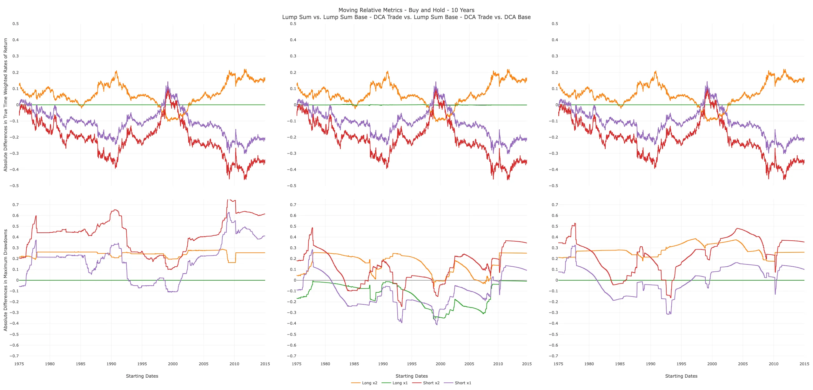
 
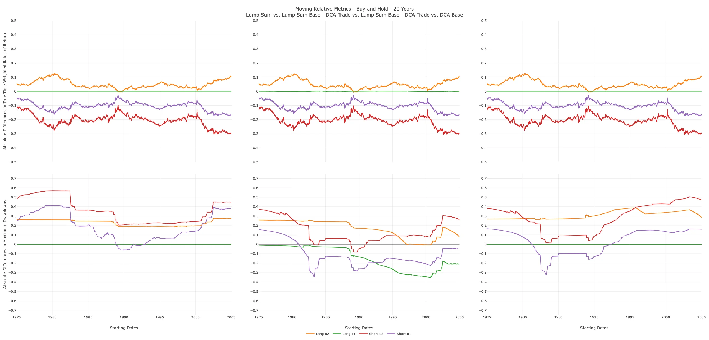
 
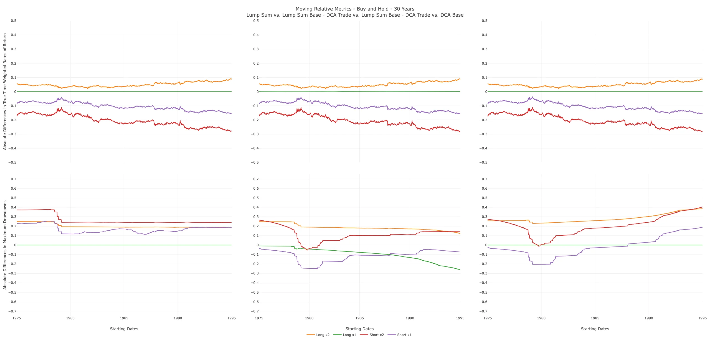
 
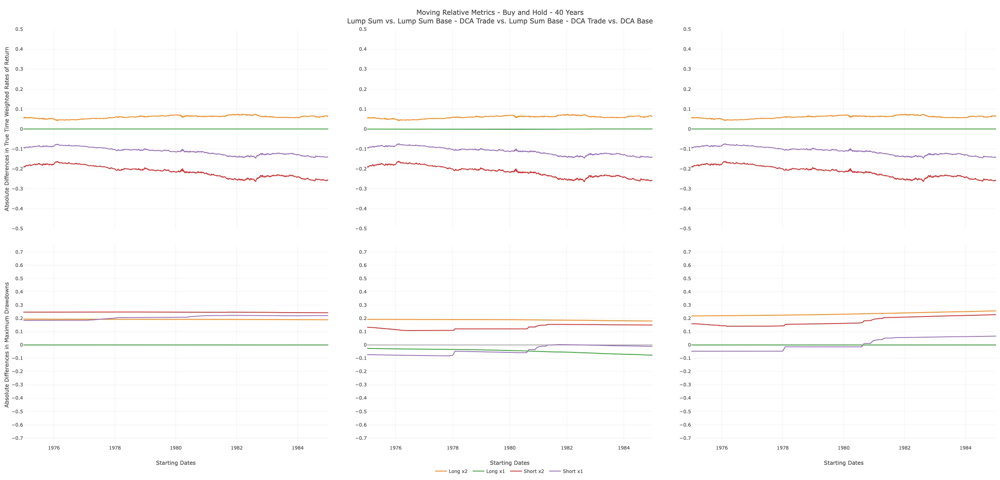

Puh, wir haben es geschafft! Nachdem wir in den letzten Beiträgen 
lange an Materialien gebastelt haben, gab es dieses Mal erneut eine 
Portion Theorie und Abstraktes um die Ohren, wofür ich von Herzen um 
Verzeihung bitten möchte und mich bei jedem bedanke, der sich mein 
Geschreibsel durchgelesen hat! Jedenfalls haben wir nun ein Verständnis 
davon, wie sich unsere Referenzen in der Vergangenheit entwickelt und in
 welchem Ausmaß Steuern und Gebühren auf das Ergebnis eingewirkt hätten.
 Darüber hinaus haben wir jetzt ein Konzept, um eine Überanpassung von 
Strategien frühzeitig zu erkennen, wodurch wir in Zukunft robuste 
Strategien formulieren und evaluieren können. So, und jetzt klapp' ich 
den Bums zu... Wir lesen uns im vierten Teil!

**Literatur und Material**

Carnap, Rudolf (1950): Logical foundations of probability. Chicago: University Press.

Efron, Bradley (1979): Bootstrap methods: Another look at the jackknife. The Annals of Statistics, 7(1): 1–26.

Keynes, John Maynard (1921): A treatise on probability. London: Macmillan.

Kolmogorov, Andrey N. (1940): Wiener spirals and some other 
interesting curves in a Hilbert space. Doklay Akademii Nauk SSSR, 26(2):
 115–118.

Mandelbrot, Benoît B. (1997): Fractals and Scaling in Finance: Discontinuity, Concentration, Risk. New York: Springer.

Metropolis, Nicholas C. & Ulam, Stanislav M. (1949): The monte
 carlo method. Journal of the American Statistical 
Association, 44(247): 335–341.

Neyman, Jerzy & Pearson, Egon (1933): On the problem of the 
most efficient tests of statistical hypotheses. Philosophical 
Transactions of the Royal Society of London. Series A, Containing Papers
 of a Mathematical or Physical Character. 231(702): 289–337.

Pitman, Edwin J. G. (1937): Significance tests which may be 
applied to samples from any population. Supplement to the Journal of the
 Royal Statistical Society, 4(1): 119–130.

Quenouille, Maurice H. (1956): Notes on bias in estimation. Biometrika, 43(3): 353–360.

Spear, Mary E. (1952): Charting Statistics. New York: McGraw-Hill Books.

Tukey, John W. (1958): Bias and confidence in not quite large samples. Annals of Mathematical Statistics 29(2): 614.

[ChemStats Archiv Github Repository Project Amumbo](https://github.com/chemicalstats/ChemStats-Archiv)
