# ChemStats Archiv: Strahlende Bullen, düstere Bären – Principia Amumbo (Teil IV)

Liebe Mitreisende auf der Mauerstrasse, liebe Wegelagerer in den Finanzgassen,

ich freue mich, euch zum vierten und vorletzten Beitrag der Reihe *"Strahlende Bullen, düstere Bären"*
 zu begrüßen! Nach kürzeren Exkursionen in gehebelte Welten wird es mal 
wieder Zeit, in die arkanen Gewölbe des Archivs hinabzusteigen und den 
Blick auf das Wirken des Heiligen Amumbos und seiner Schatten zu 
richten.

In diesem Beitrag widmen wir uns den Grundlagen und Mechanismen 
von Strategien auf Basis gleitender Durchschnitte und sehen uns an, wie 
sie Trends aus dem Rauschen der Märkte lösen und warum sich ihre Stärken
 und Vorteile vor allem über die lange Frist entfalten. Es wird mal 
wieder relativ theoretisch, denn wir basteln uns ein Protomodell, in dem
 gleitende Durchschnitte als Stellvertreter für latente Markt- und 
Regimedynamiken genutzt und funktional in die makro-kognitive Logik von 
Märkten integriert werden können.

Vielleicht hilft es zu verstehen, warum gleitende Durchschnitte 
kurzfristig volatil, langfristig jedoch robust sind und warum viele 
Adaptionen statistisch einen schweren Stand haben, psychologisch 
allerdings hilfreiche Stützen sein können – es ist jedoch ebenso 
wahrscheinlich, dass es völliger Unsinn ist... Sollte es Fragen geben 
oder etwas unklar geblieben sein, zögert bitte nicht, nachzufragen. 
Also, legen wir los...

**ZL;NG**

- Projektziel: Simulation gehebelter Long- und Short-Indizes zur 
Analyse des Heiligen Amumbo und seiner Schatten, den Dunklen Amumben, ab
 1975; Ableitung robuster Strategien.
- Gehebelte Strategien: Simulation von Simple und Exponential Moving
 Average-Strategien für Long- und Short-ETFs auf den MSCI USA im 
Hebelspektrum -2 bis +2 auf Basis realer Amundi-Produkte (WKN: ETF154, 
A0X8ZS, LYX0UW) und der Konzeption des Dunklen Amumbos.
- Theorie & Skizze: Skizzierung eines Protomodells über die 
Wirkung gleitender Durchschnitte bei der Separierung stabiler Trends aus
 Markrauschen; Interaktion von Makro-Effekten und Moving 
Average-Effekten.
- Simulation & Interpretation: Moving Average-Strategien senkten
 Drawdowns und steigerten Renditen; Sparpläne wiesen kleinere Drawdowns 
bei ähnlichen Renditen als Einmalanlagen auf.
- Warnung: Es folgt ein Beitrag, der viele Formeln, lange Textpassagen und viele Grafiken enthält!

**Beiträge der Reihe:** [**Teil I**](https://redd.it/1ite1u2) **–** [**Teil II**](https://redd.it/1iyx0rw) **–** [**Teil III**](https://redd.it/1jvu9gi/) **– Teil IV –** [**Teil V**](https://redd.it/1tw1in2)

**Einleitung**

Auf den ersten Blick wirkt der Einstieg in gehebelte Produkte 
schlicht: Weckt ein Markt oder ein Sektor unser Interesse und hat der 
Broker unseres Vertrauens ein Hebelprodukt in der Auslage, steigen wir 
ein und legen uns in die kognitive Strandliege – was jucken uns 
Rücksetzer, leben wir doch im ewigen Bullenmarkt, oder? Nunja, wie der 
letzte Beitrag zeigte, hätten gehebelte Buy-and-Hold-Anlagen auf der 
Long-Seite zwar hohe Renditen erzielt, jedoch wären vielen Anlegern die 
Drawdowns vermutlich zu hoch ausgefallen – mal ungeachtet der kognitiven
 Untiefen der Short-Seite, die eher als Lektion stoischer 
Leidensfähigkeit als strategische Anlageform taugt. Daher hat sich eine 
Vielzahl aktiver Strategien für gehebelte Anlagen etabliert, deren 
Anspruch darin besteht, Märkte in Auf-, Ab- und Seitwärtsphasen zu 
separieren und lediglich robusten Trends zu folgen, um Rücksetzer 
abzufedern oder sogar zu vermeiden.

In der Praxis aktiver Strategien sind gleitende Metriken zur 
Ermittlung des Marktregimes (z.B. Mean Reversion vs. Mean Divergence) 
wichtige Bausteine, wobei sich gerade Ansätze auf Basis einfacher 
gleitender Durchschnitte (Simple Moving Averages, SMAs) bei 
Privatanlegern großer Beliebtheit erfreuen. Hierbei ist ein Faktor, dass
 sie in ihrer Grundform lediglich einen ungehebelten Basiswert zur 
Signalevaluation und ein Zeitfenster zur Durchschnittsbildung erfordern,
 wodurch sie sich deutlich effizienter umsetzen lassen als ihre 
komplexeren Geschwister oder andere Zentralitätsmaße, die für spezielle 
Strategien zwar vorteilhafter sein können (Zakamulin 2015). Inhaltlich 
gehen sie jedoch über den Rahmen dieses Beitrags hinaus, weshalb wir sie
 uns im letzten Teil der Reihe ansehen werden.

Ähm, hilf' mir mal auf die Sprünge, wie lief' das bei dieser 
SMA-Sache nochmal? Naja, jeden Tag zum Handelsschluss wird der 
Durchschnittswert der ungehebelten Basis (Produktindex) über die letzten
 X Tage berechnet und geprüft, ob der Basiswert über oder unter seinem 
Durchschnittswert liegt (Signalevaluation). Sofern er darüber liegt, 
wird gekauft oder Sparpläne aktiviert, liegt er darunter, wird verkauft 
oder Sparpläne ausgesetzt – natürlich gibt es abhängig vom relevanten 
Markt, von der Liquidität, den Kosten und vom Standort der Investoren 
kleinere Unterschiede, ob die Umsetzung zum Handelsschluss praktikabel 
ist oder erst am folgenden Handelstag erfolgt, jedoch ist die Ableitung 
des Signals auf den täglichen Schlusskurs des Basiswerts fixiert. Wie 
wir sehen werden, ist es weniger kritisch, wann der Handel ausgeführt 
wird; es ist wichtiger, dass die Liquidität im Markt niedrige Spreads 
bietet. Zur Vorbereitung der nächsten Abschnitte zeigt die folgende 
Grafik, wie sich eine Auswahl gleitender Zentralitätsmaße im Vergleich 
zu einem hypothetischen Basiswert verhalten:
 
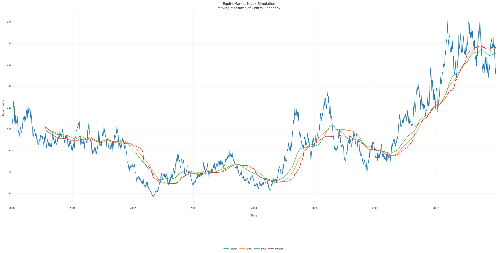

Alles klar, bevor wir uns jedoch in technische Details und 
statistische Analysen stürzen, ist es nötig, eine Sache zu verstehen: 
Jede Strategie auf Basis von Zentralitätsmaßen – unabhängig davon, 
welche gleitende Metrik genutzt wird – ist nicht darauf ausgelegt, eine 
aktive Optimierung von Renditen, sondern eine Reduktion von Drawdowns zu
 erreichen – oder anders ausgedrückt: Wir steigern Renditen indirekt 
durch die Vermeidung extremer Drawdowns und spielen langfristige Effekte
 ruhiger Marktphasen über Jahrzehnte mit Geld, das wir zuvor nicht 
verloren haben, aus. Kurzfristig ist es jedoch wahrscheinlich, kleinere 
Verluste durch Verzögerung bei Trendumbrüchen (Entry-Exit Slippage) oder
 schnellen Abfolgen von Ein- und Ausstiegen (Cost Slippage) zu erleiden.
 Ähm, klingt wie Buy-and-Hold mit Zusatzzahl, da geht' doch was, oder?

Vielleicht kurzfristig, es hängt jedoch davon ab, was man sich 
davon verspricht! Sobald wir von langen Horizonten ausgehen, in denen 
Regeln für das Handeln im Jetzt kurzfristige Verluste erzeugen, um 
langfristige, positive Effekte in der fernen Zukunft wahrscheinlicher zu
 machen, greifen kognitive Prozesse und Impulse, die uns darüber 
nachdenken lassen, ob neue Elemente in die Strategie integriert werden 
sollten, um aktuelle Sachverhalte zu vermeiden oder nutzen – sei es, 
weil der Rücksetzer vor dem letzten Ausstieg für das eigene Wohlbefinden
 zu hoch war, man weniger handeln möchte oder der Einstieg gerade 
volatil wirkt. Aha, heißt es ist Unsinn, was zu ändern, oder?!

Nein, das heißt es absolut nicht, denn in letzter Instanz geht es 
darum, dass eine Strategie als Heuristik für ihren Investor realisierbar
 ist. Statistisch ist es jenseits der Art des gleitenden Durchschnitts 
und der Länge des Zeitfensters äußerst schwierig Adaptionen, die sich 
langfristig, robust und positiv auf Risiko und Rendite auswirken, zu 
finden und zu belegen. Jedoch hilft dieses Wissen wenig, wenn sich 
herausstellt, dass die Risikotragfähigkeit zu hoch eingeschätzt wurde 
und eine Strategie aufgegeben wird, weil dem Investor die Schweißperlen 
auf der Stirn stehen. Sofern eine Adaption als kognitive Stütze (z.B. 
Signalverzögerung über Puffer zur Vermeidung schneller Ein- und 
Ausstiege und Reduktion psychischen Stresses) Investoren überhaupt in 
die Lage versetzt eine Strategie umzusetzen, rücken mögliche Einbußen 
bei langfristigen Renditen in die zweite oder dritte Reihe.

Letztlich sind Strategien persönliches Abwägen in Unsicherheit und
 solange wir beachten, dass Statistik Emotionen ignoriert und Emotionen 
nur selten Generalisierbarkeit besitzen, dürfte sich jeder in diesem 
Spektrum einrichten können. Jedenfalls hoffe ich, dass es mir in den 
nächsten Absätzen gelingt, eine Art Protomodell zur Erklärung der 
Wirkung gleitender Durchschnitte herzuleiten, das vielleicht hilft zu 
verstehen, warum Adaptionen aus statistischer Sicht einen schweren Stand
 haben – allerdings gilt wie in jedem Beitrag, dass ich euch lediglich *meine* Überlegungen schildere, aber *keinerlei*
 Anspruch auf analytische Allgemeingültigkeit erhebe. Alles klar?! Los 
geht's, steigen wir mal in die Details ein und schauen uns danach die 
Simulationen über den Heiligen Amumbo an!

**Vergessliche Glättung und Trends via Rückspiegel**

Eigentlich ist das Konzept gleitender Durchschnitte zur 
Separierung robuster Trends aus komplexen Systemen wirklich alt und 
findet sich bereits in frühen Arbeiten von Adrien-Marie Legendre (1805) 
und Carl Friedrich Gauß (1809), bevor der Begriff von George Udny Yule 
(1909) ins Vokabelheft der Statistik geschrieben wurde. Im Kontext von 
Hebel-Strategien gibt es etliche Beiträge und Artikel, die zeigen, dass 
sich konditionale Erwartungswerte und Varianzen für Renditen unter bzw. 
über gleitenden Durchschnitten unterschiedlich verhalten – oder anders 
ausgedrückt: Es ist relativ gut belegt, dass die Streuung von Renditen 
über einem gleitenden Durchschnittswert tendenziell niedriger ausfällt 
als unter ihm, was insbesondere für gehebelte Produkte durch die 
Phänomene der Volatilitätserosion (Volatility Drag) und Hebeleffekte 
(Leverage Effect) kritisch ist.

Allerdings gibt es kaum Beiträge darüber, wie gleitende 
Durchschnitte funktional wirken und welche Ansätze helfen könnten, um 
ihre Effekte plausibel in latente Marktdynamiken zu integrieren, weshalb
 ich in diesem Beitrag zunächst versuche, diverse Erklärungsansätze in 
einem Protomodell zu vereinen. Vielleicht hilft es, die Statistik von 
SMA-Strategien zu verdeutlichen... Oder es ist Müll, was ebenso 
wahrscheinlich sein dürfte. Jedenfalls stützen wir uns hierfür auf die 
beiden Archetypen gleitender Durchschnitte, den Simple Moving Average 
(SMA) und den Exponential Moving Average (EMA), da letzterer oft als 
effizientere Alternative für volatile Märkte ins Spiel gebracht wird. 
Darüber hinaus hoffe ich zu zeigen, wie sich exotischere Varianten durch
 wenige Formeln mit Simple Moving Average vergleichen lassen:
 
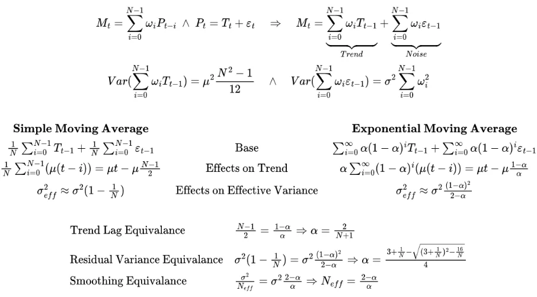

Mathematisch ist ein Großteil der funktionalen Unterschiede beider
 Archetypen direkt aus der Grundformel gleitender Durchschnitte, konkret
 aus der Gewichtung ω, ableitbar. Hierfür gehen wir davon aus, dass wir 
die Zeitreihe eines Basiswerts (z.B. ungehebelter Index) im Sinne des 
Superpositionstheorems (Bernoulli 1733, D’Alembert 1747, Euler 1748) in 
eine Trend- und eine Schwankungskomponente – Trend und Noise – zerlegen 
können. Infolge von Umformungen zeigt sich bei den Effekten auf den 
Trend (Effects on Trend), dass einfache gleitende Durchschnitte durch 
fixe Fenster der Länge N eine harte "Grenze des Vergessens" besitzen 
(Finite Response Filter) und eine Schwankungsunterdrückung von (N-1)/2 
aufweisen – sobald ein Element der Basisreihe aus dem Fenster fällt, hat
 sie keinerlei Einfluss auf beide Komponenten. Im Vergleich dazu ist der
 exponentielle gleitende Durchschnitt zeitkontinuierlicher Natur, was 
daran liegt, dass Elemente der Basisreihe zwar exponentiell abnehmend 
gewichtet, jedoch nie ausgeschlossen werden (Infinite Response Filter). 
Aufgrund der höheren Gewichtung aktueller Elemente reagiert dieser 
Archetyp mit einem Lag von (1-α)/α deutlich schneller, erzielt jedoch 
gleichzeitig eine schwächere Unterdrückung der Schwankung.

Ausgehend von der Gewichtung ω ist es durch Einsetzen möglich, 
Schätzer für die Varianz des Trends und die Varianz der Schwankung zu 
formulieren, um die Effekte gleitender Durchschnitte auf beide 
Komponenten näher zu beleuchten. Wichtiger ist jedoch, dass wir durch 
Gleichsetzung der Verzögerung oder der Effektivvarianz in der Lage sind,
 eine Äquivalenz beliebiger Durchschnitte zu berechnen. Ähm, ist ja 
super, aber warum? Naja, es ist ein nettes Werkzeug, wenn man Strategien
 gleitender Durchschnitte vergleichen möchte – anstelle unzähliger Tests
 sind äquivalente Parameter direkt ableitbar, was zeiteffizient und 
simulationskonservativ ist. Ähm, heißt konkret?

Okay, sagen wir mal, jemand setzt auf eine SMA-Strategie auf Basis
 von 200 Handelstagen und fragt sich, welche Werte für eine 
EMA-Strategie nötig wären, um das gleiche Ausmaß an Glättung zu 
erreichen, dann ließe sich aus den Äquivalenzformeln ableiten, dass ein α
 von 0.01005 für eine analoge Trendverzögerung (Trend Lag Equivalence) 
sorgen, was 198 Handelstage (Smoothing Equivalence) entsprechen würde. 
Aha, das ist wirklich praktisch! Allerdings ist zu beachten, dass jeder 
Aspekt eigene Äquivalenzen aufweist, da z.B. zwei Durchschnittsarten 
dieselbe Residualvarianz (Glätte) besitzen, jedoch unterschiedlich 
Adaptivität für Trends haben. Aber gehen wir mal auf ihre Wirkung und 
Funktionalform ein...

**Average in Space – Lost in Frequency**

In diesem Schritt greifen wir auf Ansätze von Joseph Fourier 
(1822) zur Übertragung von Zeitreihen in den Frequenzraum zurück, um 
funktionale Merkmale gleitender Durchschnitte nochmals aus einer anderen
 Perspektive zu beleuchten. Ähm, was geht wohin? Okay, ich drücke es mal
 so aus: Im Wesentlichen hat Fourier gezeigt, dass jede komplexe 
Schwingung (z.B. Zeitreihen von Preisen oder Indexständen) nur die 
Kombination harmonischer Sinus- und Kosinusschwingungen ist, was durch 
die Arbeiten von Claude Shannon zur Signaltheorie (1948, 1949) in die 
Finanzwelt durchgefräst hat – es geht schlichtweg darum, was gleitende 
Durchschnitte als statistische Filter ausmacht und welches Ausmaß an 
Schwankung durch ihre Parameter geblockt wird. Formal sind beide 
Varianten im Frequenzraum durch folgende Übertragungsfunktionen und 
Grenzfrequenzen gegeben:
 
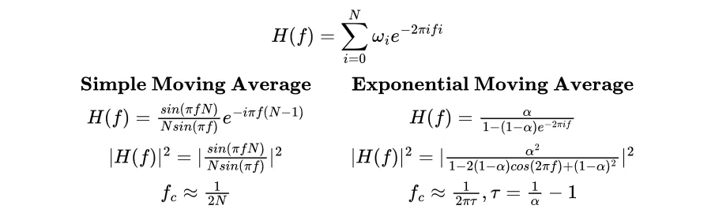

Im Hinblick auf den einfachen gleitenden Durchschnitt liefert eine
 diskrete Fourier-Transformation eine Grenzfrequenz von 1/(2N), was sich
 in eine Phasenverschiebung von N/2 überträgt – oder anders ausgedrückt:
 Einfache gleitende Durchschnitte verzögern Signale um die Hälfte ihrer 
Fensterlänge, wodurch sich die Volatilität der Signalreihe deutlich 
reduziert, da kurzfristige Impulse durch den Lag (N/2) erst effektiv 
wirken, wenn sie aus dem Lag-Bereich fallen; was jedoch Potenzial für 
harte Trendwechsel bietet. Im Vergleich dazu weist der exponentielle 
gleitende Durchschnitt durch seine zwei Parameter eine Grenzfrequenz von
 1/2πτ auf, wobei τ = (1/α)-1 für die unendliche Nicht-Linearität der 
Phasenverschiebung steht. Ähm, ja, ist schön und gut, aber was sagt mir 
das?

Im Wesentlichen hilft es uns zu verstehen, welche Vor- und 
Nachteile durch die Wahl gleitender Durchschnitte für eine Strategie 
bestehen: Während einfache gleitende Durchschnitte in volatilen Märkten 
auf kurze Fenster angewiesen sind, um schnelle Trend- und Regimewechsel 
zu nutzen, ist ein Vorteil, dass Elemente jenseits der "Grenze des 
Vergessens" keinerlei Einfluss auf die Durchschnittsbildung haben, was 
eine klare Identifikation von Trends erlaubt. Im Hinblick auf 
exponentielle gleitende Durchschnitte führt die "weiche Grenze" durch 
die theoretische Unendlichkeit der Elementpersistenz stets zu 
Verzerrungen, was stets die bivariate Optimierung von α und N 
erforderlich macht (z.B. großes N und kleines α für eine starke Glättung
 mit hohem Lag, kleines N und großes α für weniger Lag und geringere 
Glättung) – sofern diese jedoch erfolgt, ist die Adaptivität dieser 
Variante gleitender Durchschnitte selbst auf volatilen Märkten deutlich 
gesteigert, wenn auch hochgradig spezifisch und weniger 
verallgemeinerbar.

Ich hoffe, es ist deutlich geworden, dass es bei der Konzeption 
aktiver Strategien auf Basis gleitender Durchschnitte deutlich komplexer
 zugeht als der starke Fokus auf die Wahl der Periodenlänge vermuten 
lässt – vielmehr geht es darum, die Spielart für ein Asset, einen Markt 
oder ein Segment zu finden, deren funktionale Merkmale den kleinsten 
Bias in die Strategie bringen. Aber es geht weiter, es fehlt noch was...

**Das Rauschen, die Rezession und ein Hauch von Inflation**

Nachdem wir jetzt ein Verständnis davon haben, wie gleitende 
Durchschnitte wirken, bleibt zu überlegen, inwieweit sich ihre Effekte 
(z.B. Separierung von Trends und Regimen) und latente Markt- oder 
Wirtschaftszyklen in einer Art Protomodell vereinen lassen – es würde 
sicherlich helfen, SMA-Strategien in breitere Kontexte zu analysieren, 
aber ob es letztlich brauchbar, analytisch prüfbar oder Material für die
 Resterampe ist, geht über meinen Horizont hinaus, daher würde ich mich 
über Anregung oder Kritik von Makro-Modellierern freuen!

In der Regel gehen wir davon aus, dass Preise auf Finanzmärkten 
die Erwartungen über zukünftige Entwicklungen der Realwirtschaft 
widerspiegeln, was funktionale Interaktionen beider Sphären impliziert. 
Hierzu gibt es zahlreiche Studien, die sich der Beziehung von 
Marktpreisen, Indexständen und Makro-Variablen wie Zinsniveaus, 
Inflation, Rohstoffpreisen oder Handelsbarrieren widmen: So gibt Eugene 
F. Fama (1981) an, dass reale Renditen auf Aktienmärkten und Inflation 
negativ korrelieren, wobei Inflation reaktive Effekte zeigt. Ähnliche 
Resultate finden sich bei Chen et al. (1986) oder Yin-Wong Cheung & 
Lilian K. Ng (1998), deren Analysen negative Effekte auf Aktienrenditen 
durch steigende Zinsen und positive Effekte durch Produktionswachstum 
und sinkende Zinsen ermittelten, wobei die Gleichgewichte der Märkte 
langfristig auf unerwartete Veränderungen der Variablen (Innovations und
 Shocks) reagieren. Statistisch setzen viele Studien multivariate 
Vektor-Fehlerkorrekturmodelle (Engle & Granger 1987; Johansen 1988) 
ein, um langfristige Gleichgewichte von Marktpreisen und fundamentalen 
Faktoren zu schätzen und gleichzeitig kurzfristige Schwankungen durch 
Schocks oder Innovationen abzubilden:
 
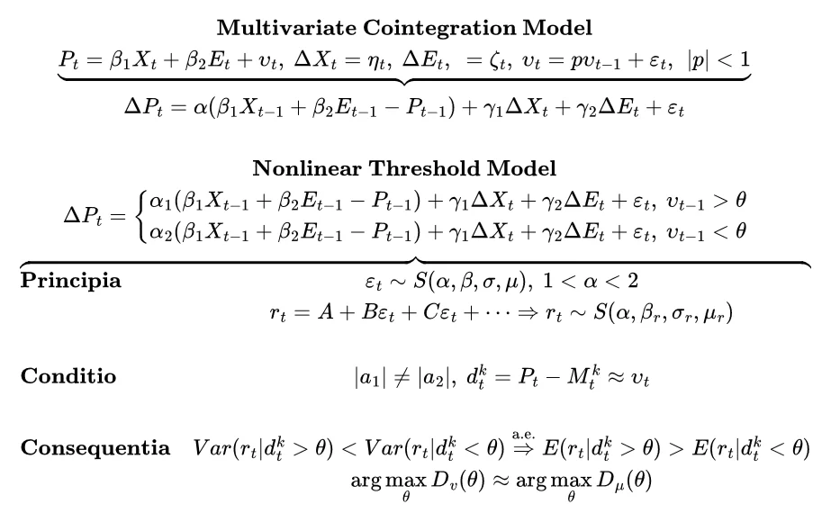

Vermutlich kriegen jetzt Makro-Ökonomen eine Krise, weil ich aus 
Gründen der Verständlichkeit stark vereinfache, aber grob gesagt, gibt 
der α-Term in dieser Art von Modellen an, in welcher Geschwindigkeit und
 Intensität die Rückführung von Preisen oder Indexständen auf ein 
langfristiges Gleichgewicht erfolgt, wobei Makro-Variablen wie 
Wechselkurse und Zinsen (Dornbusch 1976; Engel & West 2005) sowohl 
in die Rücksetzungs- als auch in die Schwankungskomponente (​γ-Terme) 
des Modells eingehen können. Aha, sagst du also, dass es Trends in 
Marktpreisen gibt? Ja, aber es geht mir nicht um die Preise, ich möchte 
auf die Schwankungs- und Störgrößen eingehen. Ähm, warum?

Nunja, selbst bei realer Kointegration und langfristigen 
Gleichgewichten, sind die Renditen auf stabilen und liquiden Märkten 
(Mature Asset Markets) in der Regel nicht normalverteilt (Mandelbrot 
1963, Kolmogorov 1940, Nolan 2020), da sich die Eigenschaften der 
Renditen aus der Art und Weise (Stochastic Inheritance) ergeben, wie 
Märkte kurzfristig auf nicht-lineare Schocks und Innovationen (z.B. 
Asymmetrien und Clusterung von Volatilität) reagieren – insofern geht 
unser Erklärungsmodell von α-stabilen Verteilungen aus, was die 
Lognormal-Verteilung als Sonderfall beinhaltet (siehe Principia). Ähm, 
was heißt das jetzt konkret?

Vielleicht hilft es, sich Märkte – unabhängig von Ländern, Zeiten,
 Assetklassen – wie ein Gummiband vorzustellen: Je weiter es gedehnt 
wird, desto stärker wird die potenzielle Rückführungskraft und 
überschreitet die Spannung einen kritischen Punkt, geht die Rückführung 
über das Gleichgewicht hinaus. Dieses Verhalten spiegelt die empirischen
 Eigenschaften von Finanzzeitreihen wider (z.B. Fat Tails, 
Volatilitätscluster und abrupte Richtungswechsel) – oder anders 
ausgedrückt: In Phasen steigender Preise wird die Zahl der Käufer stetig
 größer (Inward Herding), wodurch die Erwartung auf höhere Preise 
(Momentum) verstärkt wird. Irgendwann wirkt das hohe Preisniveau 
dämpfend und die Erwartung an die Makro-Variablen weicht zu stark vom 
Gleichgewicht ab, was ein Outward Herding auslöst, Anleger verkaufen, 
die Preise fallen und die Zahl der Verkäufer wird stetig größer. 
Ausgehend von einer Interaktion von Makro, Preis und kognitiven 
Prozessen der Anleger, würden nicht-lineare, endogen verstärkte 
Dynamiken (Lux 1998) entstehen (siehe Nonlinear Threshold Model). Soweit
 alles klar? Sehr gut, denn jetzt fügen wir die gleitenden Durchschnitte
 ins Protomodell ein... Und das ist wirklich frickelig!

Alles kar, gehen wir davon aus, dass es zu jedem Zeitpunkt t einen
 latenten Fehler vₜ gibt, der eine Abweichung des Preis- oder 
Indexniveaus von der lokalen Kointegrationsbasis angibt, und es stets 
mindestens einen Grenzwert θ gibt, der eine Preis- oder Indexzeitreihe 
auf Grundlage von Kriterien (z.B. Maximale Mittelwert- bzw. 
Volatilitätsdifferenz) in mindestens zwei distinkte Regime (Tong 1983, 
Granger & Teräsvirta 1993, Enders & Siklos 2001) gliedert. 
Sofern wir davon ausgehen, dass das Optimum von θ in der Nähe des 
Maximums des latenten Gleichgewichtsfehlers vₜ liegt, würden wir 
lediglich einen kausalen Schätzer für die Stärke des Fehlers benötigen, 
um die Regimeklassifikation zu erhalten – allerdings ist mir kein 
plausibler Ansatz über den Weg gelaufen, wie man dies realisieren 
könnte, weshalb ich eine "Krücke" nutze. Retrospektiv gibt es eine 
starke Betragskorrelation von Gleichgewichtsfehler und Differenz des 
Preises zu einer Reihe gleitender Durchschnitte (dₜ = Pₜ - Mₜ), sodass 
wir diese Größe als rein statistischen Proxy-Schätzer für die Dynamik 
des Grenzwertes θ nutzen können (Brock et al. 1992) – es ist wichtig zu 
beachten, dass der Proxy nicht das Gleichgewicht aufzeigt oder den 
Gleichgewichtsfehler ersetzt; vielmehr gibt es für jeden Zeitpunkt eine 
Reihe von gleitenden Durchschnitten, deren lokale Extremwerte in jenen 
Bereichen liegen, in denen θ optimal ist. Aha, klingt wie die Jagd von 
Schatten...

Ja, das trifft's relativ gut! Theoretisch ließe sich nun prüfen, 
ob es stabile Bereiche von Parameterwerten gibt, die lokale Grenzwerte 
für Markt- und Trendregime in adäquater Weise approximieren, indem man 
die Regimeparameter (z.B. Erwartungswert, Varianz, etc.) analysiert 
(siehe Consequentia). Praktisch ist der Mehrwert für die folgenden 
Schritte jedoch relativ begrenzt. Ähm, warum?! Naja, sobald man eine 
Strategie auf Basis gleitender Durchschnitte fährt, ist es wichtig zu 
verstehen, dass konditionale Optima stark zeit- und zustandsabhängig 
sind, da sie als funktionale Derivate der Marktvolatilität bestenfalls 
ex post gefunden werden. Die Stärken der Strategie liegen daher nicht in
 der kurzfristigen Optimierung, sondern darin, dass sich latente 
Regimeparameter über lange Horizonte hinweg stabilisieren und erst bei 
Änderungen der Grundverteilung (z.B. Einführung von Circuit Breakern, 
politische Instabilität des Marktes etc.) signifikant verschieben – 
zumindest würde dies eine plausible Erklärung dafür bieten, warum 
gleitende Durchschnitte auf allen Märkten über lange Horizonte zu einem 
konditionalen Optimum in Abhängigkeit der Marktvolatilität konvergieren,
 während kurzfristig starke Fluktuationen beobachtbar sind. Ferner würde
 es erklären, warum höhere Volatilität in Märkten oder Indizes (z.B. 
zeitvariable Steuer- und Dividendeneffekte in Brutto- und 
Nettodividendenindizes vs. Preisindizes, Währungs- und Zinseffekte, 
o.ä.) mit kleineren SMA-Werten einhergeht.

Puh, das war eine Menge Input und es gibt etliche Aspekte, die 
sich leichter und natürlicher in Form von Bayesian Dynamic Structural 
Equation Models erläutern ließen, aber vielleicht hilft das kleine 
Protomodell zu verstehen, wie sich Strategien auf Basis gleitender 
Durchschnitte verhalten, warum sie auf die kurze Frist in der Regel 
schlecht laufen und warum sie sich ihre Dynamiken von anderen 
Zentralitätsmaßen (z.B. Moving Percentiles, Moving Normals, o.ä.) 
unterscheiden. Allerdings wird es höchste Zeit, einen Blick in die 
Simulation des Heiligen Amubos und seiner Schatten zu werfen...

**Kurzes Hebeln, langes Hebeln oder Goldlöckchens Abenteuer in der Matrix**

Ah, ihr bleibt am Ball!? Hatte kurz Bedenken, dass ich euch zu 
viel Theorie vor den Latz geknallt habe, aber los geht's: In der 
Simulation des Heiligen Amumbos und seiner Schatten nutzen wir die 
ungehebelten Basisindizes in US-Dollar und Euro als Signal für den Ein- 
und Ausstieg, wobei wir ein Spektrum von 10 bis 600 Tagen bei Berechnung
 gleitender Durchschnitte einsetzen:

| Produkt | Name | WKN | Index |
| --- | --- | --- | --- |
|  |
| Long x2 | Amundi Leveraged MSCI USA Daily | A0X8ZS | [MSCI MSCI USA Net Total Return EUR](https://www.investing.com/indices/msci-us-net-eur) (MSCI-Code: 984000; Type: NETR) |
| Long x1 | Amundi MSCI USA | ETF154 | [MSCI MSCI USA Net Total Return USD](https://www.investing.com/indices/msci-us-net-usd) (MSCI-Code: 984000; Type: NETR) |
| Short x1 | Amundi MSCI USA Daily Inverse | LYX0UW | [MSCI MSCI USA Net Total Return USD](https://www.investing.com/indices/msci-us-net-usd) (MSCI-Code: 984000; Type: NETR) |
| Short x2 | ChemStats Leveraged Daily Inverse | – | [MSCI MSCI USA Net Total Return USD](https://www.investing.com/indices/msci-us-net-usd) (MSCI-Code: 984000; Type: NETR) |

Wie ersichtlich wird, nutzen wir lediglich Long-Indizes für das 
Handelssignal, da wir bei der Verwendung von Short-Indizes eine 
Abhängigkeit des Signal von Zinsraten und daraus abgeleitet, eine 
Verzerrung durch höhere Volatilität, in die Analyse einbringen würde, 
was zu komplexeren Wechselwirkungen in der Signaldynamik führen könnte. 
Ansonsten gehen wir von den gleichen Settings wie im letzten Beitrag 
aus. Ähm, heißt jetzt was? Das heißt, dass wir Nominalrenditen 
betrachten, die gemäß aktueller Steuergesetzgebung über 
Kapitalertragssteuer, Verlusttöpfe, Freibeträge, Vorabpauschale und 
Wikifolio-Gebühren besteuert werden. Im Hinblick auf den Handel wird ein
 Spread von 0.5% angesetzt und wir gehen zur Vereinfachung davon aus, 
dass Bruchstücke gehandelt werden können, Steuerzahlungen aus 
Teilverkäufen bedient werden und keine Verzinsung der Geldbestände 
erfolgt.

Insgesamt gehen wir von Einmalanlagen (Lump Sum) und Sparplänen 
(DCA) in drei Szenarien aus, die 1.) keine Steuern (No Taxes), 2.) 
aktuelle Steuern für Privatdepots (German Taxes) und 3.) aktuelle 
Steuern und Gebühren für Wikifolio-Zertifikate in Privatdepots (Fund 
Fees) abbilden, wobei wir gleitende Zeitfenster von 10, 20, 30 und 40 
Jahren zur Berechnung der Verteilungen der True Time Weighted Rates of 
Return und der Maximum Drawdowns als Rendite- bzw. Risikometrik nutzen. 
Leider gibt es harte Grenzen für Grafiken und Zeichen in Beiträgen, 
weshalb ich mich bei der Interpretation und Visualisierung auf Anlagen 
per Sparplan und generell auf Anlagen unter Berücksichtigung aktueller 
Kapitalbesteuerung fokussiere – sofern euer Herz für Einmalanlagen 
schlägt oder ihr Emittentenrisiken im Austausch für kleinere Vorteile 
bei langfristigen Renditen durch Wikifolio-Strukturen eine Chance geben 
wollt, findet ihr die Ergebnisse in den Tabellen und die Grafiken im [Repository](https://github.com/chemicalstats/ChemStats-Archiv). Alles klar, weiter geht's...

Im Hinblick auf die nächsten Abschnitte beachtet bitte, dass es 
sich, sofern nicht explizit angegeben, stets um Kalendar- nicht um 
Handelstage geht. Ähm, wie jetzt? Wie im letzten Beitrag erläutert, 
ergibt sich dies aus der Methodik und hilft bei der Vereinfachung 
einiger Berechnungen, hat jedoch nur einen marginalen Effekt auf die 
Resultate. Soweit so gut, es bleibt zu erwähnen, dass ihr bei der 
Umrechnung den Faktor 252.25/365.25 ≈ 0.69 nutzen könnt, da z.B. ein 
Wert von 300 Kalendertagen grob 207 Handelstagen entspricht. Wie in 
früheren Beiträgen ist es mir wichtig zu betonen, dass wir uns 
Ergebnisse von Simulationen ansehen, die sich auf plausible Verläufe der
 Vergangenheit beziehen, d.h. es ist eine Beschreibung (Deskription) – 
es wird keine Aussage über Wahrscheinlichkeiten von Risiken und Renditen
 getätigt (Inferenz) und absolut keine Vorhersage (Prädiktion) über die 
Superiorität eines Einzelparameters oder Parameterbereichs! Alles klar?!
 Sehr gut, sehen wir uns mal an, was der Simulator ausgespuckt hat...
 
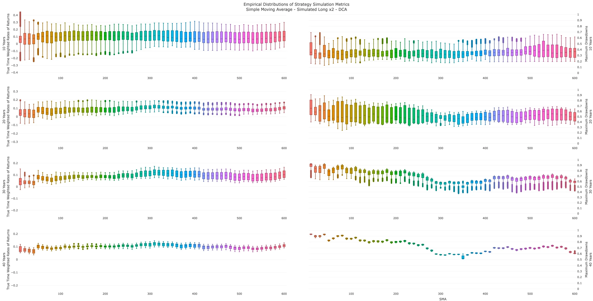
 
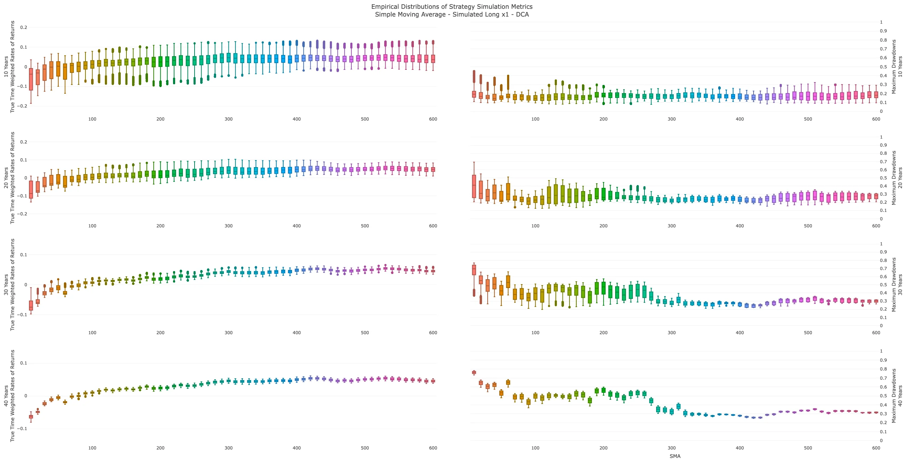

Aus den Grafiken ergibt sich, dass es ein breites Spektrum von 270
 bis 420 Tagen für Sparpläne auf den Heiligen Amumbo gegeben hätte, in 
dem hohe Renditen erzielt worden wären, wobei das Optimum bei 310 Tagen 
(215 Handelstage) gelegen hätte. Aufgrund von Unterschieden bei den 
Basisindizes ist es wenig verwunderlich, dass eine Verschiebung des 
Grundmusters auf ein stabiles Plateau von 400 bis 450 Tagen (Optimum: 
430 Tage bzw. 295 Handelstage) für den kleinen Bruder zu beobachten ist.
 Analoge Divergenzen sind in den Verteilungen der maximalen Drawdowns zu
 bemerken: So wären die niedrigsten Werte für den Heiligen Amumbo im 
Bereich von 310 bis 350 Tagen zu finden gewesen, während der kleine 
Bruder im Spektrum von 360 bis 430 Tagen anzusiedeln gewesen wäre.
 
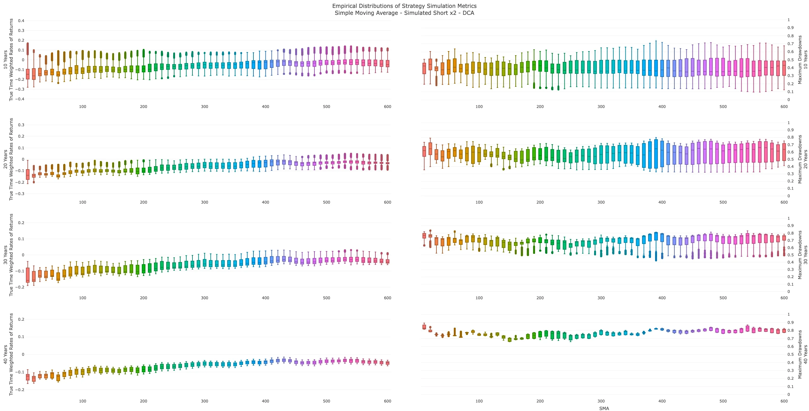
 
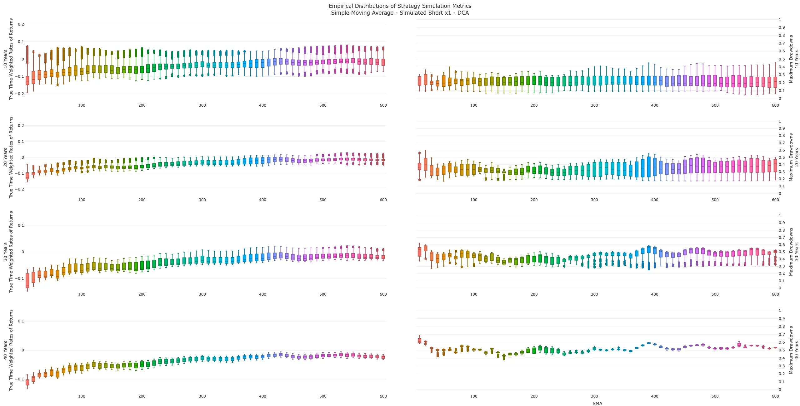

Sofern wir uns daran erinnern, dass der Dunkle Amumbo und sein 
kleiner Bruder auf der gleichen Basis wie der ungehebelte Long-ETF 
simuliert wurden, ist verständlich, warum beide Short-ETFs stabile 
Renditen im Spektrum von 410 bis 450 Tagen (Optimum: 430 Tage bzw. 295 
Handelstage) gezeigt hätten. Es gibt jedoch eine spezielle Dynamik bei 
den Drawdowns, denn es gibt zwar viele lokale Minima, aber kein klares 
Optimum, was als ein Artefakt des stetigen Wettens gegen den Long-Bias 
von Märkten betrachtet werden kann. Insofern gab es auf der Long- und 
Short-Seite des Hebelspektrums deutliche Optima, aber wie hätten sich 
die SMA-Strategien nun geschlagen?

**Effectus Volatilis Vitandus – Vola Ante Portas**

Sagen wir es mal so: Ziemlich gut! Unter Berücksichtigung von 
Steuern, Vorabpauschalen, Gebühren und Spreads hätten die 
Median-Renditen bei Einmalanlagen in den Heiligen Amumbo in Abhängigkeit
 des Investitionshorizonts bei 12.0% bis 13.2% p.a. und folglich 0.4 bis
 3.8 Prozentpunkte über Buy-and-Hold-Anlagen gelegen, während der Effekt
 für Sparpläne schwächer gewesen wäre (Median-Renditen: 11.5% bis 12.6% 
p.a.; Differenzen: -0.2 bis 3.5 pp). Jedoch dreht sich das Verhältnis 
von Anlagearten bei der Analyse der Maximum Drawdowns, da sich 
Einmalanlagen bei 59.5% bis 61.3% bewegt hätten, während Sparpläne im 
Bereich von 32.1% bis 57.9% gelegen hätten - in beiden Fällen sprechen 
wir von Reduktionen um 30 bis 36.5 Prozentpunkten zu 
Buy-and-Hold-Anlagen... Lassen wir das mal wirken!

Ähnliche Effekte sind bei der Analyse des kleinen Bruders auf der 
Long-Seite zu bemerken, denn die Median-Renditen hätten bei 5.1% bis 
5.7% p.a. (Lump Sum) bzw. 4.4% bis 5.4% p.a. (DCA) bei maximalen 
Drawdowns von 26.9% bis 36.0% bzw. 15.5% bis 25.8% gelegen. Während die 
Reduktion der Drawdowns (Lump Sum: 14.7% bis 39.8%; DCA: 18.5% bis 
45.2%) deutlich zu Buche geschlagen hätte, wären positive Effekte auf 
die Median-Renditen des kleinen Bruders mit der Lupe zu suchen gewesen –
 es gibt schlicht keinen Hebel, der geometrische Effekte in Phasen 
geringer Volatilität überproportional nutzen könnte. Aha, wie sieht's 
auf der Short-Seite aus?

Puh, wie gesagt, Shorts sind eher eine Lektion in stoischer 
Leidensfähigkeit als Anlagen, denn selbst eine SMA-Strategie hätte die 
Dunklen Amumben in positive Rendite-Bereiche gebracht – wir sprechen von
 negativen Median-Renditen über alle Horizonte und Anlagearten, was 
heißt, dass wir Shorts eher im Sinne von Bausteinen in 
Portfolio-Konzepten oder Elementen adaptiven Hebelns über 
Breakout-Indikatoren (z.B. Donchian Channels, o.ä) betrachten sollten!

Naja, jetzt habe ich den Fokus lediglich auf Mediane in aktueller 
Besteuerung gelegt, aber die Streuung der Verteilungen, ihre Extreme 
oder Social Trading-Ansätze wie Wikifolios aus Gründen der 
Übersichtlichkeit ausgeblendet, weshalb ich euch hier die vollständigen 
Tabellen der Risiko- und Renditemetriken nachliefere:
 
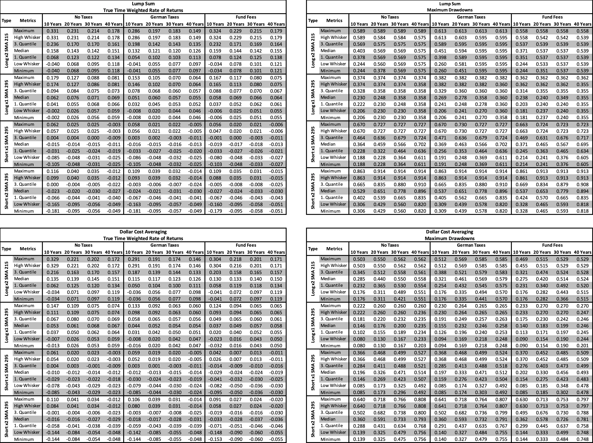

Insgesamt bestätigen die Ergebnisse die Rolle gleitender 
Durchschnitte als Instrumente zur Separation von Volatilitäts- und 
Renditeregimen – nicht als bloße technische Filter, sondern als Spiegel 
der Marktstruktur selbst. Im Vergleich zu Buy-and-Hold hätten 
SMA-Strategien sowohl bei Einmal- als auch bei Sparplananlagen eine 
robuste Balance aus Rendite und Risiko geliefert, wobei der Mehrwert von
 SMA-Strategien in der Vermeidung von Drawdowns, der Generierung 
stabiler Renditepfade und der Disziplinierung des Investitionsprozesses 
liegt. Ähm, einfach die beste Lösung ziehen, ist ja keine Kunst, du hast
 ja selbst gesagt, dass Optima keine Stabilität über die Zeit haben...

**Iudicium Regnat oder Rorschach-Pollock-Sehtest**

Natürlich wäre das keine Kunst und bitte denkt daran, dass in 
diesem Beitrag keine Inferenz oder Prädiktion gezeigt, sondern lediglich
 erläutert wird, wie sich eine Strategie in der hypothetischen, jedoch 
plausiblen Vergangenheit geschlagen hätte. Hierfür stützen wir uns bei 
der Auswahl von SMA-Werten auf die Mediane von Rendite- und 
Risikometriken, sodass wir *konditionale Optima* betrachten – es dürfte klar sein, dass sich daraus Abweichungen zu den *Absolutoptima perfekter Modelle* ergeben müssen. Zur Verdeutlichung habe ich eine Evaluation der SMA-Werte für jedes Long- und Short-Produkt aufgesetzt:
 
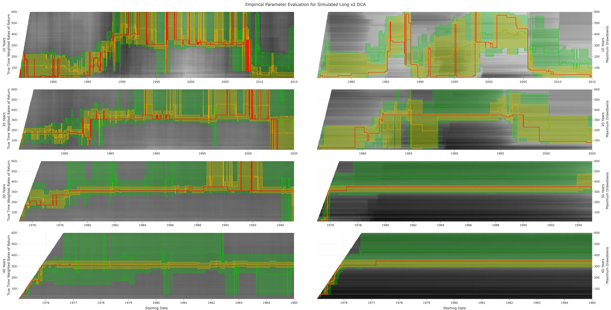
 
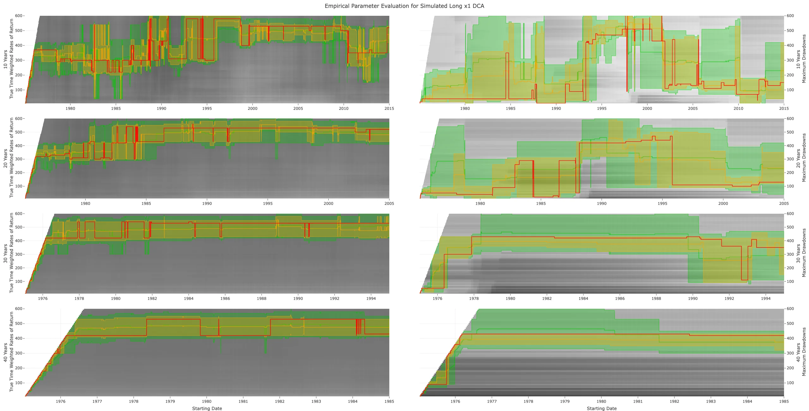
 
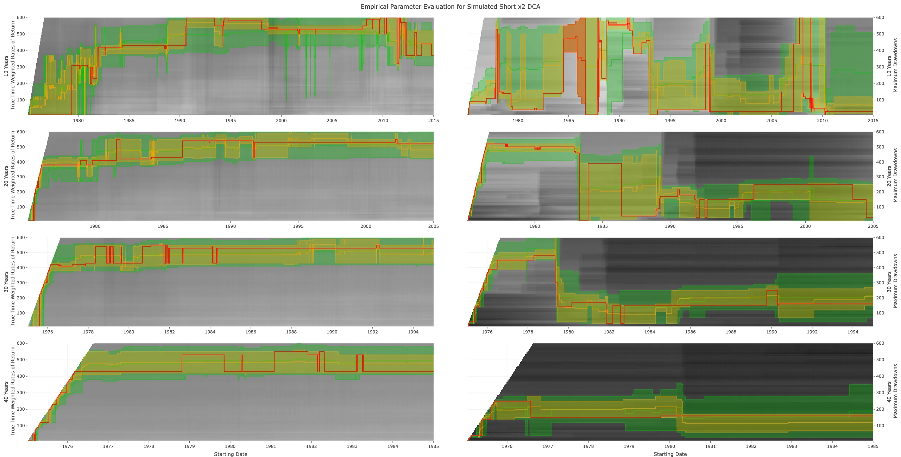
 
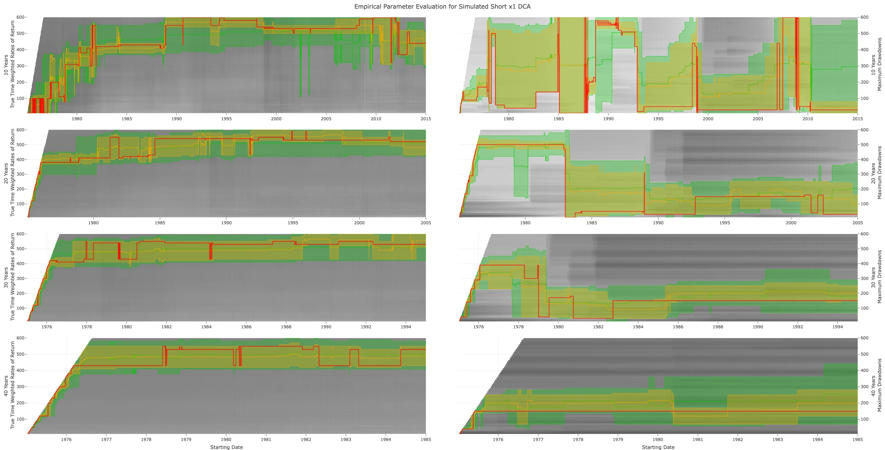

Alter, was geht jetzt? Im Grunde ist es relativ simpel: In den 
Grafiken wird gezeigt, welche SMA-Werte im Verlauf der Zeit zu den 
höchsten Renditen (linke Seite) oder den geringsten Maximum Drawdowns 
(rechte Seite) geführt hätten. Hierbei steht die rote Linie für die 
Optima, die gelbe Fläche zeigt die SMA-Werte im obersten bzw. untersten 
Dezil (10%) an und die grüne Fläche das höchste bzw. niedrigste Quartil 
(25%). Ich hoffe es wird deutlich, dass 1.) die Länge der Investition zu
 einer Stabilisierung des günstigen Wertebereichs führt, 2.) das 
Spektrum des Risikos in der Regel breiter als das Spektrum der Rendite 
ist, und 3.) die Selektion über Mediane stabile Ergebnisse für beide 
Metriken geliefert hätte, jedoch nur in Ausnahmen *Absolutoptima* darstellen. Aha, insofern stabil und effektiv, egal in welcher Richtung...

Puh, wir haben es geschafft und jedem, der diesen Beitrag bis zu 
dieser Stelle durchgelesen hat, schulde ich aufrichtigen Dank – es ist 
ein Privileg, dass ihr mir eure Aufmerksamkeit und Lebenszeit schenkt 
und ich weiß es zu schätzen! Nachdem wir uns mal wieder eine gehörige 
Portion Theorie um die Ohren gehauen haben, lag der Schwerpunkt auf der 
Simulation von SMA-Strategien für den Heiligen Amumbo und seinen 
Schatten. Wie sich zeigte, gibt es für jedes Produkt ein robustes 
Spektrum von Parametern, die deutliche Vorteile im Vergleich zu 
Buy-and-Hold-Anlagen bieten – unabhängig davon, ob es sich um Einmal- 
oder Sparplananlagen handelt. Im letzten Teil der Serie richten wir den 
Blick auf den Einfluss von Wechselkurs- und Zinseffekten auf die 
Renditen des Heiligen Amumbos, gehen auf weitere Metriken (z.B. 
Exponential Moving Averages, Moving Deciles, Moving Normals, o.ä.) als 
Alternative zu SMA-Strategien ein und führen eine Reihe experimenteller 
Bootstrap-Analysen durch, um letztendlich den Schritt von der 
Deskription in die Inferenz zu wagen. So, und jetzt klapp' ich den Bums 
zu, da ich das absolute Zeichenlimit für Reddit-Beiträgen erreicht 
habe... Wir lesen uns im fünften und letzten Teil!

**Literatur und Material**

Bernoulli, Daniel (1733): Tentamen novae theoriae musicae. Basel.

Brock, William; Lakonishok, Josef & LeBaron, Blake (1992): 
Simple Technical Trading Rules and the Stochastic Properties of Stock 
Returns. Journal of Finance, 47(5): 1731–1764.

Chen, Nai-Fu; Roll, Richard & Ross, Stephen A. (1986): 
Economic Forces and the Stock Market. The Journal of Business, 59(3): 
383–403.

Cheung, Yin-Wong & Ng, Lilian K. (1998): International 
evidence on the stock market and aggregate economic activity. Journal of
 Empirical Finance, 5(3): 281–296.

D’Alembert, Jean le Rond (1747): Recherches sur la courbe que 
forme une corde tendue mise en vibration. Histoire de l’Académie royale 
des sciences et belles-lettres de Berlin: 214–219.

Dornbusch, Rudiger (1976): Expectations and Exchange Rate Dynamics. Journal of Political Economy, 84(6): 1161–1176.

Enders, Walter & Siklos, Pierre L. (2001): Cointegration and 
Threshold Adjustment, Journal of Business & Economic Statistics, 
19(2): 166–176.

Engle, Robert F. & Granger, Clive W. J. (1987): Co-Integration
 and Error Correction: Representation, Estimation, and Testing. 
Econometrica, 55(2): 251–276.

Engel, Charles & West, Kenneth D. (2005): Exchange Rates and 
Fundamentals. Journal of Political Economy, 113(3): 485–517.

Euler, Leonhard (1748): Sur la vibration des cordes. Mémoires de l'académie des sciences de Berlin, 4: 69–85.

Fama, Eugene F. (1981): Stock Returns, Real Activity, Inflation, and Money. The American Economic Review, 71(4): 545–565.

Fourier, J. B. Joseph (1822): Théorie analytique de la chaleur. Paris: Firmin Didot.

Gauß, Carl F. (1809): Theoria motus corporum coelestium in sectionibus conicis solem ambientium. Hamburg.

Granger, Clive W. J. & Teräsvirta, Timo (1993): Modelling 
Nonlinear Economic Relationships. Oxford: Oxford University Press.

Johansen, Søren (1988): Statistical Analysis of Cointegration 
Vectors. Journal of Economic Dynamics and Control, 12(2-3): 231–254.

Kolmogorov, Andrey N. (1940): Wiener spirals and some other 
interesting curves in a Hilbert space. Doklay Akademii Nauk SSSR, 26(2):
 115–118.

Legendre, Adrien-Marie (1805): Nouvelles méthodes pour la détermination des orbites des comètes. Paris.

Lux, Thomas (1998): The Socio-Economic Dynamics of Speculative 
Markets: Interacting Agents and Nonlinear Dynamics. Journal of Economic 
Behavior & Organization, 33(2): 143–165.

Mandelbrot, Benoit (1963): The Variation of Certain Speculative Prices. The Journal of Business, 36(4): 394–419.

Nolan, John P. (2020): Univariate Stable Distributions: Models for Heavy-Tailed Data. Cham: Springer.

Shannon, Claude (1948): A Mathematical Theory of Communication. The Bell System Technical Journal, 27(3): 379–423.

Shannon, Claude (1949): Communication in the Presence of Noise. Proceedings of the IRE, 37(1): 10–21.

Tong, Howell (1983): Threshold Models in Nonlinear Time Series Analysis. New York: Springer.

Yule, George Udny (1909): The Applications of the Method of 
Correlation to Social and Economic Statistics. Journal of the Royal 
Statistical Society, 72(4): 721–730.

Zakamulin, Valeriy (2015): A Comprehensive Look at the Empirical Performance of Moving Average Trading Strategies. SSRN.

[ChemStats Archiv Github Repository Project Amumbo](https://github.com/chemicalstats/ChemStats-Archiv)
