# ChemStats Archiv: Strahlende Bullen, düstere Bären – Principia Amumbo (Teil V)

Liebe Mitreisende auf der Mauerstrasse, liebe Wegelagerer in den Finanzgassen,

ich freue mich, euch den fünften und letzten Beitrag der Reihe *"Strahlende Bullen, düstere Bären"*
 vorlegen zu dürfen! Nach langer Abstinenz durch die Welt des Heiligen 
Amumbos und seiner Schatten zu streifen, neuen Wegen zu folgen und 
kleine Nuancen ins große Mosaik einzufügen, war für mich eine 
lehrreiche, wie bittersüße Lektion – es gäbe noch so viele Details zu 
betrachten, doch jede Reise muss ihr Ende finden, um Raum für Neues zu 
schaffen.

Nunja, was erwartet euch? Zunächst greifen wir lose Fäden der 
Reihe auf, Aspekte, die bislang entweder nicht ausgearbeitet wurden oder
 einer Revision bedürfen. Konkret sehen wir uns den Exponential Moving 
Average an, gehen auf die Relevanz von Wechselkurs- und 
Zinsdifferentialen für die Renditen des Heiligen Amumbos ein und setzen 
es in Analysen der SMA-Strategie auf USD-Indizes um. Daran schließen 
sich Moving Deciles- und Moving Normals-Strategien als nicht-lineare 
Alternativen an, die ich in früheren Teilen ausgespart habe – es sind 
Ansätze für spezielle Situationen, die jedoch helfen, die Vorteile von 
Moving Average-Strategien hervorzuheben. Im zweiten Teil setzen wir eine
 Bootstrap-Batterie aus acht nicht-parametrischen und fünf 
parametrischen Verfahren auf, um einerseits das Protomodell für Moving 
Average-Strategien zu verfeinern und andererseits den Schritt von der 
Deskription zur Inferenz zu wagen – vorweg sei verraten, dass die 
Batterie uns nicht vollständig bestätigt, sondern zu einer kleinen 
Aktualisierung zwingt. Auf der Basis einer Reflexion der SMA-Strategie 
schließt die Reihe mit Implikationen für europäische Investoren.

Wie in jedem Beitrag dieser Reihe ist mir wichtig, dass ich euch lediglich *meine* Überlegungen erläutere, aber *keinerlei*
 Anspruch auf analytische Universalität erhebe. Und falls es Fragen 
geben sollte oder etwas unklar geblieben ist, zögert bitte nicht, 
nachzufragen. Also, legen wir ein letztes Mal los...

**ZL;NG**

- Projektziel: Simulation gehebelter Long- und Short-Indizes zur 
Analyse des Heiligen Amumbo und seiner Schatten, den Dunklen Amumben, ab
 1975; Ableitung robuster Strategien.
- Wechselkurs & Signalwahl: Wirkung von Wechselkursen und 
Zinsdifferentialen auf den Heiligen Amumbo; Evaluation des USD-Signals 
für SMA/EMA-Strategien.
- Moving Metrics: Simulation von EMA-Strategien; Evaluation 
nicht-linearer Zentralitätsmaße (Moving Deciles, Moving Normals) als 
alternative Signalquellen; Theoretische Einordnung über 
Frequenzeigenschaften.
- Resampling & Revision: 100.000 Bootstraps in 13 Varianten; 
Nicht-Monotone Pseudo-P-Werte in GARCH-Hierarchie erzwingt Revision von 
SMA-Strategien als Vola-Filter.
- Warnung: Es folgt ein Beitrag, der viele Tabellen, lange Textpassagen und Grafiken enthält!

 

**Beiträge der Reihe:** [**Teil I**](https://redd.it/1ite1u2) **–** [**Teil II**](https://redd.it/1iyx0rw) **–** [**Teil III**](https://redd.it/1jvu9gi) **–** [**Teil IV**](https://redd.it/1q4vda5) **– Teil V**

**Einleitung**

Manchmal steigt man so tief in die Theorie ein, dass wenig bis gar
 kein Platz für die Empirie bleibt – und das war unser Problem im 
vierten Teil, indem wir uns so intensiv der Frage gewidmet haben, was 
gleitende Durchschnitte wie tun und was es für gehebelte Produkte 
bedeutet, dass der Exponential Moving Average (EMA) auf den Dielen des 
analytischen Schneideraums verblieb. Es ist jedoch an der Zeit, dass wir
 das nachholen!

Gerade in volatilen Märkten oder Phasen wird diese Variante 
gleitender Durchschnittsbildung ins Spiel gebracht, da aktuellen Kursen 
höhere Gewichte zugewiesen werden, was eine höhere Adaptivität und 
weniger Signale bewirkt. Anhand eines kleinen Beispiels haben wir im 
letzten Beitrag gesehen, dass die Unterschiede zum SMA durch die 
Interaktion von α und N bei langen Fensterbreiten jedoch äußerst gering 
sind – sofern wir von einer funktionalen Äquivalenz der Glättung 
ausgehen (Smoothing Equivalence: SMA 200 Tage vs. EMA 198 Tage). Daraus 
ließe sich folgern, dass robuste Werte (EUR-Index) für eine 
EMA-Strategie in ähnlichen Bereichen liegen, es jedoch kleinere 
Differenzen bei Lage, Streuung und Extremen geben könnte. Schauen wir 
mal, ob die Hypothese hält...
 
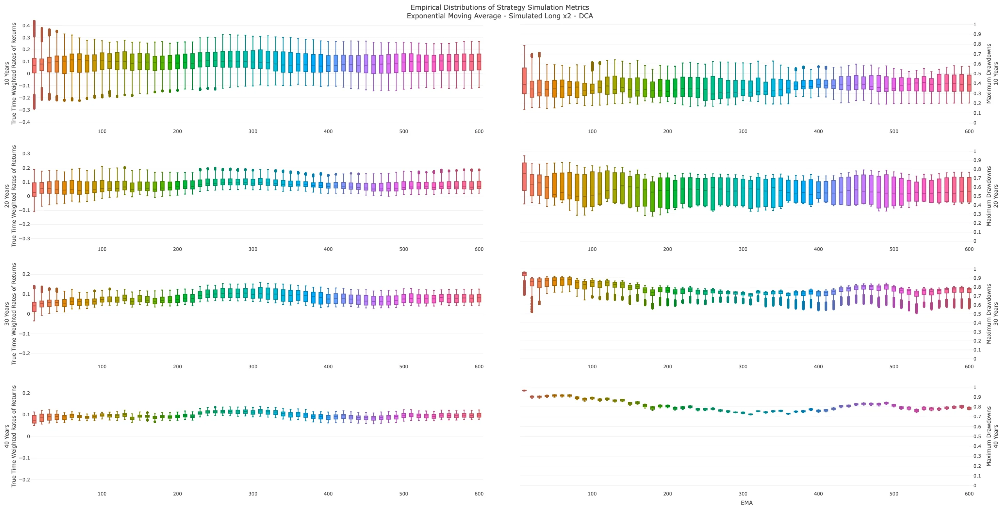
 
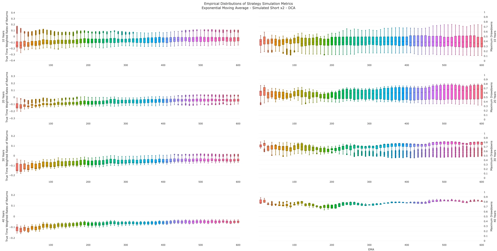

Wie sich zeigt, ist das Spektrum robuster Werte für beide Moving 
Average-Spielarten auf der Long- und der Short-Seite im gleichen Bereich
 zu verorten, wobei wir den Dunklen Amumbo in den folgenden Analysen 
lediglich aus Gründen der Kontrastierung und Vollständigkeit anführen – 
seine Stärke liegt in anderen Sphären, nicht jedoch im Abgreifen 
positiver Erwartungswerte von Aktienrenditen, was ein Produkt- und kein 
Signalproblem ist: Auf der Short-Seite sind Trendvorteil und Drag-Risiko
 im selben Frequenzbereich angesiedelt; kein Tiefpassfilter kriegt sowas
 zerlegt, mathematisch nicht möglich!

Darüber hinaus zeigt sich, dass es – unabhängig von Einmal- oder 
Sparplananlagen – größere Abweichungen in den EMA-Ergebnissen gibt: So 
hätte die Median-Rendite (TTWROR) für EMA-Strategien auf den EUR-Index 
(EMA 215 Handelstage) unter aktueller Besteuerung als Einmalanlage bei 
9.99% bis 11.9% p.a. gelegen, während die SMA-Variante ca. 12.0% bis 
13.2% p.a. geliefert hätte – eine Differenz von knapp zwei 
Prozentpunkten. Auf der Risikoseite fielen die Mediane der Maximum 
Drawdowns bei EMA-Strategien mit 49.9% bis 74.5% deutlich höher aus; 
SMAs lagen im Bereich von 45.1% bis 59.5% – oder anders ausgedrückt: 
Eine Differenz bis zu fünfzehn Prozentpunkte höherer Maximum Drawdowns 
über lange Horizonte bei geringeren Renditen. Es ist wenig 
verwunderlich, dass Sparpläne sich kaum auf dieses Grundmuster auswirken
 (TTWROR: EMA 9.4% bis 11.7% p.a. vs. SMA 11.5% bis 12.6%; Maximum 
Drawdowns: EMA 31.2% bis 72.4% vs. SMA 32.1% bis 57.9%), da ihre Effekte
 die latenten Eigenschaften auf beiden Seiten des Vergleichs nur 
abmildern, jedoch nicht aufheben.
 
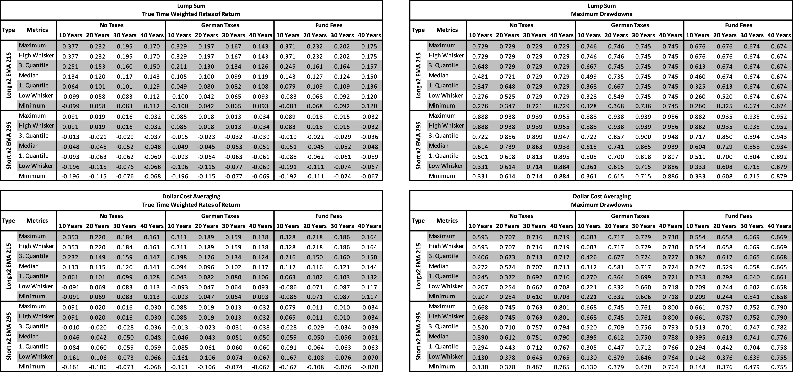

Selbst bei Analyse der Extreme auf der Long-Seite sticht ins Auge,
 dass EMA-Strategien über alle Horizonte schlechter als ihre 
SMA-Pendants gewesen wären. Die vermeintliche Adaptivität des EMA lässt 
sich damit eher als kognitive Stütze einordnen – sie bietet ein Gefühl 
von Reaktionsschnelligkeit, liefert aber bei gehebelten Produkten keinen
 statistischen Vorteil. Alles klar, aber eigentlich war uns längst klar,
 dass die größte Stellschraube des Heiligen Amumbos in einer anderen 
Sphäre zu finden ist, oder?!

**Hebel, Hektik und Haben – Forex per Tempora**

Ähm, hilf' mir mal bitte kurz... Naja, die Spezialität des 
Heiligen Amumbos ergibt sich daraus, dass er den MSCI USA Net Total 
Return Index in Euro-Denomination abbildet, womit er die 
Fremdkapitalleihe über die – zumindest aktuell sehr günstige – Euro 
Short-Term Rate (€STR) abwickelt, dafür jedoch den Schwankungen des 
EUR/USD-Wechselkurses ausgesetzt ist – oder in formalen Termen 
ausgedrückt:
 
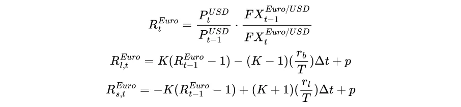

Ähm, und was heißt das jetzt? Nunja, es bedeutet, dass die 
Renditen des Heiligen Amumbos von zwei Kräften geprägt werden, die 
unterschiedliche Zeit- und Wirkhorizonte haben: Auf Ebene täglicher 
Renditen regiert der Wechselkurs, da seine Schwankungen oft bis einem 
Faktor von 100 über der kurzfristigen Wirkung des Zinsdifferential 
liegen – oder anders ausgedrückt: Wenn Hebelkredite über €STR 1.95% p.a.
 und SOFR 3.65% p.a. kosten würden, dann läge der tägliche, negative 
Einfluss auf die Renditen bei 0.00005417 bzw. 0.00010139, was einen 
kontrafaktischen Zinsdifferentialeffekt von 0.4722 Basispunkten bedeuten
 würde (Annahme: 360 Tage gem. MSCI-Modell). Würde der Wechselkurs 
EUR/USA am selben Tag von 1.15 auf 1.13 sinken, wäre dies ein negativer,
 ungehebelter Wechselkurseffekt von 173.91 Basispunkten. Okay, das ist 
deutlich...

Allerdings haben Wechselkurse auf lange Frist eine Tendenz der 
Mean Reversion, was ihre Einflüsse auf die lange Frist abschwächen und 
phasenweise umkehren kann. Im Vergleich dazu sind Zinsdifferentiale 
deutlich stabiler und weisen eine Kointegration zu Aktienkursen auf, 
wodurch sie die langen Horizonte prägen – schauen wir uns die letzten 
zwei Dekaden an, lieferten Euro-Kreditzinsen einen Bonus von ca. zwei 
Prozentpunkten pro Jahr im Vergleich zu ihren US-Pendants. Aha, aber 
kriege ich nicht das Beste aus allen Welten, wenn ich den Heiligen 
Amumbo über den USD-Index in einer SMA-Strategie spiele? Schauen wir uns
 erstmal für Sparpläne (Ergebnisse für Einmalanlagen sind aus 
Platzgründen ins Repository ausgelagert) an, was wir auf diese Weise 
erhalten hätten, bevor wir die Details und Ebenen der Frage angehen...
 
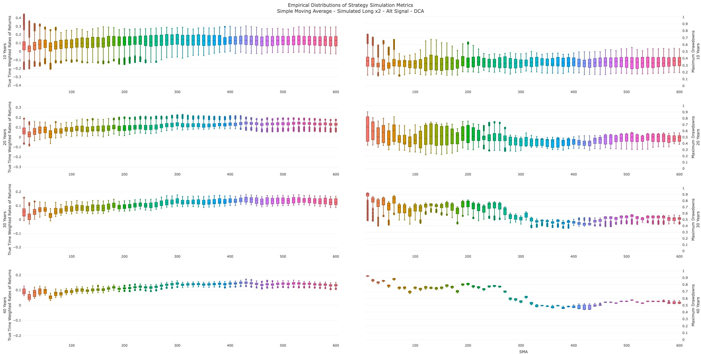
 
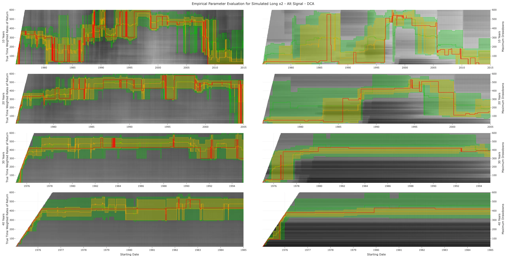

Naja, es wird relativ deutlich, welchen Effekt eine Bereinigung 
des SMA-Signals von Wechselkursvolatilitäten hat – weniger Schwankung, 
ruhigere Filterung, längere Fenster, denn das Spektrum robuster Werte 
für den USD-Index liegt bei 280 bis 310 Handelstagen, während der 
EUR-Index bei 190 bis 215 Handelstagen lag; die große Diskrepanz ergibt 
sich einzig aus dem Hebeleffekt auf den Wechselkurs. Und es ist wenig 
verwunderlich, dass sich dieser Effekt in den Ergebnissen für alle 
Variationen niederschlägt...
 
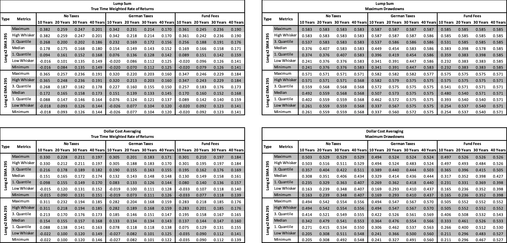

Sofern wir eine SMA-Strategie auf Basis des USD-Signals genutzt 
hätten, wären sowohl für Einmal- als auch bei Sparplananlagen im 
Vergleich zur EUR-Referenz höhere Median-Renditen über alle Horizonte zu
 erwarten gewesen (Lump Sum TTWROR: 14.3% bis 15.4% p.a. USD-SMA vs. 
12.0% bis 13.2% p.a. EUR-SMA; DCA TTWROR: 13.2% bis 14.8% p.a. USD-SMA 
vs. 11.5% bis 12.6% p.a. EUR-SMA) – wir sprechen von einer Differenz von
 knapp zwei bis zweieinhalb Prozentpunkten im Median. Auf der Seite der 
Maximum Drawdowns sieht es ähnlich aus: Die Mediane der 
USD-SMA-Strategien liegen bei Einmalanlagen im Bereich von 44.9% bis 
58.6% (Lump Sum) bzw. 32.9% bis 44.4% (DCA), während EUR-SMA-Strategien 
45.1% bis 59.5% (Lump Sum) und 31.2% bis 57.9% (DCA) aufwiesen. Hierbei 
gibt es eine kleine Asymmetrie für Sparpläne über die Horizonte, denn 
bei kurzen Horizonten von zehn Jahren ist EUR-SMA leicht im Vorteil, auf
 langen Horizonten kehrt sich der Befund durch kumulative Effekte des 
Wechselkurseffekts um. Daraus ergibt sich, dass das USD-Signal im Sinne 
deskriptiver Analysen als struktureller Effizienzgewinn für 
SMA-Strategien betrachtet werden muss. Aha, heißt für uns, USD-Signal?

Puh, das ist mir zu pauschal! Es ist wichtig zu verstehen, dass 
kein Makro-Vorteil über die eigenen Präferenzen erhaben ist - oder 
anders ausgedrückt: Sobald wir bei einer Anlage über kurze Horizonte 
sprechen oder sich der Markt in einer Phase hoher Volatilität befinden, 
steigt die formale oder kognitive Wirkmacht des Wechselkurses. Sofern 
sich dieser ungünstig verhält, ist das Zinsdifferential – zeitlich oder 
psychologisch – nicht in der Lage, dies zu kompensieren. In diesen 
Situationen liefert ein EUR-Signal ruhigere Verläufe im Depot, was die 
kognitive Stressreaktion vermutlich reduzieren dürfte. In jedem Fall ist
 die Wahl des Index-Signals nicht so pauschal und trivial, wie es gerne 
abgetan wird und greifen diese Gedanken bei den Implikationen für 
europäische Investoren nochmals auf, aber zunächst gehen wir mal ins 
Reich der Nicht-Linearität...

**Moving Deciles und Moving Normals - Centralitas Non Linearis**

Eigentlich sind gleitende Durchschnitte nur eine kleine Gruppe von
 Zentralitätsmaßen, deren formale Eigenschaften auf den ersten Blick 
eher schlecht als recht zur Separierung von Trends aus Rauschen taugen –
 gerade in Systemen, deren Verteilungen schwere Enden und phasische 
Zentralitäten aufweisen, wie bei Kapitalmarktrenditen der Fall ist, gibt
 es oft Verweise auf Moving Deciles und Moving Normals. Erstere beruhen 
auf der Rangordnung von Werten in gleitenden Zeitfenstern der Länge N 
und nutzen Perzentile als Signalgrenzwert, wodurch eine Verzerrung durch
 Extremwerte vermieden wird – sofern wir es leicht technisch ausdrücken 
möchten, wird ein L1-Kriterum-Filter (Laplace-Rauschen) statt des 
L2-Filters gleitender Durchschnitte (Gauß-Rauschen) genutzt, was 
theoretische Vorteile bei Verteilungen mit schweren Endregionen bietet.

Im Gegensatz dazu nutzen Moving Normals eine 
Min-Max-Normalisierung für die Werte eines Fensters der Länge N – oder 
anders ausgedrückt: Jeder Wert im Fenster der Länge N relativ zum 
niedrigsten und höchsten Wert auf das Intervall [0,1] transformiert. Der
 Charme liegt darin, dass Moving Normals die lokale Spannweite des 
Fensters als Referenz nutzen, wodurch sie sich implizit an das 
Volatilitätsregime anpassen – ein Feature, das bei SMA-Strategien erst 
durch die Wahl der Periodenlänge indirekt adressiert wird. Klingt wie 
ein Vorteil, ist jedoch bei Long Leverage-ETFs eher problematisch, weil 
die Division durch die Spannweite gerade den Aspekt unterdrückt, den 
Long-Positionen strukturell aufgreifen. In der folgenden Tabelle wird 
eine Übersicht über die formalen Merkmale der gleitenden Ansätze 
gegeben:
 
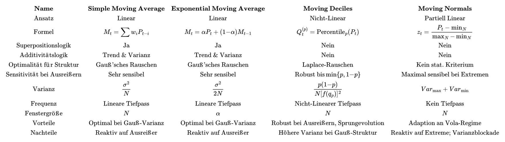

Analog zu den gleitenden Durchschnitten erfolgte die Analyse 
beider Ansätze über Fensterlängen von 10 bis 600 Kalendartagen (Notiz: 
Im Sinne der Verständlichkeit wird in der Interpretation auf Handelstage
 umgerechnet!) in 10-Tage-Schritten, zusätzlich wurden alle Grenzwerte 
des EUR-Index in 0.1er-Schritten pro Fenster berechnet – bitte beachtet,
 dass die Analyse aus technischen Gründen ohne Steueranalyse erfolgte. 
In den Grafiken werden Rendite (True Time Weighted Rates of Return) und 
Risiko (Maximum Drawdown) durch einen Blau-Gelb-Farbgradienten 
visualisiert, wobei dunkle Blautöne für niedrige und helle Gelbtöne für 
hohe Werte stehen:
 
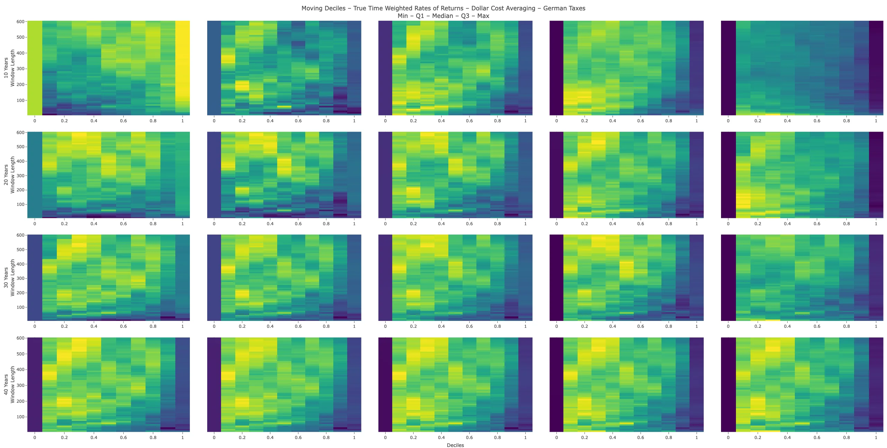
 
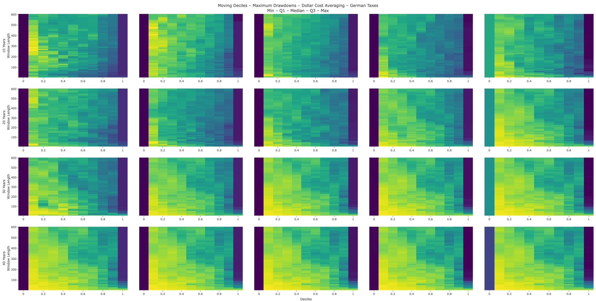
 
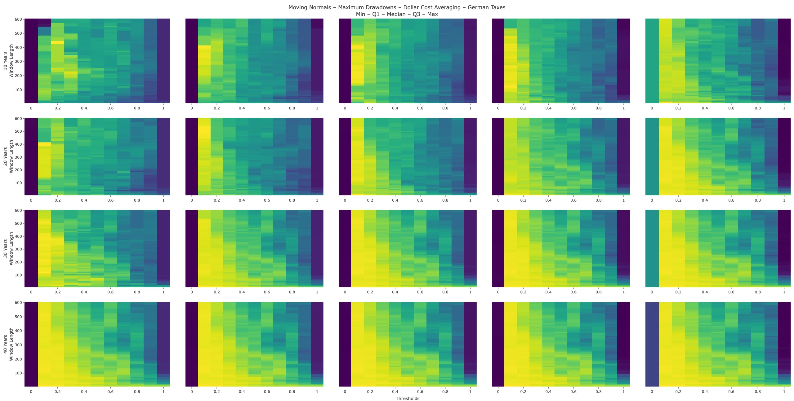
 
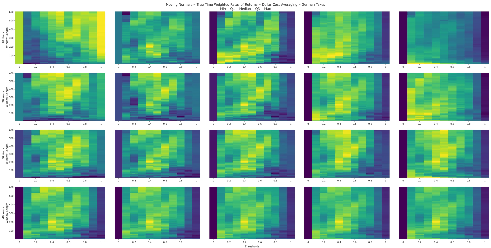

Aha, hübsch, aber was uns das? Konkret ergaben sich für Moving 
Deciles 380 Tage auf dem 1. Dezil und 210 Tage auf dem 2. Dezil als 
robuste Konfigurationen, während Moving Normals bei 380 Tage auf der 
Grenze von 0.6 und 210 Tage auf der Grenze 0.4 robuste Ergebnisse 
lieferten. Auf kurzen DCA-Horizonten waren 380 Tage in Bezug auf Maximum
 Drawdowns leicht im Vorteil, allerdings sind beide nicht-linearen 
Metriken in den Verteilungen deutlich breiter gestreut und in den 
Extremen schwächer, sodass SMA-Ansätze über die volle Bandbreite der 
Horizonte überlegen gewesen wären.
 
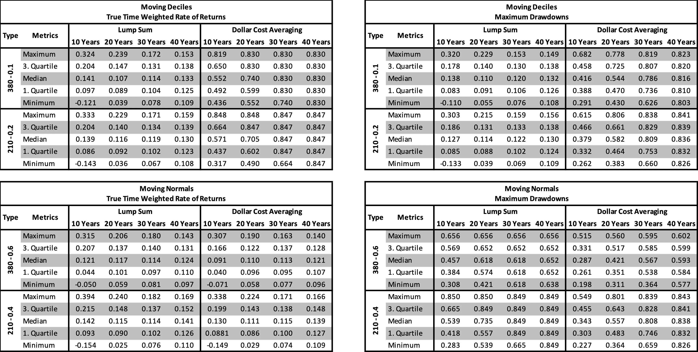

Im Grunde liegt der Mehrwert für uns nicht im rohen Vergleich der 
Kennzahlen, sondern in der trivialen Erkenntnis, dass der Effekt 
gleitender Zentralitätsmaße über ein breites Spektrum von Werten 
losgelöst von der funktionalen Form des Filters funktioniert. Trotzdem 
ergibt sich eine Ordnung der Signale für Long-(L)ETFs: Simple Moving 
Averages vor Moving Deciles vor Moving Normals. Dies ist ein starkes 
Indiz für die These, dass Moving Average-Strategien – unabhängig davon, 
ob es gehebelte oder ungehebelte Produkte betrifft – strukturelle und 
keine parametrische Effekte aufgreifen. Im vorherigen Beitrag hat das 
Protomodell erste Ansätze zur Wirkungsweise von gleitenden 
Zentralmetriken geliefert, aber es fehlt eine Erklärung dafür, dass 
triviale Durchschnitte so viel effizienter als andere Metriken sind. 
Ähm, wie willst du die kriegen? Ist doch jetzt alles getestet worden?! 
Völlig richtig, wir haben getestet wie die Geisteskranken, alle 
Datenpunkte sind verbraucht und vielleicht ist es reiner Zufall 
gewesen... Anschnallen, resamplen!

**Narren des Zufalls, Schüler des Chaos – Per Aspera ad Bootstrap**

Vor langer Zeit habe ich euch das Konzept des Resamplings 
vorgestellt und erläutert, wie sich der Grad an Überanpassung einer 
Strategie durch Ziehung von Zufallsstichproben aus der realen Zeitreihe 
prüfen lässt. In diesem Abschnitt setzen wir es in die Praxis – 
allerdings nicht in der Standard-Variante, denn wir greifen auf eine 
Batterie aus dreizehn Bootstrap-Techniken zurück, die jeweils 100.000 
Pfade erzeugen wird. Naja, vielleicht fragt sich jetzt mancher von euch,
 wozu wir so ein Biest von Analyse aufsetzen – das Zauberwort ist 
Komplementarität!

In jeder Methodik gibt es implizite Vorgaben darüber, welche 
Eigenschaften der realen Zeitreihe erhalten und zerstört werden sollen. 
Dabei gibt es drei Zentralachsen: Temporale Abhängigkeit 
(Autokorrelation, Momentum, Mean Reversion), Volatilitätsstruktur 
(Heteroskedastizität, Clustering) und Tail-Verhalten (Extremereignisse, 
Crashs). Unser Ansatz ist, die Methoden nicht einzeln zu interpretieren,
 wir möchten ihre Diskrepanzen lesen – jede Abweichung gibt uns 
Einsichten in die speziellen Eigenschaften unserer Strategie und hilft 
uns, das Protomodell als Erklärungsansatz zu verfeinern.

| Methode | Literatur | Erhält | Zerstört | Diagnostik | Knockout-Rate |
| --- | --- | --- | --- | --- | --- |
|  |
| Raw | Efron 1979 | Marginale Verteilung | Alles Zeitliche (IID) | Reicht purer Zufall? | – |
| Block | Künsch 1989 | Lokale Autokorrelation | Langfristige Abhängigkeiten | Wie wichtig ist Momentum? | – |
| Stationary | Politis & Romano 1994 | Geometrishe Autokorrelation | Blockgrenzeneffekte | Wie robust sind Blöcke? | 0.1% |
| Wild | Wu 1986, Mammen 1993 | Heteroskedastizität | Vorzeichen-Autokorrelation | Wie wichtig Ist Vola-Clustering? | 0.1% |
| Regime | Hamilton 1989 | Diskrete Vola-Zustände & Markov-Übergänge | Alle Strukturen in den Regimen | Was passiert bei Regime-Wechseln? | 0.1% |
| Reset | – | Beobachtungsgrößen | Trendrichtung | Was passiert bei zufälliger Trendumkehr? | 0.1% |
| EVT | Balkema & de Haan 1974 | Tails via GPD-Extrapolation | Zeitstruktur | Was passiert bei noch schlimmeren Crashs? | 0.1% |
| Tails | Davison & Hinkley 1997 | Empirische Tails | Zeitstruktur | Was passiert bei empirischen Crashs? | 0.1% |
| GARCH | Bollerslev 1986, Pascual et al. 2006 | Symmetrisches Vola-Clustering | Trends | Erklärt Clustering den Effekt? | 0.1% |
| GJR-GARCH | Glosten et al. 1993 | + Asymmetrie (Leverage Effect) | Trends | Erklären Crash-Asymmetrien den Rest? | 0.1% |
| MS-GARCH | Haas et al. 2004, Bauwens et al. (2010) | + Markov-Regime-Wechsel | Trends | Erklären Regime den Rest? | 34.1% |
| MS-AR-GARCH-M | Engle et al. 1987 | + Rendite-Autokorrelation & Risikoprämien | Residuen | Erklären Trends-Drifts den Rest? | 22.1% |
| TVTP-MS-GARCH | Filardo 1994 | + Varianzabhängige Übergangswahrscheinlichkeiten | Residuen | Erklären Übergangsdynamik den Rest? | 16.2% |

Im Grunde ist es relativ simpel, weil die Bootstraps bilden vier 
nicht-parametrische Gruppen: Raw und Wild prüfen die Relevanz der 
Heteroskedastizität; Block und Stationary testen den Effekt von 
Autokorrelationen, denn beide erhalten lokale Autokorrelation über 
Blöcke, wählen die Länge der Blöcke jedoch in anderer Weise (Statisch 
vs. Distributiv); EVT und Tails sind die Kontrolle für Extremereignisse –
 beide knüpfen bei analogen Tail-Anteilen an, aber EVT extrapoliert 
parametrisch über das historische Worst-Case-Szenario hinaus; Regime 
zielt auf globale Zustandwechsel in Markov-Regimen ab und Reset ist der 
adversiale Endgegner – alles wird auf den Kopf gestellt, invertiert, 
zerstört, sodass Welten ohne Struktur entstehen; konkret ist dies Phase 2
 des Analysekonzepts, das ich im dritten Teil vorgestellt habe. Neben 
diesen Ansätzen wird eine Gruppe aus fünf GARCH-Bootstraps eingesetzt, 
die sich in steigender Komplexität realen Marktstrukturen annähern, um 
einzelne Effekte in SMA-Strategien isolieren zu können (Phase 3). Weiter
 geht's...

**Parameter-Grids, ESS-Normalisierung und Knockout-Pfade**

Ähm, was ist das? Alles klar, jede Methode hat Hyperparameter – 
Blocklängen, Tail-Schwellen, Anzahl der Regime – und ein einzelner, 
willkürlich gewählter Wert könnte das Ergebnis verzerren. Daher wird 
jede Analyse über ein Gitter plausibler Werte ausgeführt: Block- und 
Stationary nutzen 37 durchschnittliche Blocklängen von fünf bis 365 
Tagen mit feinerer Auflösung bei kurzen Blöcken; Regime geht von zwei 
bis vier Zuständen aus; EVT und Tails tasten Tail-Segmente von einem bis
 zehn Prozent in halben Prozentpunkten ab; Reset flippt in 
Wahrscheinlichkeiten von einem bis zehn Prozent. Um sicherzustellen, 
dass einzelne Parameter nicht deutlich größere Mengen an Zufallspfaden 
generieren, nutzen wir eine Standardisierung über die Effective Sample 
Size (ESS), ein Maß für die informationseffektive Stichprobengröße einer
 Bootstrap-Stichprobe.

Im Kern gibt die ESS an, wie viele unabhängige Beobachtungen einem
 korrelierten oder gewichteten Sample effektiv entsprechen. Starke 
Abhängigkeiten innerhalb eines Pfades (z.B. lange Blöcke oder hohe 
GARCH-Persistenz) reduzieren die ESS und folglich die statistische 
Informationsmenge. Entsprechend werden Bootstrap-Pfade aus Kombinationen
 mit hoher ESS stärker gewichtet als solche mit niedriger ESS. Auf diese
 Weise wird verhindert, dass einzelne Grid-Punkte mit zufällig günstigen
 Eigenschaften das Gesamtergebnis dominieren – insgesamt wird die 
Bootstrap-Verteilung robuster.

Okay, gehen wir mal auf Knockout-Pfade ein, da sie wirklich 
interessant sind, denn Knockouts entstehen, wenn die Simulation von 
Produkt oder Basisindex im Verlauf der Simulation auf Null fällt oder 
negativ wird. In der Realität haben Produkt-Anbieter etliche 
Möglichkeiten wie Reverse Splits oder Schutzklauseln, jedoch würde es 
für den Investor relativ wenig an der Tatsache ändern, dass ein Extrem- 
oder Totalverlust eingetreten wäre – rien ne va plus. Im Bereich 
nicht-parametrischer Bootstraps ist die Knockout-Rate verschwindend 
gering, was daran liegt, dass Stichproben aus historischen Tagesrenditen
 gezogen werden – es ist nicht möglich, dass sie reale Bandbreiten über-
 oder unterschreiten. Anders sieht es in den parametrischen Ansätzen 
aus, da sie die Erlaubnis haben, das Undenkbare zu simulieren – den 
plötzlichen Sprung in einen Hochvolatilität-Kontext oder das Bleeding 
der Circuit-Breaker durch schwarze Schwäne oder Drachenkönige, die keine
 Halluzination sind, sondern lediglich durch Zufall nicht in der Sequenz
 der realen Zeitreihe aufgetreten sind. Ähm, ist 'ne Menge Holz, aber 
wie sehen die Ergebnisse aus und was hast du getestet?

Okay, sieht auf den ersten Blick komplex aus, ist jedoch relativ 
logisch: In jeder Iteration wird ein Tag oder eine Gruppe an Tagen aus 
der realen Zeitreihe gezogen, um die Korrelation von EUR-Index, 
USD-Index und Wechselkurs zu erhalten – dies wird solange wiederholt bis
 wir eine hypothetische Realität vom 01-01-1977 bis 31-12-2024 erhalten,
 wobei wir die Zeit vor 1977 als Initialisierungspfade der gleitenden 
Durchschnitte benötigen. Auf jeden Bootstrap-Pfad erfolgt die Simulation
 einer Einmal- und einer Sparplananlage für Buy-and-Hold sowie 
SMA-Strategien auf den EUR- und USD-Index (Handelstage: EUR 215 Tage; 
USD 295 Tage) – bitte seht es mir nach, dass ich an dieser Stelle aus 
Gründen der Einfachheit auf eine Steuersimulation verzichtet habe. 
Abschließend wird jede Strategie auf der realen Zeitreihe geschätzt und 
jede Metrik (True Time Weighted Rates of Return, Maximum Drawdown und 
Bivariate Pareto Dominance) ins Verhältnis zur jeweiligen 
Bootstrap-Verteilung gesetzt – oder anders ausgedrückt: Die 
Pseudo-P-Werte liefern den Anteil an Stichproben unter den Annahmen des 
jeweiligen Verfahrens, die besser/schlechter/gleich gut als die 
Realisierung der einzelnen Strategie waren – und nochmal anders 
ausgedrückt, weil der Punkt wichtig ist: Bootstraps sind Vereinfachungen
 der Realität; gebrochene Realitäten, in denen nicht alles so ist, wie 
es war; sie erhalten Eigenschaften, zerstören andere, weshalb sie unter 
keinen Umständen als Prognose gelesen werden dürfen! Schauen wir mal, 
was rausgekommen ist...
 
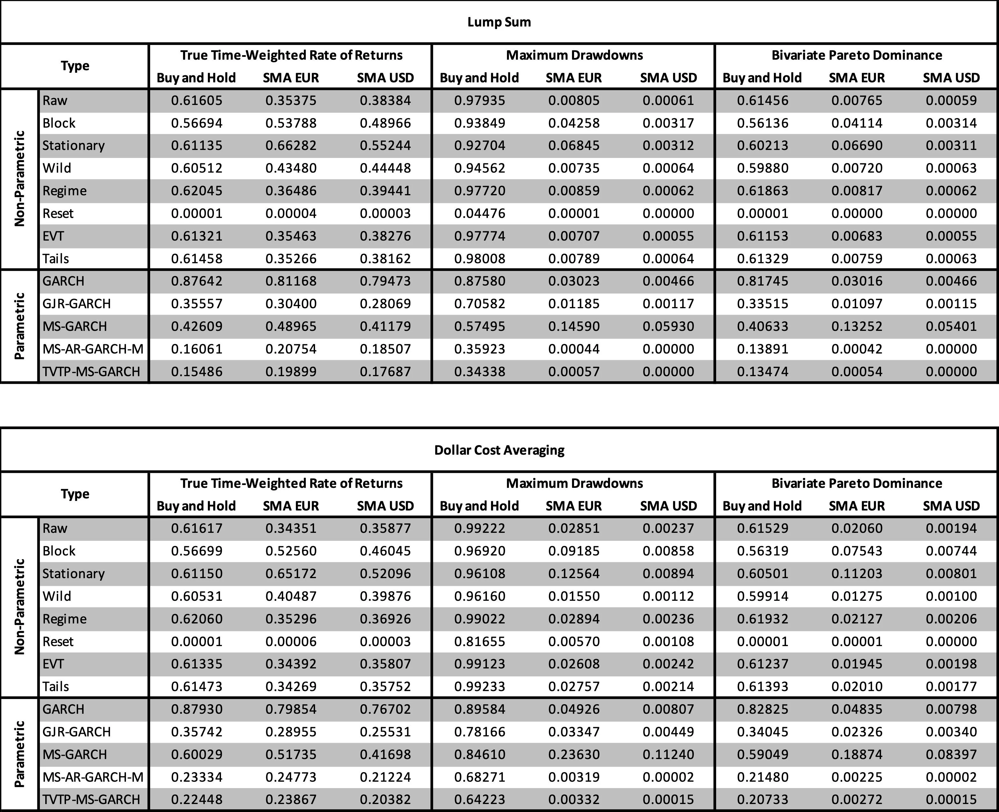

**Ergebnis 1 – Historische Drawdowns für Buy-and-Hold sind Extremereignisse**

Sofern wir den Blick auf die Buy-and-Hold-Spalten richten, wird 
deutlich, dass die Werte bei 0.57 bis 0.67, was heißt, dass die reale 
Rendite des Heiligen Amumbos im Bereich der Mediane der 
nicht-parametrischen Bootstraps liegen – eine typische Realisation. Im 
Kontrast dazu liegen die Werte für Maximum Drawdowns in der gleichen 
Gruppe bei 0.93 bis 0.99, womit 93% bis 99% aller Bootstrap-Szenarien 
kleinere, maximale Drawdowns aufwiesen, sodass die Realität im Bereich 
eines Extremwertes liegt – lassen wir erstmal so wirken...

**Ergebnis 2 – SMA-Strategien waren historisch außergewöhnlich gut**

Im Hinblick auf die SMA-Strategien ergibt sich ein anderes Bild, 
wobei die Variation der Werte für EUR-Signal-Renditen sehr 
aufschlussreich ist: Block (0.54) und Stationary (0.66) erhalten 
Autokorrelation und bieten der Strategie ideale Voraussetzungen – wird 
diese Eigenschaft zerstört (Raw, Wild, Regime, EVT, Tails), liegen die 
Werte bei 0.35 bis 0.43, die Realität schlägt sich also deutlich besser 
als die Simulation. Bei den Maximum Drawdowns ist die Strategie die 
Inverse von Buy-and-Hold: Abseits idealer Umfelder liegen Werte für 
Sparplan- und Einmalanlagen bei höchstens 0.028, was heißt 97+% der 
Bootstrap-Szenarien bei Raw, Regime, EVT und Tails liefern schlechtere 
Ergebnisse als die Realität. Es ist wenig überraschend, dass die 
USD-Signal-Werte durch Wegfall der Wechselkursvolatilität nochmals 
deutlich extremer ausfallen (TTWROR: 0.18 bis 0.55; Maximum Drawdowns: 
0.0006 bis 0.003).

Die bivariate Pareto-Dominanz bestätigt das Bild aus einer anderen
 Perspektive: Bei Buy-and-Hold schlagen knapp 60% aller simulierten 
Pfade die historische Realisation in Rendite und Drawdown gleichzeitig –
 ein ineffizientes Profil. SMA-EUR liegt bei weniger als 7% und SMA-USD 
sogar unter 1% – blicken wir auf die Modelle zur Parametrisierung realer
 Märkte (MS-AR-GARCH-M und TVTP-MS-GARCH) sinkt der Wert auf die 
Detektionsschwelle, was heißt, dass kein einziger Pfad die historische 
USD-Signal-Performance bivariat schlägt.

**Ergebnis 3 – Die Drawdown-Reduktion ist Robustheit in Reinform**

Über alle Methoden, alle Strategien und alle Signalindizes ist die
 Drawdown-Reduktion durch SMA konsistent signifikant – selbst das 
Reset-Setting, das einen Kollaps der Rendite erzeugt, bestätigt dies. 
Ähm, in leichter Sprache, bitte?! Es ist ein wichtiges Resultat für die 
SMA-Strategie, denn sofern jemand das Argument des Overfittings anführen
 möchte, müsste erklärt werden, wie ein einzelner Parameter einen Effekt
 erzeugen kann, der über die Gesamt-Batterie robust bleibt – auch vor 
dem Hintergrund, dass die Parameter aus breiten Plateaus auf 
Median-Niveaus gezogen wurden und keine Grid-Search-Optimierung 
durchlaufen haben. Ähm, in leichter Sprache? Okay, würde der Haupteffekt
 von SMA-Strategien (Reduktion von Maximum Drawdowns) für den Heiligen 
Amumbo auf dem EUR- bzw. dem USD-Signal lediglich per Zufall 
funktionieren, müsste dieser Glücksfall in der Bootstrap-Batterie zu 
Pseudo-P-Werten um 0.5 für die Drawdowns und die Pareto-Dominanz führen –
 jedoch geschieht dies nicht, unabhängig von Signal oder Modellbasis; 
der Effekt ist robust und konditional unvereinbar mit einem 
Zufallsbefund. Soweit, so klar, gehen wir jetzt einen Schritt zurück und
 reflektieren nochmal, dass die SMA-Fenster aus breiten, robusten 
Fenstern gewählt wurden und sich das Grundmuster für etliche Märkte 
reproduzieren ließ, ist die Hürde für ein "Es ist pures 
Overfitting"-Argument wirklich sehr hoch.

**Ergebnis 4 – Die Trendabhängigkeit ist zentral, nicht optional**

Im Reset-Setting wird deutlich, was wir bereits ahnten: Ohne 
jegliche Trendstruktur gibt es keinen SMA-Vorteil in der Rendite und 
eine fehlende Positiv-Tendenz in Märkten bewirkt den Kollaps von 
Buy-and-Hold. Daraus folgt, dass jede Art Moving Average-Strategie 
lediglich funktioniert, weil Märkte Trends aufweisen. Allerdings ist die
 Trend-Abhängigkeit asymmetrisch: Zwar wird die Rendite unter Reset 
vernichtet (0.001), aber bleibt die Drawdown-Kontrolle für 
SMA-Strategien bestehen (0.001). Aha, ja, ist klar... Okay, das heißt, 
dass SMA-Strategien auf zwei, separaten Komponenten beruhen – einen Art 
Rendite-Premium aus Trendfolge und Momentum, das fragil und 
marktkontextuell ist, und eine Drawdown-Absicherung, die selbst unter 
schwierigsten Vorgaben in theoretischen Tests (Randomisierte 
Trendumkehr) robust bleibt. Gehen wir mal weiter...

**Ergebnis 5 – GARCH-Dekomposition klärt das Warum, nicht das Ob**

Naja, uns liegen bereits so viele Einsichten aus den Bootstraps 
vor, aber die formalsten Resultate liefert erst die Gruppe der 
GARCH-Modelle: So steigt der Wert für Maximum Drawdowns für 
SMA-Strategien unter Annahme langsamer, symmetrischer 
Volatilitätsstrukturen – sobald Bootstrap-Pfade realistische 
Volatilitätscluster aufweisen, sinkt der Vorteil der Realität und die 
Pseudo-P-Werte nähern sich dem Median an; das ist keine Widerlegung der 
Wirkweise, sondern ihre Erklärung: Gleitende Durchschnitte filtern 
Volatilität. Geht man jedoch den nächsten Schritt in Richtung realer 
Marktstrukturen und bildet die Asymmetrie von Crashs (GJR-GARCH), sinkt 
der Wert, weil die Crashes auf den Bootstrap-Pfade SMAs stärker treffen –
 oder anders ausgedrückt: Gleitende Durchschnitte wären in Märkten, 
deren alleinige Merkmale Vola-Clusterung und Asymmetrie in Crash-Phasen 
wären, strukturell zu langsam, um schnelle Erholungen effektiv 
auszunutzen.

| Modell | Schritt | P (EUR-SMA) | P (USD-SMA) |
| --- | --- | --- | --- |
|  |
| Baseline | Raw | 0.00805 (LS); 0.02851 (DCA) | 0.00061 (LS); 0.00237 (DCA) |
| + Vola-Clustering | GARCH | 0.03023 (LS); 0.04926 (DCA) | 0.00466 (LS); 0.00807 (DCA) |
| + Asymmetrie | GJR-GARCH | 0.01185 (LS); 0.03347 (DCA) | 0.00117 (LS); 0.00449 (DCA) |
| + Markov-Regime | MS-GARCH | 0.14590 (LS); 0.23630 (DCA) | 0.05930 (LS); 0.11240 (DCA) |
| + Mean-Dynamik | MS-AR-GARCH-M | 0.00044 (LS); 0.00319 (DCA) | 0.00000 (LS); 0.00002 (DCA) |
| + Varianzsprünge | TVTP-MS-GARCH | 0.00057 (LS); 0.00332 (DCA) | 0.00000 (LS); 0.00000 (DCA) |

Sofern die beiden Elemente in ein Markov-Regime-Wechselmodell 
(MS-GARCH) integriert werden, steigt der Wert (0.149) erneut, weil die 
Regime-Drift-Wechsel in den Stichproben existieren, die gleitende 
Durchschnitte auf der Preisebene über die Trendkomponente aufgreifen. 
Jeder Grad an Komplexität über diese Stufe hinaus, führt in den 
Bootstraps zu einer Reduktion der Pseudo-P-Werte, was vermuten lässt, 
dass es jenseits von Autoregressivität von Renditen, regimeabhängigen 
Risikoprämien und varianzabhängigen Übergangswahrscheinlichkeiten noch 
Aspekte realer Märkte gibt, die sie neutralisieren (z.B. Long-Memory 
Effects, o.Ä.). Ähm, warum das? Sollte es keine Kompensation für diese 
Effekte geben, würde es bedeuten, dass die historischen Ergebnisse so 
extrem wären, dass eine Replikation unter der Annahme der 
Modellgültigkeit unmöglich wäre. Joa, wäre nicht so prall...

**Protomodell Revision – Über Mythos und Realität gleitender Durchschnitte**

Okay, was bringt uns der Kram? Im vierten Teil haben wir ein 
Protomodell formuliert, dass erklären soll, wie und warum gleitende 
Durchschnitte für Finanzprodukte funktionieren – es gab drei Schichten, 
die sich diversen Aspekte von einer Makro-Integration von Aktienrenditen
 über nicht-lineare Verstärkung bis zur Rolle von SMAs als Regime-Proxys
 widmete. Unsere Bootstrap-Batterie war ein Versuch, die Grundlagen des 
Modells empirisch zu prüfen und hat gezeigt, dass eine Revision der 
zweiten Schicht nötig ist – aufgrund des nicht-monotonen Verlaufs der 
GARCH-Hierarchie hat sich die frühere Annahme als unrealistisch 
erwiesen. Schauen wir mal, was zu reparieren oder zu präzisieren ist...
 
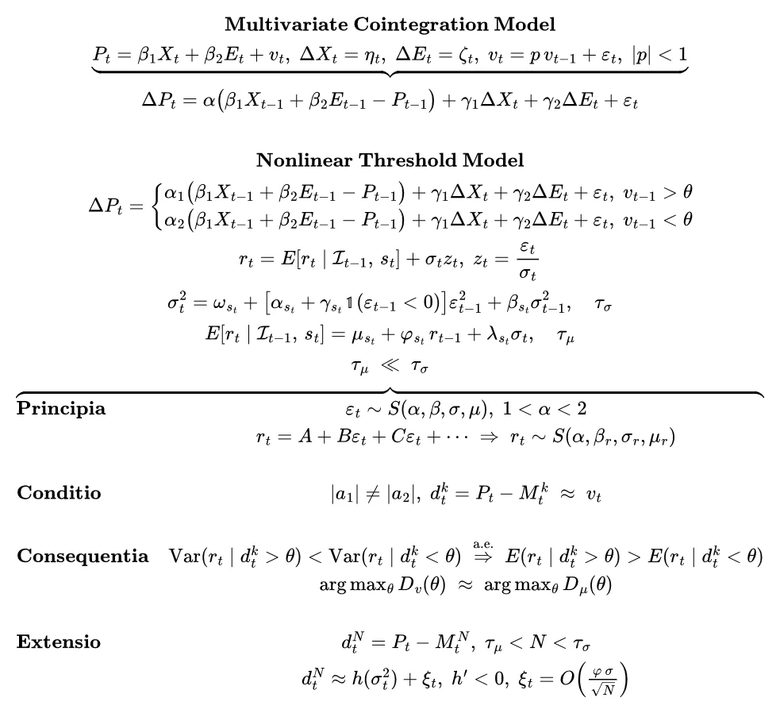

Konkret gibt es die Notwendigkeit, die zweite Schicht des 
Protomodells aufzuspalten, da sich über alle Stufen der GARCH-Hierarchie
 eine Verschiebung der Pseudo-P-Werte in die gleiche Richtung hätte 
zeigen müssen, wenn ihre vorherige Annahme gültig wäre. Jedoch gibt es 
zwei Gruppen Vorzeichenverläufen: Varianzstruktur-Modelle (GARCH, 
MS-GARCH) schieben die Werte in Richtung der Mediane, 
Krisenrealismus-Modelle (GJR-GARCH, MS-AR-GARCH-M) bilden Distanz. 
Daraus ergibt sich eine Aufspaltung in Schicht 2a – die langsame 
Varianz-Komponente (τ(σ) ≈ 50 bis 700 Tage) als Verbündeter gleitender 
Durchschnitte – und Schicht 2b – die schnelle Mean-Komponente (τ(μ) ≈ 15
 bis 50 Tage) als ihr funktionaler Gegenspieler. Sofern wir von der 
Gültigkeit der Bootstraps ausgehen, ergibt sich, dass die 
Strukturbedingung τ(μ) ≪ N ≪ τ(σ) die einzige Option ist, die 
statistischen Muster kohärent zu interpretieren – sie besagt, dass 
robuste SMA-Werte im Zentrum beider Zeitskalen liegen müssen, um den 
Varianzkanal als Signal gewähren zu lassen, aber den schnell 
Mean-Reversion-Kanal zu unterdrücken. Ähm, klar, aber in einfacher 
Sprache, bitte?! Gerne, das heißt, dass gleitende Durchschnitte im 
Wesentlichen Regime-Drift-Filter aus der Klasse der Trendfolger sind, 
die Volatilitätscluster allenfalls als Nebeneffekt aufgreifen. So, 
kehren wir der Theorie jetzt endgültig den Rücken zu und schauen uns an,
 was das alles für jemanden bedeutet, der tatsächlich Geld anlegen 
möchte...

**Quid Agendum? – Lektionen des Amumbos**

Sofern wir aus der Perspektive europäischer Investoren auf die 
Ergebnisse blicken, ergeben sich folgende Aspekte: Unabhängig davon, ob 
man die Annahmen des Protomodells teilt oder nicht, setzen Strategien 
auf Basis gleitender Durchschnitte an den strukturellen Schwachstellen 
gehebelter Produkte an, wobei ihr Mechanismus robust wie trivial ist – 
Ausstieg bei Signalverlust. Solange Krisen zu einer Veränderung latenter
 Volatilität führen, sei es durch algorithmische oder kognitive 
Überreaktion, bleibt ihr Effekt bestehen. Es gibt jedoch Schwächen in 
trendlosen Märkten oder Crash-Asymmetrien, deren Verlauf gerne als Beleg
 für die Fehlerhaftigkeit der Ansätze herangezogen wird – naja, it's not
 a bug, it's the math und letztlich die Prämie, die wir entrichten, um 
in der Mehrzahl der Fälle in den Genuss der Vorteile zu gelangen. Am 
Ende des Tages sind sie jedoch keine Artefakt technischer Analysen, 
keine Esoterik und ihre Wirkung ergibt sich auch nicht aus Überanpassung
 – sie haben eine Theoriebasis, die empirisch geprüft werden kann, und 
ich hoffe zumindest einen Anstoß in diese Richtung gegeben zu haben.

Im Hinblick auf die gezielte Signalwahl gibt es valide Punkte für 
beide Varianten: Während der USD-Index Vorteile durch die Exklusion der 
Wechselkursvolatilität über die lange Frist besitzt, ist er deutlich 
sensitiver für die konkrete Pfadrealisierung – oder anders ausgdrückt: 
alle Varianten der Bootstrap-Batterie stufen die historischen 
USD-Ergebnisse als deutlich extremer als die EUR-Ergebnisse ein. Auch 
zeigen die Analysen, dass Investoren mit langen Horizonten über 20 
Jahren, bisher einen höheren Effektivnutzen vom USD-Index erhielten – 
dabei werden selbst die leicht höheren historischen Drawdowns 
kompensiert. Über kürzere Zeiträume oder kognitivem Stress durch 
Wechselkursschwankungen bietet das EUR-Signal eine ruhigere Alternative,
 was deutliche Vorteile für Phasen birgt, in denen das Sequenzrisiko von
 Renditen höher Relevanz erlangt (z.B. Entsparphase, Gleitpfade, etc.).

Vor allem ist es jedoch wichtig zu verstehen, dass Strategien auf 
Basis gleitender Durchschnitte – unabhängig davon, ob SMA, EMA oder 
andere Ansätze – keine Rendite-Maschinen sind, sondern 
Verlust-Versicherungen für strukturelle Schwächen gehebelter Produkte! 
Ich hoffe, es ist trotz der methodischen Komplexität deutlich geworden, 
dass unsere Zeitlinie für den Heiligen Amumbo extrem gewesen wäre und 
war – etliche Crashes und Risiken sind nicht eingetreten, viele 
Makro-Umstände waren sehr günstig. Inwieweit es sich in der Zukunft so 
verhält, weiß niemand, aber kleine Abschläge auf Rendite (1 bis 2 pp 
p.a.) und Maximum Drawdowns (5 bis 10 pp) helfen, die Erwartungshaltung 
und das Nervenkostüm robsuter zu machen – und würden sich deutlich 
realistischer ins Resampling einfügen. Ist vielleicht eine Überlegung 
wert...

**Servus Amumbo - In Fine Initium**

Puh, und jetzt ist es soweit... Ich bedanke mich bei jedem, der 
diese Reihe bis zu diesen Zeilen gelesen hat – es ist ein Privileg, dass
 ihr mir eure Aufmerksamkeit und Lebenszeit geschenkt habt und ich weiß 
es zu schätzen, dass ihr euch in die Untiefen der Statistik begeben 
habt!

Zwar gibt es noch so viele Aspekte des Heiligen Amumbos zu 
beleuchten, offene Punkte auf meiner Liste wie Flexi-Strategien, 
Breakouts im Long- und Short-Segment und weitere Spielereien, aber es 
ist an der Zeit neue Kapitel aufzuschlagen. Vielleicht habt ihr ja dem 
Geschreibsel was abgewinnen können, sei es die Mechanik gehebelter 
Indizes, Ideen für eigene Analysen oder Spaß an langen Sätzen aus kruden
 Wörtern – es würde mich freuen... Servus Amumbo!

**Literatur und Material**

Balkema, August A. & de Haan, Luca (1974): Residual Life Time at Great Age. Annals of Probability, 2(5): 792–804.

Bauwens, Luc; Preminger, Arie & Rombouts, Jeroen V. K. (2010):
 Theory and Inference for a Markov Switching GARCH Model. Econometrics 
Journal, 13(2): 218–244.

Bollerslev, Tim (1986): Generalized Autoregressive Conditional 
Heteroskedasticity. Journal of Econometrics, 31(3): 307–327.

Davison, Anthony C. & Hinkley, David V. (1997): Bootstrap Methods and their Application. Cambridge: University Press.

Efron, Bradley (1979): Bootstrap Methods: Another Look at the Jackknife. Annals of Statistics, 7(1): 1–26.

Engle, Robert F.; Lilien, David M. & Robins, Russell P. 
(1987): Estimating Time Varying Risk Premia: The ARCH-M Model. 
Econometrica, 55(2): 391–407.

Filardo, Andrew J. (1994): Business-Cycle Phases and Their 
Transitional Dynamics. Journal of Business & Economic Statistics, 
12(1): 1–10.

Glosten, Lawrence R.; Jagannathan, Ravi & Runkle, David E. 
(1993): On the Relation Between Expected Value and Volatility. Journal 
of Finance, 48(5): 1779–1801.

Haas, Markus; Mittnik, Stefan & Paolella, Marc S. (2004): A 
New Approach to Markov-Switching GARCH Models. Journal of Financial 
Econometrics, 2(4): 493–530.

Hamilton, James D. (1989): A New Approach to the Economic Analysis
 of Nonstationary Time Series. Econometrica, 57(2): 357–384.

Hansen, Peter R. (2005): A Test for Superior Predictive Ability. 
Journal of Business & Economic Statistics, 23(4): 365–380.

Künsch, Hans R. (1989): The Jackknife and the Bootstrap for 
General Stationary Observations. Annals of Statistics, 17(3): 1217–1241.

Mammen, Enno (1993): Bootstrap and Wild Bootstrap for High 
Dimensional Linear Models. Annals of Statistics, 21(1): 255–285.

Pascual, Lorenzo; Romo, Juan & Ruiz, Esther (2006): Bootstrap 
Prediction for Returns and Volatilities in GARCH Models. Computational 
Statistics & Data Analysis, 50(9): 2293–2312.

Politis, Dimitris N. & Romano, Joseph P. (1994): The 
Stationary Bootstrap. Journal of the American Statistical Association, 
89(428): 1303–1313.

Wu, Chien-Fu Jeff (1986): Jackknife, Bootstrap and Other 
Resampling Methods in Regression Analysis. Annals of Statistics, 14(4): 
1261–1295.

[ChemStats Archiv Github Repository Project Amumbo](https://github.com/chemicalstats/ChemStats-Archiv)
