# ChemStats Archiv: Eine kleine Reise in gehebelte Welten - Vectis Mundi (Teil I)

Liebe Mitreisende auf der Mauerstrasse, liebe Wegelagerer in den Finanzgassen,

leider gab es eine kleine Pause meiner Reisen durch die Welt des 
Heiligen Amumbos, jedoch hat die Kunde über das Erscheinen des Seligen 
Amumbos für Aufruhr im Rauschen der Märkte gesorgt, weshalb ich mich in 
die Untiefen meiner Archive begab, um arkanen Code zu bergen... 
Ursprünglich war geplant, lediglich einen kurzen Blick darauf zu werfen,
 aber irgendwie führte eine Zeile zur nächsten Funktion und plötzlich 
gab es wieder so viel Material, dass ich es ungern in der Cloud 
verstauben lassen möchte. Insofern begrüße ich euch zu einem kleinen 
Abstecher in die gehebelten Welten!

In dieser Reihe schaue ich mir gehebelte Weltportfolios an, wobei 
der Fokus auf dem Seligen Amumbo, der eine gehebelte Variante des MSCI 
World (ISIN: FR0014010HV4, WKN: ETF888) abbildet, liegen wird. Derzeit 
bemühe ich mich um Zugriff auf speziellere Daten für Regional-Indizes, 
aber selbst wenn dies scheitern sollte, würde ich in späteren Beiträgen 
die Potenziale von Multi-Produkt-Portfolios ansehen – einerseits gab es 
ja mal gehebelte Produkte auf den MSCI Europe (WKN: A0X8ZT) und MSCI 
Emerging Markets (WKN: ETF128), andererseits wirkt die Amundi S.A. nicht
 gänzlich abgeneigt die Palette auszuweiten. Mal sehen, was wird...

Vorweg eine kleine Warnung: In diesem Beitrag wird sehr viel 
Material aus meiner Hauptreihe wiederholt, weil ich in den letzten 
Wochen deutlich zu viel Zeit für die Erklärung methodischer Aspekte 
verwenden musste als mir lieb ist – wer bereits das *Vergnügen* hatte, möge bitte direkt in die letzten Sektionen (*Kaufen, Halten, Beten, Handeln* und *Gleitende Wellenreiter*)
 springen, in denen die Ergebnisse präsentiert werden! Falls es jedoch 
Fragen geben sollte oder etwas unklar geblieben ist, zögert bitte nicht 
nachzufragen. Also, legen wir los...

**ZL;NG**

- Projektziel: Simulation des Seligen Amumbos (Index: 2x MSCI World 
Net Total Return USD; WKN: FR0014010HV4) und gehebelter Weltportfolios 
aus Basis von MSCI-Regionen-Indizes von 01-01-1975 bis 31-08-2025.
- Indizes & Modelle: Entwicklung eines Vorgehens zur 
Rückrechnung von Preis-, Brutto- und Nettodividendenindizes in US-Dollar
 und Euro unter Einbezug historischer Datenquellen für Zinsen und 
Indizes.
- Pro Buy-and-Hold: Der Selige Amumbo hätte ungehebelte Produkte auf
 den MSCI World geschlagen (+1.8 bis +2.8 pp p.a. Medianrendite); 
allerdings mit höherer Schwankung durch Einstiegseffekte.
- Contra Buy-and-Hold: Deutlich härtere Drawdowns im Vergleich zur 
Referenz (Gehebelt: 56% bis 88%, Ungehebelt: 29% bis 62%); Sparpläne 
helfen gegenüber Einmalanlagen, führen aber trotzdem zu höheren 
Drawdowns als Sparpläne beim ungehebelten Pendant (Worst Cases: 62% vs. 
34%).
- Alternative Moving Averages: Kleiner Rendite-Schub (Vergleich 
gehebeltes Buy-and-Hold: +2 bis +4 pp p.a. Medianrenditen), aber Stärke 
der Drawdowns (Vergleich gehebeltes Buy-and-Hold: bis zu 40 pp; 
Ungehebeltes Buy-and-Hold: 7 bis 19 pp) in der robusten Zone um 255 
Handelstage – guter Kompromiss aus Rendite und Risiko.

**Beiträge der Reihe: Teil I –** [**Teil II**](https://www.reddit.com/r/mauerstrassenwetten/comments/1o21g35/chemstats_archiv_eine_kleine_reise_in_gehebelte/)

**Einleitung**

In diesem Beitrag erkläre ich euch, 1.) welche Ansätze und Daten 
ich für die Simulation der Preis-, Brutto- und 
Nettodividendenrendite-Varianten des MSCI World-Index ab Januar 1975 
eingesetzt habe, 2.) wie gehebelte Produkte aus diesen Indexzeitreihen 
abgeleitet werden, 3.) wie ich diese Produkte von US-Dollar in Euro 
umrechne, obwohl der Euro für weite Teile der Zeitreihen nicht 
existierte, 4.) wie ich eine Vervollständigung der Zinsstruktur 
deutscher Bundeswertpapiere angehe, um den Einfluss von Vorabpauschalen 
in der Steuersimulation abbilden zu können, 5.) welche Parameter für die
 Simulation verwendet werden und 6.) welche Vorgaben und Annahmen von 
mir hierfür gemacht bzw. getroffen wurden.

Insgesamt hoffe ich, euch ein robustes Vorgehen vorstellen zu können, mir ist jedoch wichtig, dass ich euch *mein* Vorgehen erläutere und *keinerlei*
 Anspruch auf analytische Universalität erhebe – mir geht es darum, 
Ansätze und Methoden aufzuzeigen, die sich aus meiner Sicht als relativ 
nützlich, effektiv und robust für Rückrechnungen erwiesen haben. Im 
Prinzip ist dieses Vorgehen auf jeden Typus von Index – egal, ob Long, 
Short, Factor, Cap Size, etc. – übertragbar, aber jede Methodik hat ihre
 Stärken und Schwächen, weshalb ich hoffe, dass ich euch mein Vorgehen 
so nachvollziehbar wie möglich erläutern kann.

**Statistische Spielzeuge für Zeitreisende**

In jedem Fall ist es nötig, dass wir uns die längsten Zeitreihen 
der drei Basis-Varianten des MSCI World-Index auf Tagesbasis besorgen – 
letztlich gehen alle Anbieter wie S&P Global Inc. oder MSCI Inc. bei
 ihren Index-Varianten stets vom Preisindex (Price Return) aus. Er 
bildet lediglich die Preisbewegung des relevanten Marktes oder 
Marktsegments ab – keine Reinvestition von Dividenden, keine Abführung 
von Steuern. Sobald Dividendenzahlungen in den Index einfließen, landen 
wir beim Bruttodividendenindex (Gross Total Return), ziehen wir Steuern 
von den Dividendenzahlungen ab, erhalten wir den Nettodividendenindex 
(Net Total Return). Daraus folgt, dass diese drei Index-Varianten selbst
 über kurze Zeiträume durch den Zinseszinseffekt relativ stark 
divergieren.

Im Hinblick auf den MSCI World gibt es eine kleine Kuriosität bei 
der Verfügbarkeit täglicher Daten, denn Yahoo Finance bietet den 
USD-Preisindex ab dem 03-01-1973 an, während wir per API-Abruf bei MSCI 
Inc. ab dem 13-12-1996 täglich Datenreihen erhalten – statistisch sind 
beide Zeitreihen, abgesehen von Unterschieden in der Dezimalpräzision, 
identisch, weshalb wir die Bestände splicen können. Allerdings sind 
USD-Brutto- und Nettodividendenindex erst ab dem 31-12-1998 verfügbar. 
Im Hinblick auf die Euro-Indizes liegen die Zeitreihen für den 
Preisindex (01-01-1999), den Brutto- und den Nettodividendenindex 
(29-12-2000) noch deutlich später vor – das heißt, dass wir kreativ 
werden müssen.

| Indizes / Zinssätze | Währung / Einheit | Zeitraum | Quelle |
| --- | --- | --- | --- |
|  |
| MSCI World Price Return (STRD) | USD | 31-12-1974 bis 01-09-2025 | Yahoo Finance /MSCI Inc. |
| MSCI World Gross Total Return (GTRD) | USD | 01-01-1999 bis 01-09-2025 | MSCI Inc. |
| MSCI World Net Total Return (NETR) | USD | 01-01-1999 bis 01-09-2025 | MSCI Inc. |
| MSCI World Gross Total Return (NETR) x2 | USD | 29-12-2000 bis 01-09-2025 | MSCI Inc. |
| Federal Funds Effective Rate (DFF) | Prozent | 01-07-1954 bis 01-09-2025 | Federal Reserve |
| Secured Overnight Financing Rate (SOFR) | Prozent | 03-04-2018 bis 01-09-2025 | Federal Reserve |
| MSCI World Price Return (STRD) | EUR | 01-01-1999 bis 01-09-2025 | MSCI Inc. |
| MSCI World Gross Total Return (GTRD) | EUR | 29-12-2000 bis 01-09-2025 | MSCI Inc. |
| MSCI World Net Total Return (NETR) | EUR | 29-12-2000 bis 01-09-2025 | MSCI Inc. |
| Frankfurter Tagesgeld (ST0101) | Prozent | 01-12-1959 bis 31-05-2012 | Deutsche Bundesbank |
| Euro Overnight Index Average (EONIA) | Prozent | 04-01-1999 bis 29-12-2021 | Federal Reserve |
| Euro Short-Term Rate (€STR) | Prozent | 01-10-2019 bis 01-09-2025 | Federal Reserve |
| Abgeleitete Renditen von Bundeswertpapiere mit jährl. Kuponzahlungen (Monats- & Tageswerte | Prozent | 01-09-1972 bis 01-09-2025 | Deutsche Bundesbank |
| Euro Currency Exchange Rate USD | Ratio | 01-07-1974 bis 01-09-2025 | Statistisches Amt der Europäischen Union |

Im ersten Schritt wird jede Basis-Zeitreihe einer 
Stineman-Interpolierung (Stineman 1980) unterzogen, um einerseits die 
spätere Verarbeitung und Simulation zu erleichtern, andererseits die 
Anzahl der Werte pro Zeitreihe durch plausible Schätzung zu maximieren. 
Warum jetzt gerade die? Im Wesentlichen liefert sie uns eine Schätzung 
für Tage, an denen keine Handels- oder Zinssignale vorlagen, die sich 
bei kurzen Sequenzen fehlender Werte vergleichbar wie eine lineare 
Interpolation oder Fortschreibung verhält, jedoch bei längeren Sequenzen
 weder strikte Linearität oder Treppenbildung noch die Tendenz anderer 
Spline-Ansätze (Wahba 1990) zur Über- oder Untersteuerung durch hohe 
Volatilität aufweist.

Ausgehend von diesen Zeitreihen ist es uns nun möglich, 
statistische Modelle zur Rückrechnung der Index-Varianten über ihre 
Tagesrenditen zu nutzen, da uns auf diese Weise latente Annahmen der 
meisten nicht-linearen Ansätze in die Karten spielen und wir haben 
Zugriff auf Modelle, die robuste Schätzung und hohe Flexibilität 
vereinen – sofern wir die Preisniveaus nutzen würden, wäre dies nicht 
möglich. Konkret habe ich mich dafür entschieden, verallgemeinerte 
additive Modelle (Generalized Additive Models) zu nutzen.

**Kleine Superposition für Indexfreaks**

Diese Gruppe von Modellen beruht auf Ideen von David Hilbert 
(1902) und dem Superpositionstheorem von Andrey Kolmogorov (1957), dass,
 leicht vereinfacht ausgedrückt, besagt, dass eine Zielvariable, deren 
Verteilung f der Exponentialfamilie angehört und multivariat 
kontinuierlich ist, durch endlich linear additive Komposition 
kontinuierlicher Funktionen der Prädiktorvariablen ausgedrückt werden 
kann:

Leider gibt das Theorem lediglich an, dass es diese funktionale 
Relation gibt, jedoch nicht, welche Methoden zu ihrer Konstruktion 
angebracht sind, was oftmals den Einsatz komplexerer Systeme bedeutet. 
In der Praxis haben sich die Arbeiten von Trevor Hastie und Robert 
Tibshirani (1986, 1987) als deutliche Vereinfachung des Modells 
erwiesen, die lediglich eine Link-Funktion g, welche die Beziehung des 
Prädiktors und dem Mittelwert der Verteilung f regelt, erfordern. Auf 
diese Weise ist das Modell in linearer Schreibweise auszudrücken und 
letztlich durch Maximum-Likelihood-Ansätze schätzbar:

Wie angedeutet, nutzen wir die Tagesrenditen des MSCI 
World-Preisindex in US-Dollar von 01-01-1999 bis 03-01-2025 als 
Prädiktor für die Renditen des Brutto- und Nettodividendenindex, um die 
Modelle zur Schätzung der Index-Varianten vor dem 01-01-1999 verwenden 
zu können. Sobald uns diese Zeitreihen zur Verfügung stehen, ist es 
möglich die Euro-Zeitreihen durch Einsatz der Umrechnungskurse aus den 
USD-Zeitreihen abzuleiten – welche Umrechnungskurse vor der Einführung 
des Euros relevant sind, wird in den folgenden Absätzen genauer 
erläutert.

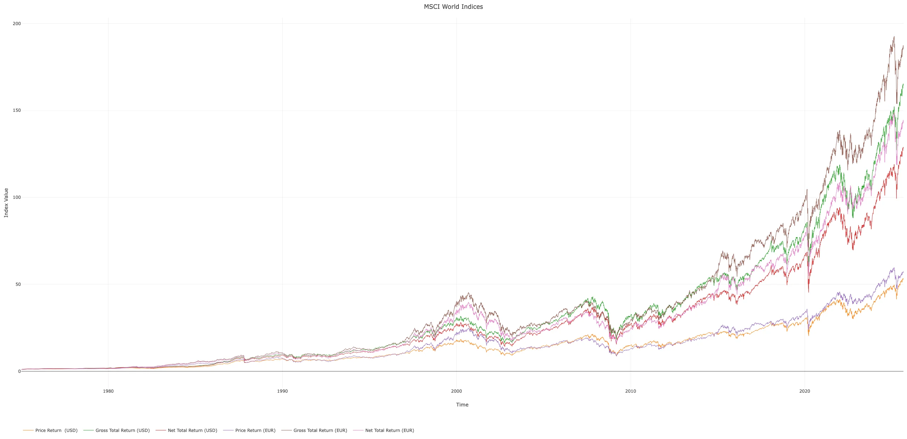

**Kleine Hebelkunde für Modellbastler**

Ausgehend von den Basis-Varianten des MSCI World-Index ist die 
Berechnung gehebelter Indizes lediglich die Anwendung von 
Standardformeln, die sich in den meisten Methodologien von 
Indexanbietern finden lassen. So ergeben sich die Tagesrenditen für 
gehebelte Long- und Short-Indizes aus der folgenden Formel, wobei die 
Short-Indizes lediglich aus Gründen der Vollständigkeit aufgeführt 
werden:
 

Hierbei stehen K für den Hebelfaktor, Rₜ₋₁ für die Rendite des 
Referenzindex, r für die Leih- und Verleihzinssätze, T für die Anzahl 
der Tage pro Jahr und 𝚫ₜ für einen Tag. Aufgrund der vorherigen 
Schritte habe ich einen Adjustierungsfaktor p in die Formeln eingefügt. 
Letzteren Wert erhalten wir über einen Grid Search-Algorithmus, wobei 
die Adjustierung über die Minimierung klassischer Fehlermetriken (z.B. 
Root Mean Square Error, etc.) zur Referenz des MSCI World Net Total 
Return x2 von MSCI Inc. erfolgt. Insgesamt ist der Adjustierungsfaktor 
von ca. -1.5×10⁻⁵ über alle Metriken zwar sehr niedrig und wird daher 
gerne vernachlässigt, jedoch ist es ein täglicher Effekt, der in anderen
 Analysen stets auf einem ähnlichen Niveau wie langfristige 
Tracking-Differenzen lag.

Entsprechend der Vorgaben der MSCI-Methodologie zu 
Finanzierungszinsen, stützen wir uns auf die Federal Funds Effective 
Rate (DFF) und die Secured Overnight Financing Rate (SOFR) der Federal 
Reserve, wobei wir analog zu MSCI Inc. den 01-08-2021 für den Wechsel 
der Zinssätze nutzen. Insofern haben wir eine vollständige Zeitreihe des
 MSCI World Daily Leverage Net Total Return von 01-01-1975 bis 
31-08-2025 vorliegen, sodass es nun reicht, eine rückwirkende 
Verrechnung des täglichen Anteils der Gesamtkostenquote und der 
Tagesrendite von Indizes zu realisieren:

Hierbei steht R für die Rendite des hypothetischen ETFs (Subskript
 f) und Referenzindex (Subskript i) am Tag t, r für die 
Gesamtkostenquote des Produkts, T für die Anzahl der Tage pro Jahr und p
 für einen Adjustierungsfaktor, der jedoch für diese Simulation 
irrelevant ist, da es derzeit kein reales Produkt als Vergleichsreferenz
 gibt. In diesem Kontext ist der Referenzindex der MSCI World Net Total 
Return, den ich in der folgenden Grafik im Vergleich zu anderen MSCI 
World-Varianten darstelle:

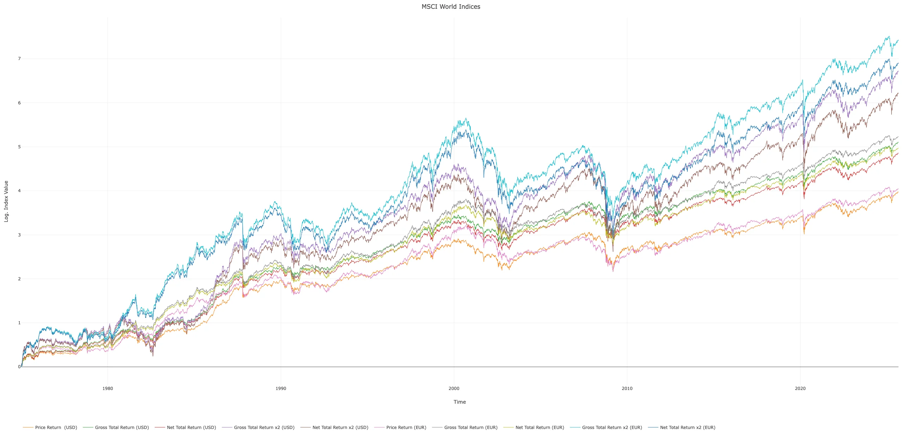

Im letzten Schritt ist lediglich die Anwendung der Total Expense 
Ratio auf Indexzeitreihen nötig, wobei wir für den Seligen Amumbo den 
Wert von 0.6% p.a. festlegen, den die Amundi S.A. bereits bestätigt hat.
 Es folgt die Umrechnung des Produktpreises in Euro, denn letztlich wird
 das gehebelte Produkt für Europäer in dieser Währung zu bezahlen sein. 
Dies wirft jedoch das Problem auf, dass es diese Währung erst ab dem 
01-01-1999 gibt. An dieser Stelle hilft uns das Statistische Amt der 
Europäischen Union (EuroStat), denn dort finden wir Zeitreihen zur 
Europäischen Währungseinheit (Ticker: ECU) und ihren Vorgänger die 
Europäische Rechnungseinheit (Ticker: EUA) aus den Beständen der 
Europäischen Zentralbank (ECB): Ab Juni 1974 gab es, zunächst in der 
Europäischen Gemeinschaft, später in der Europäischen Union, diese 
beiden Vorgänger des Euro zur leichteren Abrechnung von Geschäften und 
Transaktionen im Binnenmarkt, die letztlich am 01-01-1999 im Verhältnis 
1:1 vom Euro abgelöst wurden. Ausgehend von diesen Wechselkursen rechnen
 wir die Produktreihe in Euro um.

**Svenssons Werk, Akimas Beitrag und ChemStats Wahnsinn**

Alles klar, jetzt sind wir durch, oder? Nicht so schnell, denn mir
 ist aufgefallen, dass in vielen Analysen Steuern entweder komplett 
ignoriert werden oder lediglich die Kapitalertragssteuer ohne 
Vorabpauschale berechnet wird  – langfristig wird so jedoch ein sehr 
positives Element für manche Strategien ausgeblendet, weshalb wir dies 
in unserer Simulation berücksichtigen möchten.

Klingt schwierig, aber glücklicherweise ist unser Steuerrecht 
relativ hilfreich, denn juristisch wie inhaltlich richten sich 
Vorabpauschalen nach dem Basiszins des Bundesfinanzministeriums gemäß § 
18 Abs. 4 InvStG. Darin wird festgelegt, dass sich der Basiszins für 
unsere Simulationen *"aus der langfristig erzielbaren Rendite öffentlicher Anleihen"* abgeleiten muss, *"den die Deutsche Bundesbank anhand der Zinsstrukturdaten jeweils auf den ersten Börsentag des Jahres errechnet"*.
 Ein kurzer Blick in die Bundessteuerblätter der letzten Jahre zeigt 
uns, dass wir unseren Basiszins aus dem Zinssatz für Bundeswertpapiere 
mit einer Restlaufzeit von 15 Jahren und jährlichen Kuponzahlungen 
ableiten müssen. Na, so lässt sich doch arbeiten...

Nunja, allerdings gibt es leider keine Angaben über die Zinssätze 
von Bundeswertpapieren vor 1972 und selbst danach liefert uns die 
Bundesbank für weite Phasen unseres Analysezeitraums lediglich 
Monatsendwerte. Daher holen wir uns die Zeitreihen der Zinsstrukturen 
von Bundeswertpapieren mit jährlichen Kuponzahlungen abgeleiteter 
Renditen (S1311), die wir von 30-09-1972 bis 31-08-2025 als Monats- bzw.
 01-08-1997 bis 31-08-2025 als Tageswerte aus dem Datenportal der 
Deutschen Bundesbank beziehen - jeweils über ein Restlaufzeit-Spektrum 
von einem bis dreißig Jahren. Anschließend fügen wir alle Zeitreihen in 
eine laufende Kalendarmatrix ein und beachten, dass sich die Monatsdaten
 stets auf den letzten Handelstag des Monats beziehen. Im Wesentlichen 
liegt uns eine Zinsstrukturfläche in täglicher Auflösung vor, jedoch 
liegt ein gutes Stück Arbeit vor uns, um diese Lücken zu schließen:

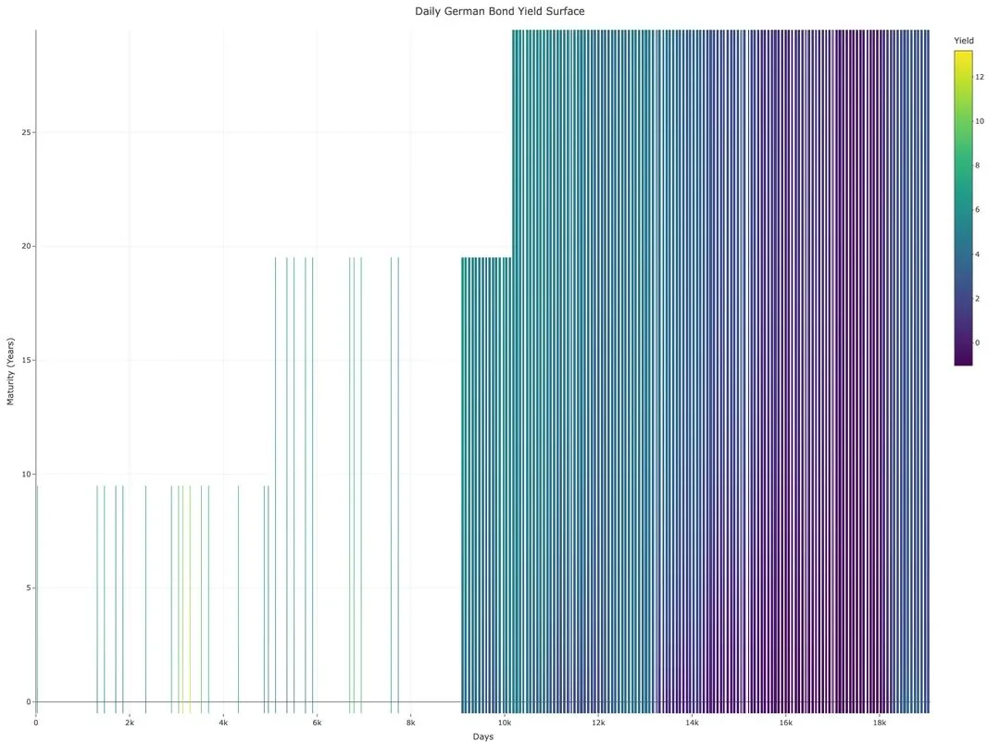

Vor längerer Zeit habe ich mir eine kleine Strategie überlegt, die
 sich zunächst der Vervollständigung der Zinsstrukturkurve einzelner 
Tage über alle Restlaufzeiten widmet, bevor eine bidirektionale 
Spline-Interpolation eingesetzt wird. Im Wesentlichen nutzen wir das 
Modell von Nelson und Siegel (1987) sowie die Optimierung von Svensson 
(1994), welche davon ausgehen, dass sich die latente Struktur von 
Zinssätzen als Differenzialgleichungen zweiter Ordnung beschreiben 
lässt, was in zeitdiskreter Schreibweise die folgende Gleichung ergibt:

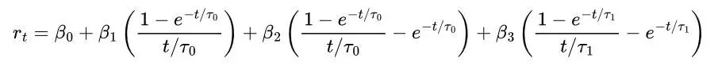

Hierbei steht rₜ für den Zinssatz eines Bundeswertpapiers an einem
 beliebigen Zeitpunkt t, die Parameter β₀ bis β₂ für das Niveau, die 
Steigung und die Krümmung der Kurve und τ für die Geschwindigkeit, in 
der Zinssätze in Richtung des langjährigen Durchschnitts konvergieren. 
Sowohl β₂ als auch τ haben direkten Einfluss darauf, wie gipflig die 
Zinsstruktur ausfällt, wobei β₂ Höhe und Richtung, aber τ die Breite des
 Gipfels definiert. Alle vier Werte sind stets größer als Null. Im Zuge 
der Optimierung von Svensson sorgen τ₀ und τ₁ für die Konvergenz der 
Zinssätze in Richtung des langjährigen Durchschnitts, wobei sich der 
Effekt von τ₁ lediglich auf den Zusatzterm β₃ auswirkt. Alle sechs Werte
 sind stets größer als Null.

Ausgehend vom Svensson-Modell ist es uns möglich, unvollständige 
Zinsstrukturen über das volle Spektrum von Restlaufzeiten zu simulieren,
 sodass wir nun eine bidirektionale Akima-Interpolation (Akima 1970, 
1974) nutzen können, um die restlichen Lücken plausibel zu schließen. 
Grundsätzlich ist dieses Vorgehen für jede rechteckige Fläche 
einsetzbar, denn es beruht auf dem Einsetzen bikubischer Polynome, wobei
 jedes Polynom von den Werten einer Funktion z(x,y) und partiellen 
Ableitungen an den Eckpunkten des Rechtecks bestimmt wird:

Sofern wir uns für einen beliebigen Punkt i,j auf der 
unvollständigen Zinsstrukturfläche interessieren, dann sind die Werte 
der partiellen Ableitung an diesem Punkt durch diese partiellen 
Ableitungen erster und zweiter Ordnung definiert. In den 
Gewichtungskoeffizienten gelten die geteilten Differenzen erster und 
zweiter Ordnung:

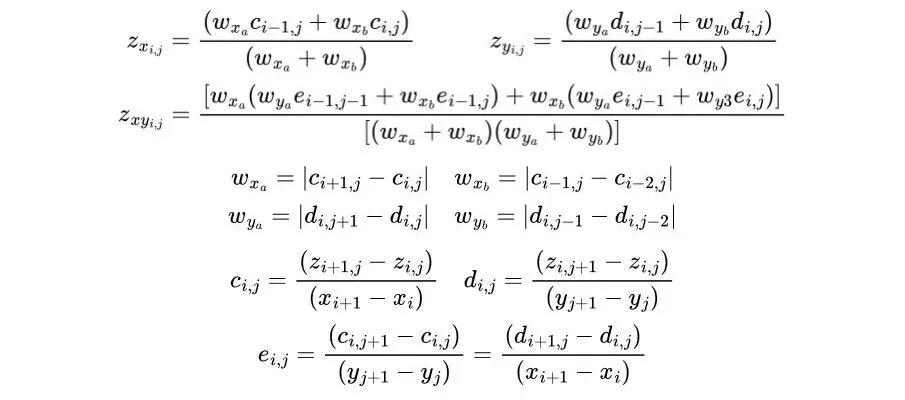 

Sobald wir diese Vorgaben an unseren Rechner übergeben, holen wir 
uns erstmal einen Kaffe, Tee oder irgendwas Hochprozentiges, denn leider
 ist unsere Zinsstrukturfläche so löchrig, dass uns sehr lange 
Rechenzeiten bevorstehen. Allerdings lohnt es sich, wie ihr selbst sehen
 könnt:

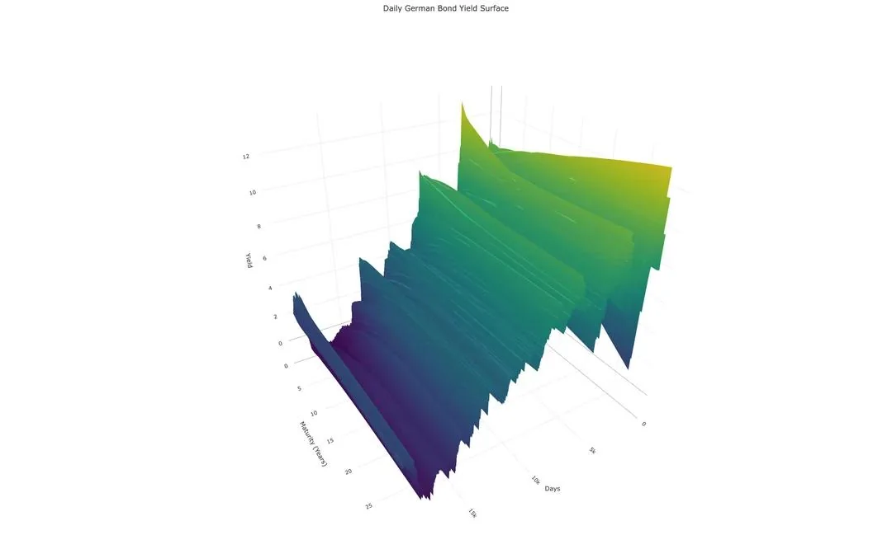 

Puh, jetzt haben wir es endlich geschafft! Wir haben alle Materialien für eine plausible Simulation!

**Kleiner Gruß aus ChemStats Hebelküche**

Vor langer Zeit habe ich ein kleines Paket für die Sprache R 
aufgesetzt, das es uns erlaubt, Strategien für einzelne Assets oder 
Portfolios zu prüfen, wobei jede Position die Option auf eigene Signale 
und Parameter (z.B. Buy-and-Hold, Moving Averages, etc.) besitzt. 
Derzeit ist eine Simulation von Einzelbeträgen (Lump Sum) oder 
Sparplänen (Dollar Cost Averaging), deren Intervalle über einen 
Zahlenwert, die Wahl des Turnus (Standard: Month; Alternativen: Quarter,
 Year) und den Ausführungstag (inkl. Korrektur für Schaltjahre und 
Monatslängen; Standard: 1. Tag des Monats) flexibel geregelt werden, 
möglich.

Abhängig von der Strategie ist es möglich, die Sparplanbeträge im 
Sinne des Buy-and-Hold direkt anzulegen oder am Signal der Strategie 
auszurichten (z.B. Ansparen von Sparplanbeträgen bis Signal ausgelöst 
wird). Analog ist die Regelung des Rebalancings für multiple Assets 
aufgebaut, jedoch gibt es für diese Art der Simulation die Option, 
Sparpläne für stetiges Rebalancing zu verwenden (Standard: Off).

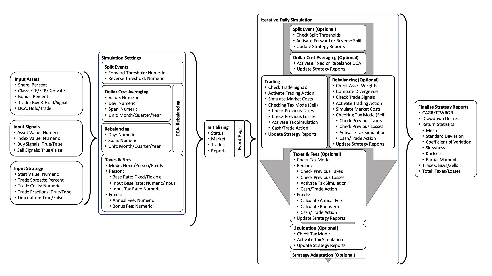

Im Hinblick auf die Simulation des Handels gibt es Optionen zur 
Regelung des Bruchstückhandels (Standard: On), der Abbildung von Splits 
bzw. Reverse Splits (inkl. Grenzwerten; Standard: Off) und einer 
Liquidation des Portfolios zum Ablauf der Simulation (inkl. Steuern und 
Gebühren). Analog zur Definition von Strategien für einzelne Assets, 
verfügt jedes Asset über einen Spread-Wert (Standard: 0.5%) und 
Handelskosten (Standard: 0€) – hierbei ist zu beachten, dass ich den 
Spread gerne leicht höher ansetze, um Variationen bei Ein- und Ausstieg 
(z.B. Handel kurz vor/nach Schließung/Öffnung von EU-Börsen) abzubilden.

Sofern die Simulation von Steuern oder Gebühren relevant ist, 
besteht die Option Vorabpauschalen gemäß Investmentsteuergesetz (InvStG)
 und Kapitalertragssteuern (KapESt) oder Gebühren für eine 
Wikifolio-Anlage zu berechnen. In der Steuersimulation gibt es neben der
 Möglichkeit einen Steuersatz für die Kapitalertragssteuer (Standard: 
26.375%) festzulegen auch die Option einen fixen Basiszins für die 
Vorabpauschale oder historische Daten für einen flexiblen Basiszins 
anzugeben. In den Strategietests nutze ich die Simulation der Zinsen für
 Bundeswertpapiere, um den Basiszins des Bundesfinanzministeriums 
realistisch abzuleiten.

Bitte beachtet, dass der Handel von Assets in der Simulation stets
 über hypothetische Tagesschlusskurse auf Xetra-Niveau erfolgt und es 
sich bei den folgenden Ergebnissen um konditionale Aussagen auf Basis 
eines Modells handelt – insofern sind es Approximationen, welche 
Renditen und Risiken plausibel gewesen wären, wenn aktuelle Bedingungen 
in der Vergangenheit gegolten hätten. Insofern sind es *Simulationen*, keine *Vorhersagen*,
 wichtiger Unterschied! Alles klar, aber es fehlen die Kosten, oder? 
Prinzipiell ja, da Orderkosten bei kurzen Horizonten negativ ins Gewicht
 fallen, aber sobald unser Investment zehn Jahre oder länger besteht, 
sind mögliche Kosten für Kauf und Verkauf selbst bei teuren Brokern eine
 Marginalität. Achja, und alle Angaben gehen von Nominalrenditen aus, 
weil ich den Effekt der Inflation auf gehebelte Investments erstmal 
ausgeblendet habe.

Ähm, heißt jetzt was? Das heißt, dass alle Ergebnisse auf 
Nominalrenditen beruhen, die gemäß aktueller Steuergesetzgebung über 
Kapitalertragssteuer, Verlusttöpfe, Freibeträgen und Vorabpauschale 
besteuert werden. Im Hinblick auf Handelsereignisse wird ein Spread von 
0.5% angesetzt und wir gehen zur Vereinfachung davon aus, dass 
Bruchstücke gehandelt werden können. Wir betrachten Einmalanlagen (Lump 
Sum) und Sparpläne (DCA). Alles klar, los gehts...

**Kaufen, Halten, Beten – In den Wogen der Märkte**

Schauen wir uns zunächst mal die Ergebnisse für Buy-and-Strategien
 für den Seligen Amumbo an, bevor wir uns den gleitenden Durchschnitten 
widmen. Hierbei bieten sich Boxplots (Spear 1952) an, um die 
Variabilität der Ergebnisverteilungen der gleitenden Fenster von 10, 20,
 30 und 40 Jahren (True Time Weighted Rate of Return und Maximum 
Drawdown als Rendite- bzw. Risikometrik) zu erläutern; sollte euer 
Interesse anderen Aspekten gelten, findet ihr alle Metriken (z.B. Least 
Partial Moments, o.ä.) und interaktive Grafiken im Repository. Zur 
Einordnung der Metriken habe ich ein Produkt ohne Hebel auf Grundlage 
des größten MSCI World-ETFs von iShares (WKN: A0RPWH; TER: 0.2% p.a.) 
simuliert:

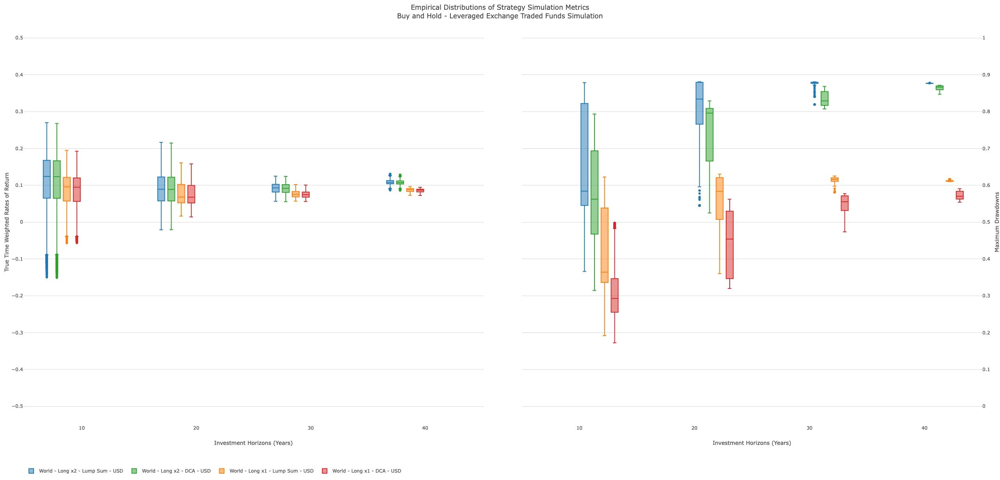

Im Hinblick auf die Rendite ist zunächst ein leichtes Absinken der
 Mediane beim Übergang von 10 Jahre (LS: 12.40% p.a.; DCA: 12.34% p.a.) 
auf 30 Jahre Investitionszeit (LS: 9.31% p.a.; DCA: 9.19% p.a.) für 
beide Konstellationen zu bemerken, bevor eine Erholung bei 
Investitionsfenstern von 40 Jahren (LS: 10.8% p.a.; DCA: 10.7% p.a.). 
Gleichzeitig reduziert sich die Streuung der Renditeverteilung deutlich,
 was zwei Hauptgründe hat: Einerseits ist die Anzahl gleitender Fenster 
bei 10 Jahren Investitionszeit deutlich höher als die anderer 
Investitionslängen, andererseits wirkt sich der Long Bias der Märkte, 
insbesondere beim Einsatz von Hebeln, umso stärker aus, je länger die 
Investitionszeiten ausfallen – eigentlich nichts Neues oder 
Bahnbrechendes.

Im Bereich der Maximum Drawdowns sind ähnliche Trends zu 
betrachten: So reduziert sich die Streuung der Risikometrik über die 
Länge der Investitionszeiten für alle Konstellationen, während 
gleichzeitig der Median der Verteilungen stetig steigt – letztlich ist 
es nicht verwunderlich, denn prinzipiell steigt die Wahrscheinlichkeit 
für längere Rezessionen oder größere Crashes mit der Investitionslänge, 
insbesondere bei Buy-and-Hold-Strategien.

Sobald wir uns die Ergebnisse des Seligen Amumbos im Vergleich zur
 ungehebelten Referenz ansehen, wird relativ deutlich, dass sowohl die 
Medianrendite als auch die Streuung der Renditemetrik für den Seligen 
Amumbo höher ausgefallen wären – wir sprechen für Einmal- und 
Sparplananlage von 1.8 bis 2.8 Prozentpunkten höheren Median und einem 
0.1 bis 3.9 Prozentpunkten größeren Interquartilsabstand (IQR = Q3-Q1). 
Während die Mediandifferenz über die Zeit relativ stabil geblieben wäre,
 hätte sich die Differenz der Interquartilsabstände über die Länge der 
Investitionszeiträume reduziert – in anderen Worten: Über den längsten 
Horizont von 40 Jahren wäre die robuste Streuung der Renditen beider 
Produkte kaum zu unterscheiden gewesen.

Jedoch ist Rendite lediglich eine Seite der Medaille und beim 
Vergleich des Risikos über den Maximum Drawdown liegen – eigentlich wie 
zu erwarten war – Welten zwischen Referenz und Seligem Amumbo: So hätte 
die Differenz bei Einmalanlagen 22.1 bis 22.6 Prozentpunkten höheren 
Drawdowns beim gehebelten MSCI World gelegen, während bei 
Sparplananlagen sogar 26.9 bis 34.2 Prozentpunkte zu Buche schlagen. In 
ähnlicher Weise wäre die Differenz bei den Interquartilsabständen der 
Maximum Drawdowns ausgefallen, wobei wir in der kurzen Frist von 10 
Jahren von 25.3 und 28.8 Prozentpunkten (Einmal- bzw. Sparplananlage) 
sprechen. Vergleichbar zur robusten Streuung der Renditen wäre auch ihr 
Pendant für die Risikomaße über die Länge des Zeitraums auf ein 
marginales Niveau gesunken.

Natürlich habe ich mich jetzt lediglich auf die Mediane und IQRs 
konzentriert, daher hier noch die vollständige Tabelle der Risiko- und 
Renditemetriken:
 
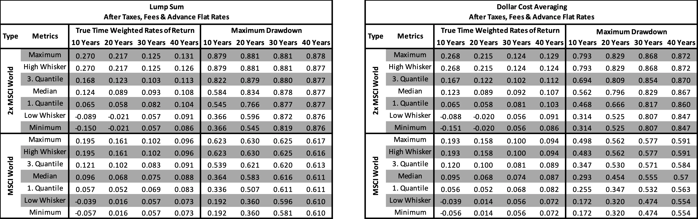

**Gleitende Wellenreiter – Vola Ante Portas**

Naja, wie wir gesehen haben, ist die Rendite von gehebelten 
Buy-and-Hold-Anlagen relativ gut, jedoch ist die Kehrseite starke 
Drawdowns und vielen Anlegern ist das Risiko schlicht zu hoch, weshalb 
sich gerade für gehebelte Anlagen aktive Strategien großer Beliebtheit 
erfreuen. Hierbei zählen Strategien auf Basis gleitender Durchschnitte 
(Moving Averages) zu den populärsten Ansätzen, denen jedoch ebenso große
 Kritik begegnet. Tja, jetzt böte es sich an, sich nochmal die 
Eigenschaft gleitender Durchschnitt zur Separation von Volatilitäts- und
 Renditeregimen anzusehen, aber das Thema gehört in die *Principia Amumbo*...
 Was ist jetzt diese Strategie? Im Grunde wird lediglich der ungehebelte
 Basisindex des Hebelprodukts betrachtet und ein gleitender Durchschnitt
 für die letzten X Handelstage berechnet. Sobald der Basisindex über den
 gleitenden Durchschnittswert steigt, wird das Hebelprodukt gekauft, 
fällt der Basisindex jedoch unter den gleitenden Durchschnitt, wird das 
Hebelprodukt verkauft – so viel zur Basis der folgenden Analysen, wer 
sich erstmalig in das Thema einlesen möchte, sei' [Zahlgrafs Exzellente Abenteuer – Hebel für den Langlauf](https://www.reddit.com/r/mauerstrassenwetten/comments/t4fivd/zahlgrafs_exzellente_abenteuer_teil_8/) nahegelegt.

Allerdings ist mir wichtig nochmals zu betonen, dass wir uns 
Ergebnisse von Simulationen ansehen, die sich auf plausible Verläufe der
 Vergangenheit beziehen, d.h. es ist eine Beschreibung (Deskription) – 
es wird keine Aussage über Wahrscheinlichkeiten von Risiken und Renditen
 getätigt (Inferenz) und absolut keine Vorhersage (Prädiktion) über die 
Superiorität eines Einzelparameters oder Parameterbereichs! Insofern 
dürfen sich diejenigen, deren Reflex "Überanpassung" oder 
"Selektionsverzerrung" zu schreien gerade einsetzt, gerne zurücklehnen 
und runterfahren. Alles klar?! Sehr gut, weiter geht's...

In der Simulation des Seligen Amumbos nutzen wir als Signal für 
den Ein- und Ausstieg gleitende Durchschnitte (Simple Moving Average) 
des MSCI World Net Total Return USD Index (MSCI-Code: 990100 Typ: NETR, [MIWO00000NUS](https://www.investing.com/indices/msci-world-net-usd)),
 wobei wir ein Spektrum von 10 bis 600 Tagen zur Berechnung des 
Durchschnitts verwenden – bitte beachtet diesen Punkt: Sofern ich es 
nicht explizit angebe, handelt es sich um Kalendertage, nicht 
Handelstage. Hä, warum das? Im Prinzip ergibt es sich aus dem bisherigen
 Vorgehen, es hilft bei der Vereinfachung einiger Berechnungen, aber es 
hat lediglich einen marginalen Effekt auf die Ergebnisse. Okay, soweit 
so gut, es bleibt lediglich zu erwähnen, dass ihr bei der Umrechnung den
 Faktor 252.25/365.25 ≈ 0.69 nutzen könnt, sodass z.B. ein Wert von 300 
Kalendertagen grob 207 Handelstagen entspricht. Alles klar, sehen wir 
uns mal an, was der Simulator ausgespuckt hat...

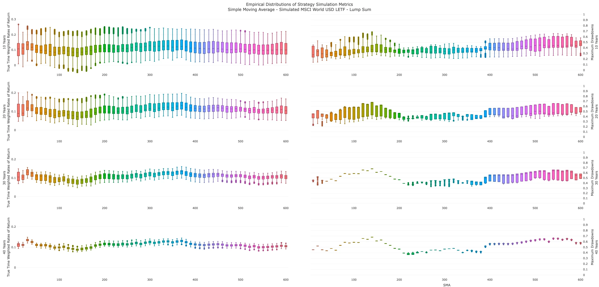

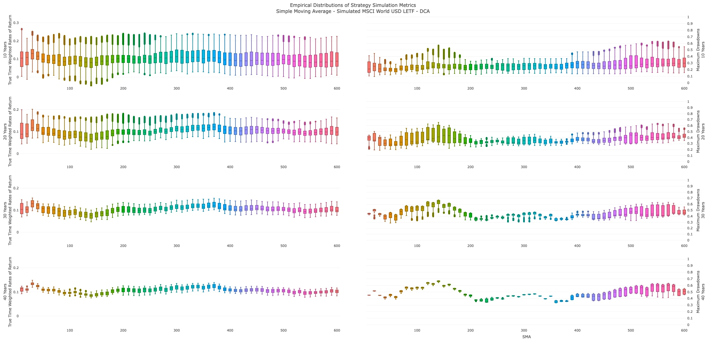

Im Wesentlichen sind die Ergebnisse über das Spektrum von 
SMA-Werten für Einmal- und Sparplananlagen relativ ähnlich, wobei sich 
für die Medianrendite von Einmalanlagen neben einem Peak bei 30 Tagen 
eine breite Zone von 260 bis 510 Tagen ausgebildet hätte - darin hob 
sich das Segment von 300 bis 380 heraus. Auch bei Sparplananlagen gibt 
es einen Rendite-Peak bei 30 Tagen und eine Zone höchster 
Medianrenditen, die jedoch eher bei 300 bis 390 Tagen gelegen hätte. 
Sobald wir auf die Seite der Maximum Drawdowns wechseln, heben sich 
diese Zonen über die Zeit deutlich vom Grundmuster ab – konkret liegen 
die Mediane der Maximum-Drawdown-Verteilung in diesen Zonen deutlich 
niedriger als es bei anderen SMA-Werten der Fall gewesen wäre.

Im Hinblick auf beide Metriken scheint der Bereich von 360 bis 380 Tagen die Spitze einer *Goldlöckchen-Zone*
 zu bilden, in der relativ hohe Medianrenditen bei relativ niedrigen 
Maximum Drawdowns erreicht worden wären. Sofern wir es in Handelstagen 
ausdrücken möchten, würde dies einer Zone von 248 bis 262 Tagen 
entsprechen. Zur leichteren Orientierung habe ich 255 Tage für eine 
Gegenüberstellung mit der *klassischen* Angabe von 200 Tagen 
ausgewählt – bitte beachtet, dass diese Auswahl eine subjektive 
Entscheidung ist und wir lediglich Ergebnisse einer Simulation 
historischer Dynamiken betrachten! Ähm, die beste Lösung ziehen, ist ja 
keine Kunst...

Natürlich ist das keine Kunst, aber bitte denkt daran, dass wir in
 diesem Beitrag keine Inferenz oder Prädiktion betreiben, sondern uns 
lediglich ansehen, wie eine Strategie in der hypothetischen, jedoch 
plausiblen Vergangenheit abgeliefert hätte. Abgesehen davon handelt es 
sich bei unseren SMA-Werten um *konditionales Optimum* – wir setzen bei der Auswahl ja bei Medianen von Rendite und Risiko an, was in der Regel eine Abweichung vom *Absolutoptimum* bedeutet. Zur Verdeutlichung habe ich mir erlaubt, eine Evaluation der SMA-Werte für Sparplananlagen aufzusetzen:

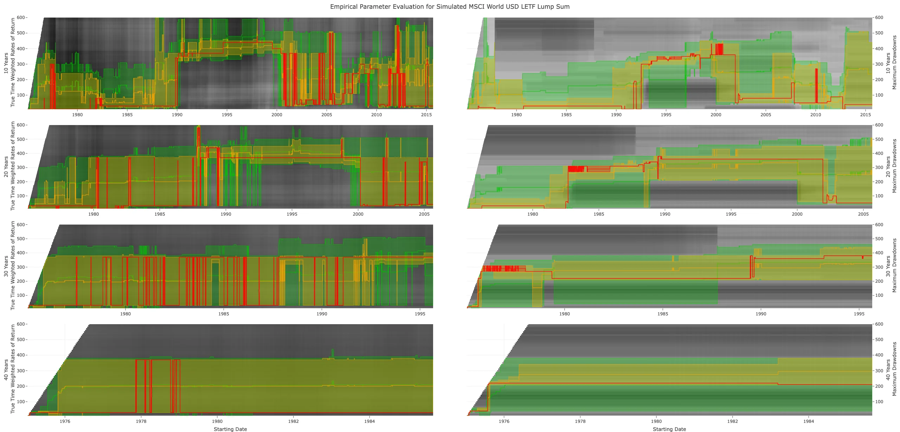

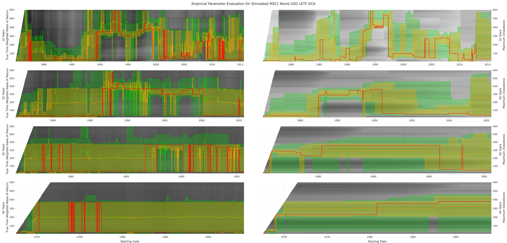 

Alter, was ist das? In den Grafiken wird gezeigt, welche SMA-Werte
 im Verlauf der Zeit zu den höchsten Renditen (linke Seite) oder den 
geringsten Maximum Drawdowns (rechte Seite) geführt hätten. Hierbei 
steht die rote Linie für die Optima, die gelbe Fläche zeigt die 
SMA-Werte im obersten bzw. untersten Dezil (10%) an und die grüne Fläche
 das höchste bzw. niedrigste Quartil (25%). Ich hoffe es wird deutlich, 
dass 1.) die Länge der Investition zu einer Stabilisierung des günstigen
 Wertebereichs führt, 2.) das Spektrum des Risikos in der Regel breiter 
als das Spektrum der Rendite ist, und 3.) die Selektion über Mediane 
stabile Ergebnisse für beide Metriken geliefert hätte, jedoch nur in 
Ausnahmen *Absolutoptima* darstellen. Aha, aber wie hätte sich eine SMA-Strategie nun geschlagen?

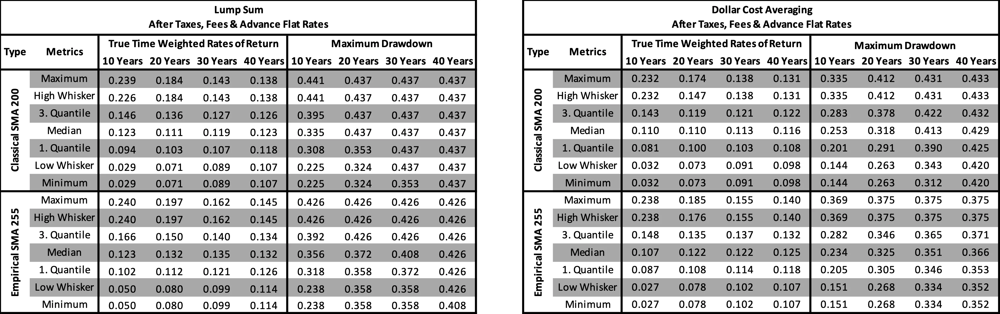 

Sagen wir es mal so: Ziemlich gut! Unter Berücksichtigung von 
Steuern, Vorabpauschalen, Gebühren und Spreads liegen die Unterschiede 
der Medianrenditen beider SMA-Varianten für Einmalanlagen bei 0 bis 4 
Prozentpunkten – anders ausgedrückt: Im Hinblick auf den Median hätten 
SMA-Strategien eine Buy-and-Hold-Anlage geschlagen. Sobald wir 
Sparplananlagen betrachten, liegen die Differenzen bei -2 bis 3 
Prozentpunkten, worin sich widerspiegelt, dass Sparpläne bereits bei 
Buy-and-Hold eine Glättung der Renditekurven bewirken und der Effekt 
gleitender Durchschnitte abgemildert wird.

Gräbt man sich in die Zahlen tiefer ein, ergibt sich im Vergleich 
zu ungehebeltem Buy-and-Hold folgendes Bild: Im Hinblick auf 
Einmalanlagen lagen die Medianrenditen von Buy-and-Hold über alle 
Laufzeiten hinweg zwischen 6.8% und 9.6% p.a., während beide 
SMA-Strategien mit 10.7% bis 13.2% p.a. ein klar höheres Niveau 
erzielten – die Outperformance liegt im schlechtesten Fall bei 2.7, im 
besten Fall der 200er-Variante bei 4.4 Prozentpunkten, während die 
Outperformance der 255er-Variante bei 6.4 Prozentpunkten gelegen hätte. 
Selbst bei den Minima wird die Robustheit sichtbar, denn ungehebeltes 
Buy-and-Hold schwankte zwischen -5.7% und 7.3% p.a., während SMAs mit 
2.9% bis 11.4% p.a. stabil positive Werte aufgewiesen hätten. Bei den 
Maxima gibt es kleinere Unterschiede, die jedoch ebenfalls für die 
SMA-Strategien sprechen (Buy-and-Hold: 16.1% bis 19.5% p.a.; SMA: 18.4% 
bis 24.0% p.a.). Bemerkenswert ist die Entwicklung der 
Interquartilsabstände, denn während Buy-and-Hold über die Zeiträume 
hinweg eine relativ breite Streuung (2.5 bis 6.4 Prozentpunkte) 
aufgewiesen hätten, wären beide SMA-Strategien auf vergleichbarem Niveau
 (3.4 bis 5.2 Prozentpunkte) gelegen.

Wie zu erwarten, wäre die Lage bei Sparplananlagen weniger 
deutlich ausgefallen: Ungehebeltes Buy-and-Hold hätte Medianrenditen 
zwischen 6.8% und 9.5% p.a., während die SMA-Varianten mit 10.7% bis 
12.5% p.a. leicht darüber gelegen hätten; ebenso wie bei den 
Einmalanlagen liegt sowohl für die 200er- als auch die 255er-Variante 
eine deutliche Outperformance im Vergleich zum ungehebelten Buy-and-Hold
 vor (1.5 bis 4.2 bzw. 1.2 bis 5.4 Prozentpunkte p.a.). Hinsichtlich der
 Minimalrenditen gibt es eine deutliche Diskrepanz, denn klassisches 
Buy-and-Hold hätte in ungünstigen Zeitfenstern Verluste von bis zu -5.6%
 verbuchen müssen, während beide SMA-Strategien in allen Konstellationen
 im positiven Bereich (2.7% bis 10.7% p.a.) gelegen hätten. Auch bei den
 Maximalrenditen wäre Buy-and-Hold mit 9.4% bis 19.3% p.a. relativ hoch 
anzusiedeln gewesen, jedoch hätten SMA-Strategien dies deutlich 
übertroffen (13.1% bis 23.8% p.a.). Ähnlich wie bei der Einmalanlage 
bestätigen auch die Interquartilsabstände diesen Trend für Sparpläne: 
Klassisches Buy-and-Hold hätte eine Bandbreite von 2.6 bis 6.4 
Prozentpunkten aufgewiesen, während die SMA-Varianten bei 3.0 bis 4.8 
Prozentpunkten verblieben wären.

Klingt doch gut, oder? Naja, streben SMA-Strategien keine 
Generierung von Überrenditen an, sondern haben das Ziel Maximum 
Drawdowns zu reduzieren, hierbei kracht es mächtig: Im Grunde wäre eine 
Halbierung bei beiden SMA-Strategien erzielbar gewesen, unabhängig von 
Einmal- oder Sparplananlage: Im direkten Vergleich zum gehebelten 
Buy-and-Hold wäre der Unterschied sehr deutlich ausgefallen, denn die 
Werte beider SMA-Strategien hätten knapp 20 bis 40 Prozentpunkte 
geringer ausgefallen.

Zieht man ungehebeltes Buy-and-Hold als Referenz heran, hätten die
 SMA-Varianten die Maximum Drawdowns deutlich reduziert: So hätte die 
200er-Variante bei Einmalanlagen die Rückschläge um 3 bis 17 
Prozentpunkte verringert, die 255er-Variante sogar bis zu 21 
Prozentpunkte. Im Hinblick auf Sparplänen wären die Drawdowns um 4 bis 
14 Prozentpunkte bei SMA 200 und um 6 bis 20 Prozentpunkte bei SMA 255 
niedriger ausgefallen. Insgesamt entspricht dies einer Reduktion von 7 
bis 19 Prozentpunkten gegenüber Buy-and-Hold, wobei die 255er-Variante 
der SMA-Strategie tendenziell stärkere Rückschlagsbegrenzungen als ihr 
200er-Pendant erreicht hätte. Lassen wir das mal wirken... Ernsthaft.

Puh, das war jetzt viel Input! Eigentlich wäre jetzt der Punkt, an
 dem wir uns ansehen würden, wie sich die Einzelregionen des Seligen 
Amumbos geschlagen hätten, ob man ihre Unterschiede im Momentum nutzen 
könnte, wo sich der beste SMA-Wert befunden hätte und warum 
SMA-Strategien relativ robust sind, aber auch, ob es möglich ist, 
Währungseffekte für eine weitere Reduktion der Maximum Drawdowns zu 
nutzen. Jedoch sollten wir dafür eine neue Seite unseres Reisetagebuchs 
aufschlagen und uns erstmal von den Strapazen erholen, denn Reddit 
erlaubt mir keine weiteren Grafiken und glaubt mir, ich werde sie 
brauchen! In diesem Sinne: Ich klapp' den Bums jetzt zu... Wir lesen uns
 im zweiten Teil!

**Literatur und Material**

Akima, Hiroshi (1970): A new method of interpolation and smooth 
curve fitting based on local procedures. Journal of the Association for 
Computing Machinery, 17(4): 589–602.

Akima, Hiroshi (1974): A method of bivariate interpolation and 
smooth surface fitting based on local procedures. Communications of the 
Association for Computing Machinery, 17(1): 18–20.

Hastie, Trevor & Tibshirani, Robert (1986): Generalized Additive Models. Statistical Science, 1(3) 297–310.

Hastie, Trevor & Tibshirani, Robert (1987): Generalized 
Additive Models: Some Applications. Journal of the American Statistical 
Association, 82(398): 371–386.

Hilbert, David (1902): Mathematical problems. Bulletin of the American Mathematical Society, 8(10): 461–462.

Kolmogorov, Andrey N. (1957): On the representation of continuous 
functions of many variables by superpositions of continuous functions of
 one variable and addition. Doklay Akademii Nauk SSSR, 14(5): 953–956.

Nelson, Charles R. & Siegel, Andrew F. (1987): Parsimonious 
modeling of yield curves. Journal of Business, 60(4): 473–489.

Spear, Mary E. (1952): Charting Statistics. New York: McGraw-Hill Books.

Stineman, Russel W. (1980): A Consistently Well Behaved Method of Interpolation. Creative Computing, 6(7): 54–57.

Svensson, Lars E. O. (1994): Estimating and Interpreting Forward 
Interest Rates: Sweden 1992 - 1994. National Bureau of Economic Research
 Working Paper Series, 4871.

Wahba, Grace (1990): Spline Models of Observational Data. Society for Industrial and Applied Mathematics.

[ZahlGraf (2022): ZahlGrafs Exzellente Abenteuer. Reddit. Mauerstrassenwetten.](https://www.reddit.com/r/mauerstrassenwetten/comments/s71qds/zahlgrafs_exzellente_abenteuer_teil_1/)

[ChemStats Archiv Github Repository Project Gloverage.](https://github.com/chemicalstats/ChemStats-Archiv)
