# ChemStats Archiv: Eine kleine Reise in gehebelte Welten - Vectis Mundi (Teil II)

Liebe Mitreisende auf der Mauerstrasse, liebe Wegelagerer in den Finanzgassen,

nachdem der Selige Amumbo nun auf den Märkten wandelt, freue ich 
mich, euch zu einem weiteren Abstecher in die gehebelten Welten zu 
begrüßen! Wie bereits im letzten Beitrag angedeutet, hat mich die Frage 
bewegt, wie sich eine Investition in gehebelte Weltregionen geschlagen 
und wie sich ihre Trends und Dynamiken auf den Seligen Amumbo (ISIN: 
FR0014010HV4, WKN: ETF888) ausgewirkt hätten. Zumindest war das mein 
Plan für eine ruhige Reihe...

Allerdings war mir nicht klar, dass ich einen Wettlauf gegen die 
Zeit führen würde, denn leider hat die MSCI Inc. seit Kurzem einen 
Großteil ihrer Daten in Subscription-Archiven versteckt, weshalb wir uns
 ein weiteres Mal fragiler Künste bedienen werden, um Renditen aus einem
 Hauch von Nichts zu erschaffen... Also, legen wir los!

**ZL;NG**

- Projektziel: Simulation des Seligen Amumbos und gehebelter 
Weltportfolios auf Basis von MSCI-Regionen-Indizes von 01-01-1975 bis 
31-08-2025.
- Indizes & Modelle: Rekonstruktion täglicher Preisindizes aus 
Monatsdaten via Constraint Quadratic Approach und Simulation gehebelter 
Regionen-Produkte.
- Pro Regionen: Deutliche Renditepotenziale in kurzen Zeiträumen 
(z.B. Pazifik +3 pp p.a., Emerging +2 pp p.a.) durch Momentum-Effekte 
und Bubble-Phasen; Moving-Average-Strategien senkten Drawdowns um 30 bis
 40 pp und steigerten Renditen um bis zu 2 pp.
- Contra Regionen: Hohe Volatilität und starke Streuungen (IQR bis 
24 pp); Drawdowns bis 95% (Pazifik und Emerging); langfristig keine 
stabile Überlegenheit im Vergleich zum Diversifikationseffekt des 
Seligen Amumbos – zumindest in der Einzelkritik.
- Ausblick: Regionale Hebel haben für den Großteil keine Vorteile; 
sie sind jedoch ideal für Momentum-Strategien, um regionale Exzesse 
abzuschöpfen.

**Beiträge der Reihe:** [**Teil I**](https://www.reddit.com/r/mauerstrassenwetten/comments/1n6je6h/chemstats_archiv_eine_kleine_reise_in_gehebelte/) **– Teil II**

**Einleitung**

In diesem Beitrag zeige ich euch, 1.) welche Modelle und Ansätze 
ich zur Schätzung täglicher Preisindexwerte aus Monatsdaten für die vier
 Hauptregionen des MSCI-Universums eingesetzt habe, 2.) das Vorgehen des
 letzten Beitrags zur Ableitung gehebelter Produkte auf USD- und 
EUR-Indizes für diese Regionen genutzt wird, 3.) welche Parameter für 
die Simulation von Buy-and-Hold- und Moving-Average-Strategien mit 
diesen Produkten gewählt wurden, und 4.) welche Resultate Investitionen 
in gehebelte Regionen im Vergleich zum Seligen Amumbo gebracht hätten, 
wenn diese Produkte am Markt (Europe: A0X8ZT; Emerging: ETF128) 
geblieben wären oder überhaupt existiert hätten.

Wie in jedem Beitrag hoffe ich, euch ein robustes Vorgehen 
vorstellen zu können, wobei mir jedoch wichtig ist, dass ich euch *mein* Vorgehen erläutere und *keinerlei*
 Anspruch auf analytische Universalität erhebe. Zwar bemühe ich mich, 
alle Schritte und Annahmen so nachvollziehbar wie möglich zu erläutern, 
sofern jedoch Fragen bestehen oder etwas unklar geblieben ist, zögert 
bitte nicht nachzufragen.

**Schwarze Künste der Quadratur – Renditen aus dem Nichts**

Im Zuge des letzten Beitrags habe ich mich gefragt, welche Effekte
 von den Regionen auf die Struktur des MSCI World ausgehen, wie sie sich
 über die Zeit verändert haben und welche Lehren sich für den Seligen 
Amumbo in der kurzen und langen Frist ergeben – anders ausgedrückt: Es 
hat mich gejuckt, leichte Kost ohne große Vorarbeiten zu basteln. Jedoch
 hat mir die MSCI Inc. einen dicken Strich durch die Rechnung gemacht: 
Einerseits gab es die Preisindizes der MSCI-Regionen auf täglicher Basis
 erst ab dem 01-01-1997, andererseits ist ein Großteil der MSCI-Daten in
 den letzten Tagen in Subscription-Archive verlagert worden, womit sich 
der Zugriff auf Tages-, Monats- oder Jahresdaten schwierig gestaltet... 
Zum Glück lagen die Analysen und Ergebnisse ab dem 01-01-1975 zu diesem 
Zeitpunkt bereits auf der Platte. Jedoch habe ich keine Kopie der 
Preisindizes angelegt, weshalb ich aktuell keine Optimierung der 
Schätzung entwickeln kann. Ähm, wo ist das Problem?

Naja, es ist relativ simpel: Leider lagen mir für die Preisindizes
 der vier MSCI-Strukturen (World, North America, Europe und Pacific) nur
 Monatswerte für die Zeit vom 31-12-1969 bis 31-12-1996 vor; die Daten 
für den MSCI Emerging sogar erst ab dem 31-12-1987. Darüber hinaus gab 
es die Rekonstruktion des täglichen Preisindex für den MSCI World aus 
dem letzten Beitrag, sodass ein Problem fehlender Werte vorliegt. Aha, 
aber wo nichts ist, kann ja was werden, oder? Ja, aber das heißt, die 
fragilen Mächte der Imputation anrufen zu müssen. Aha, und wie? Konkret 
greifen wir auf, dass die Industrieregionen als Elemente und die 
Schwellenländer als Gegenpol ein hohes Maß direkter und indirekter 
Dependenz zum MSCI World aufweisen, was sich u.a. in der Korrelations- 
oder Kovarianzstruktur ausdrückt und eine Disaggregation der 
Monatsrenditen auf Basis täglicher Referenzen erlaubt. Äh, bitte was?

Im Grunde ist unser Ziel, Tagesrenditen der Subindizes zu 
schätzen, deren Verlauf die kleinste Abweichung zum MSCI World aufweist 
bzw. ihrer Relation so präzise wie möglich folgen. Hierfür nutzen wir 
einen Constraint Quadratic Approach (Wolfe 1959 & Bertsekas 1996), 
der uns eine plausible Schätzung der Tagesrenditen für jeden Subindex 
auf Basis der Monatsrenditen Rₘ und den Tagesrenditen des MSCI World rₕ 
über die Minimierung einer quadratischen Distanzfunktion liefert. In der
 Praxis sind die Ergebnisse lineare Verschiebungen des MSCI World, 
weshalb wir den Constraint setzen, dass die Summe der täglichen Renditen
 exakt den Monatsrenditen der Subindizes entsprechen muss 
(Aggregationskonsistenz). Glücklicherweise ist diese lineare Projektion 
durch einen Lagrange-Multiplikator (Bertsekas 1989) lösbar:

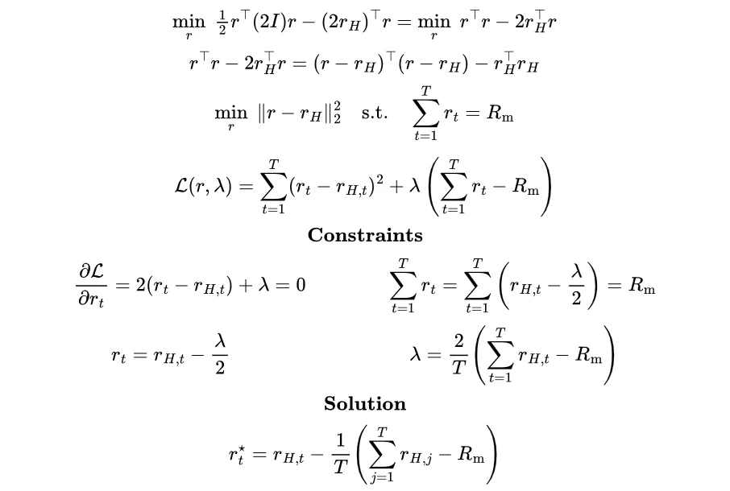

Ausgehend von dieser Schätzung täglicher Renditen ist es möglich, 
den Verlauf der Preisindizes jeder MSCI-Region abzuleiten, jedoch setzen
 wir davor eine Grid Search-Prozedur zur Ermittlung eines 
Skalierungsfaktors ein, der gewährleisten soll, dass die Simulation der 
Preisindizes stets auf dem realen Indexendwert oder marginal niedriger 
liegt – wir sprechen von sehr kleinen Werten, die eine lineare Korrektur
 der Renditen bewirken, die unsere Simulation jedoch kumulativ verzerrt 
hätten (North America: -2.97×10⁻⁵; Europe: -5.08×10⁻⁵; Pacific: 
-5.59×10⁻⁵; Emerging: -4.91×10⁻⁵). Zur Konstruktion vollständiger 
Zeitreihen werden die Disaggregationen jedes Subindex mit den realen 
Renditen ab dem 01-01-1997 zusammengeführt, wobei die lineare Korrektur 
nur in den simulierten Bereichen vor 1997 eingesetzt wird.

Im Hinblick auf dieses Vorgehen ist zu beachten, dass der 
Lagrange-Multiplikator eine lineare Verschiebung der Renditen um den 
Faktor λ bewirkt und wir diese Prozedur auf Prior-Angaben für 
Korrelationen, Kovarianzen und Interaktionen (Honaker & King 2010) 
hätten ausweiten können, wäre ich schneller gewesen. Insofern liegen uns
 zwar plausible Schätzer für die Zeit vor dem 01-01-1997 vor, jedoch 
fehlt eine kleine Stochastik zur präziseren Abbildung der 
Kursvariabilität, was eine Glättung der Indexverläufe bewirkt – 
methodisch ist es eine Art grober Stineman-Interpolation auf Basis 
spärlicher Stützstellen (Stineman 1980) und liefert ab, aber ich habe 
längere Zeit gehadert, die Simulation zu starten. Naja, es ist, wie es 
ist...

Während der Analyse war ich leider nicht so geistesgegenwärtig, 
eine Visualisierung zu erstellen, weshalb ich euch lediglich eine 
Proof-of-Concept-Reproduktion mit Daten vom 01-01-1995 bis 31-08-2025 
anbieten kann. Hierfür habe ich Tagesrenditen der Subindizes ab dem 
01-01-2011 sowie die Monats- und Tagesrenditen des MSCI World ab dem 
01-01-1995 als Referenz genutzt – in anderen Worten ausgedrückt, 
simulieren wir, dass es keine Tageswerte der MSCI-Regionen vor dem 
01-01-2011 gibt und wir diese jedoch nun so genau wie möglich 
rekonstruieren wollen:
 
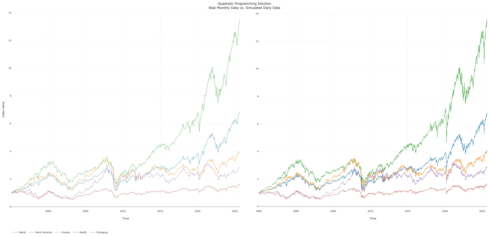

Im Anschluss an die Simulation der Preisindizes in US-Dollar ist 
es möglich, alle Index-Varianten für die vier Regionen in US-Dollar und 
Euro über die Methodik des letzten Beitrags abzuleiten, was uns die 
Grundlage für gehebelte Produkte liefert. Hierzu gehen wir von regulären
 Kapitalzinsen (USD: DFF/SOFR; EUR: FTG/EONIA/€STR) und Total Expense 
Ratios aus, die den Eigenschaften früherer Produkte entlehnt sind oder 
auf Schätzungen basieren (Nordamerika: 0.5% p.a.; Europa: 0.5% p.a.; 
Pazifik: 0.7% p.a.; Emerging: 0.8% p.a.):
 
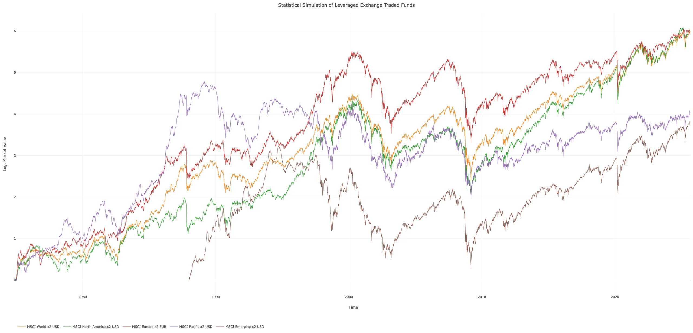

In der Regel gehen wir von Nettodividendenindizes in US-Dollar zur
 Konstruktion der gehebelten Produkte aus, jedoch habe ich den EUR-Index
 für das Europa-Produkt gewählt, um die Simulation für diese Region 
realistisch zu gestalten. Aha, wieso? Naja, es wäre in vielen Ländern 
steuerlich ungünstig oder unattraktiv, gehebelte Produkte auf diesem 
Markt in US-Dollar zu basteln; der Heilige Amumbo ist ja gerade durch 
diese Region-Währung-Divergenz und seine Verwendbarkeit in 
Vorsorgedepots so einzigartig. Vermutlich wird es jedoch Leute geben, 
die sich fragen, wie sich ein Produkt auf Euro- oder USD-Indizes 
verhalten hätte, weshalb ich die Simulation für alle Regionen und den 
MSCI World in beiden Varianten aufgesetzt habe – ich füge euch die 
Resultate als Tabellen im Verlauf des Beitrags ein. Alles klar!? Weiter 
geht's...

**Kaufen, Halten, Beten – Supreme Regional Edition**

Nun liegen uns alle Elemente für die Analyse vor, sodass wir einen
 Blick in die Dynamik der Regionen werfen und sie in einen Vergleich zum
 Seligen Amumbo setzen können. Hierfür gehen wir von den gleichen 
Settings wie im letzten Beitrag aus. Ähm, heißt jetzt was? Das heißt, 
dass wir Nominalrenditen betrachten, die gemäß aktueller 
Steuergesetzgebung über Kapitalertragssteuer, Verlusttöpfe, Freibeträge 
und Vorabpauschale besteuert werden. Im Hinblick auf den Handel wird ein
 Spread von 0.5% angesetzt und wir gehen zur Vereinfachung davon aus, 
dass Bruchstücke gehandelt werden können. Wir betrachten Einmalanlagen 
(Lump Sum) und Sparpläne (DCA), wobei wir gleitende Zeitfenster von 10, 
20, 30 und 40 Jahren zur Berechnung der Verteilungen der True Time 
Weighted Rates of Return und der Maximum Drawdowns als Rendite- bzw. 
Risikometrik nutzen.

Leider gibt es harte Grenzen für Grafiken und Zeichen in 
Beiträgen, sodass ich mich bei Visualisierungen auf Anlagen per Sparplan
 fokussiere – sofern euer Herz für Einmalanlagen schlägt, findet ihr die
 Ergebnisse in den Tabellen und die Grafiken im Repository. Darüber 
hinaus lege ich den Schwerpunkt der Interpretation auf Nordamerika und 
halte den Rest der Welt kürzer, um alles in einem Beitrag behandeln zu 
können. Alles klar, sehen wir uns mal an, was der Simulator ausgespuckt 
hat...
 
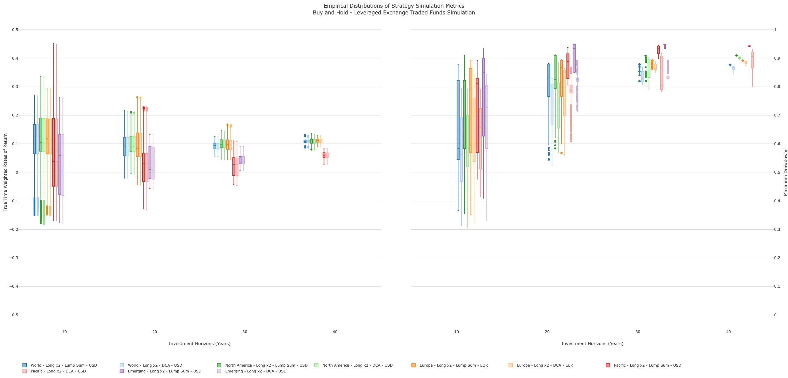

Im Wesentlichen zeigen die vier Regionen in den Boxplots (Spear 
1952) dieselben Trends, die wir bereits im letzten Beitrag für 
Buy-and-Hold-Anlagen beobachtet haben: So wären die mittleren Renditen 
(Mediane) über die mittleren Horizonte leicht gesunken, bevor sie über 
lange Horizonte angestiegen wären. Gleichzeitig hätte sich die Streuung 
der Verteilungen verringert, was einerseits auf kleinere 
Stichprobengrößen bei längeren Horizonten und ihre Neigung zu 
homogeneren Verteilungen, andererseits auf die glättende Wirkung des 
Long Bias von Aktienmärkten, der sich bei gehebelten Produkten 
verstärkt, zurückzuführen ist. Ähnliche Trends wären auch bei den 
Maximum Drawdowns zu beobachten gewesen, da die Streuung der Ergebnisse 
in Abhängigkeit von der Investitionsdauer abgenommen hätte, während 
gleichzeitig die Mediane der Verteilung gestiegen wären – eigentlich 
keine neue Erkenntnis, oder?

Eigentlich ist es wenig überraschend, dass sich Nordamerika als 
eine, später die Säule des globalen Aktienmarkts nahtlos in diese Trends
 einfügt: So weist die Region das stabilste Renditeprofil der 
Weltregionen auf, wobei die Medianrendite für den Bereich von 10 Jahren 
bei 10.4% bzw. 10.3% p.a. (LS bzw. DCA) gelegen hätte, was deutlich 
unter den Renditen des Seligen Amumbos rangiert hätte (12.4% bzw. 12.3% 
p.a.) - eine Ursache für diese Differenz ist der starke Impuls des 
Pazifikraums in der frühen Phase der Simulation, der sich in seiner 
Zeitdynamik deutlich vom späteren Aufstieg Nordamerikas unterscheidet. 
Im Hinblick auf längere Zeiträume hätte eine Stabilisierung der Mediane 
eingesetzt (LS: 9.2% bis 11.0% p.a.; DCA: 9.2 bis 10.9% p.a.), was 
leicht über den Renditen gehebelter World-Produkte gelegen hätte. 
Hinsichtlich der Streuung (IQR = Q3 - Q1) fielen die Unterschiede 
relativ klein bzw. marginal aus, was sich aus der strukturellen Dominanz
 des US-Markts im globalen Aktienmarkt ergibt.

Im Vergleich dazu lagen Europas mittlere Renditen stets im Bereich
 der globalen Referenz (LS: 8.3% bis 11.2% p.a.; DCA: 8.3% bis 11.6% 
p.a.), wobei sie bei Anlagen von 10 bis 20 Jahren knapp 0.6 bis 0.7 
Prozentpunkte p.a. unter der Referenz, bei längeren Anlagen ab 30 Jahren
 jedoch 0.4 Prozentpunkte p.a. über dem Seligen Amumbo gelegen hätten. 
Ähnlich verhält es sich bei der robusten Streuung, deren Differenz zur 
globalen Benchmark bei 0.2 bis 1.9 bzw. 0.3 bis 1.9 Prozentpunkte p.a. 
gelegen hätte.

Jenseits der stabilen Regionen liegt das Reich der Volatilität: 
Anhand des obersten Quartils und des Maximums des Pazifikraums (21.6% 
bzw. 45.2% p.a.) wird deutlich, welches Ausmaß das Excess Momentum in 
der Bubble-Ära erreicht hätte und welcher Abstieg für Anlagen in diese 
Region bei mittleren Renditen von 5.8% bis 3.8% p.a. erfolgt wäre. 
Vergleichbar volatil wären Anlagen in die Emerging Markets ausgefallen, 
deren Medianrenditen mit 5.9% bis 3.7% p.a. (10 bzw. 30 Jahre) ebenfalls
 unter der globalen Referenz gelegen hätten – in beiden Regionen gibt 
die Simulation extrem rechtsschiefe Verteilungen aus, sodass ein 
gehebeltes Buy-and-Hold für diese Produkte kaum Vorteile geboten hätte.

Allerdings ist die Rendite lediglich eine Seite der Medaille, 
sodass wir den Blick auf die Maximum Drawdowns richten, um weitere 
Einsichten über Buy-and-Hold-Anlagen zu erlangen: Hierbei weist 
Nordamerika Mediane von 59.3% bis 90.9% (LS) bzw. 58.8% bis 90.2% (DCA) 
auf, was knapp 3.2 bis 5.5 Prozentpunkte über den Werten gehebelter 
World-Produkte gelegen hätte, während sich Europa (LS: 59.6% bis 89.1%; 
DCA: 58.9% bis 88.6%) lediglich 1.2 bis 4.0 Prozentpunkte über der 
globalen Referenz bewegt hätte. Erneut wären der Pazifikraum (LS: 81.2% 
bis 94.2%; DCA: 65.7% bis 90.6%) und die Schwellenländer (LS: 85.1% bis 
94.9%; DCA: 72.6% bis 83.0%) eine eigene Vola-Liga gewesen, wobei zu 
beachten ist, dass die Stichprobengröße der Schwellenländer durch das 
Startdatum 01-01-1988 niedriger ausfällt, was einen Optimistic Bias in 
die Verteilung einbringt.

Naja, jetzt habe ich den Fokus lediglich auf Mediane und IQRs 
gelegt, aber die Extreme aus Gründen der Übersichtlichkeit ausgeblendet,
 weshalb ich euch hier die vollständigen Tabellen der Risiko- und 
Renditemetriken für Produkte auf USD- und EUR-Indizes nachliefere:
 
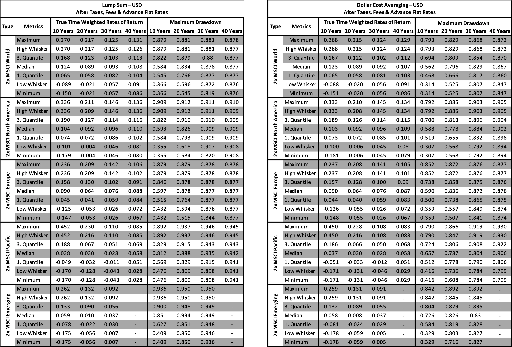
 

Was heißt das jetzt? Im Rahmen einer Buy-and-Hold-Strategie wäre 
ein gehebelter MSCI World wohl die beste Wahl im Hinblick auf Risiko und
 Rendite gewesen. Zwar hätte Nordamerika leicht höhere Renditen geboten,
 was jedoch stets von höheren Drawdowns flankiert worden wäre; Europa 
wäre lediglich in Form eines EUR-Index-Produkts eine Alternative 
gewesen, während die volatilen Ausschläge im Bereich des Pazifikraums 
und der Schwellenländer sowohl risiko- als auch renditeseitig 
ineffizient gewesen wären – oder den Investoren eine harte Lektion in 
Stoizismus erteilt hätten. Wichtig ist jedoch, dass Sparpläne in allen 
Regionen über alle Zeiträume das Risiko gesenkt und die Nerven geschont 
hätten.

**Goldlöckchens Expedition durch globale Volatilität**

Naja, wie wir gelernt haben, ist die Rendite von gehebelten 
Buy-and-Hold-Anlagen relativ gut, jedoch ist die Kehrseite hohe 
Drawdowns und vielen Anlegern ist das Risiko schlicht zu hoch, weshalb 
sich gerade für gehebelte Anlagen aktive Strategien auf Basis gleitender
 Durchschnitte (Moving Averages) großer Beliebtheit erfreuen. Hierbei 
soll eine Separation des Marktes in Auf- und Abwärtsphasen helfen, die 
größten Drawdowns zu reduzieren oder sogar zu vermeiden. Dazu wird 
lediglich der Durchschnitt ungehebelter Basisindizes über eine fixe 
Anzahl an Tagen benötigt – oder grob vereinfacht: Liegt der Basisindex 
zum Börsenschluss über dem Durchschnitt, wird das Produkt am nächsten 
Börsentag gekauft; liegt er darunter, wird es verkauft. Soweit klar, 
oder!?

In der Simulation der MSCI-Regionen nutzen wir die ungehebelten 
Basisindizes in US-Dollar und Euro als Signal für den Ein- und Ausstieg,
 wobei wir ein Spektrum von 10 bis 600 Tagen bei Berechnung gleitender 
Durchschnitte einsetzen:

- MSCI World Net Total Return USD (MSCI-Code: 990100; Type: NETR, [MIWO00000NUS](https://www.investing.com/indices/msci-world-net-usd))
- MSCI North America Net Total Return USD (MSCI-Code: 990200; Type: NETR, [MINA00000NUS](https://www.investing.com/indices/msci-north-america-net-usd))
- MSCI Europe Net Total Return EUR (MSCI-Code: 990500; Type: NETR, [MIEU00000NEU](https://www.investing.com/indices/msci-europe-net-eur))
- MSCI Pacific Net Total Return USD (MSCI-Code: 990800; Type: NETR, [MIPC00000NUS](https://www.investing.com/indices/msci-pacific-net-usd))
- MSCI Emerging Net Total Return USD (MSCI-Code: 891800; Type: NETR, [MIEF00000NUS](https://www.investing.com/indices/msci-em-net-usd))

Sofern ich es nicht explizit angebe, handelt es sich um 
Kalendertage, nicht um Handelstage. Ähm, wie jetzt? Wie im letzten 
Beitrag erläutert, ergibt sich dies aus der Methodik und hilft bei der 
Vereinfachung einiger Berechnungen, hat jedoch nur einen marginalen 
Effekt auf die Resultate. Soweit so gut, es bleibt zu erwähnen, dass ihr
 bei der Umrechnung den Faktor 252.25/365.25 ≈ 0.69 nutzen könnt, da 
z.B. ein Wert von 300 Kalendertagen grob 207 Handelstagen entspricht.

Wie in früheren Beiträgen ist es mir wichtig zu betonen, dass wir 
uns Ergebnisse von Simulationen ansehen, die sich auf plausible Verläufe
 der Vergangenheit beziehen, d.h. es ist eine Beschreibung (Deskription)
 – es wird keine Aussage über Wahrscheinlichkeiten von Risiken und 
Renditen getätigt (Inferenz) und absolut keine Vorhersage (Prädiktion) 
über die Superiorität eines Einzelparameters oder Parameterbereichs! 
Alles klar?! Sehr gut, weiter geht's...
 
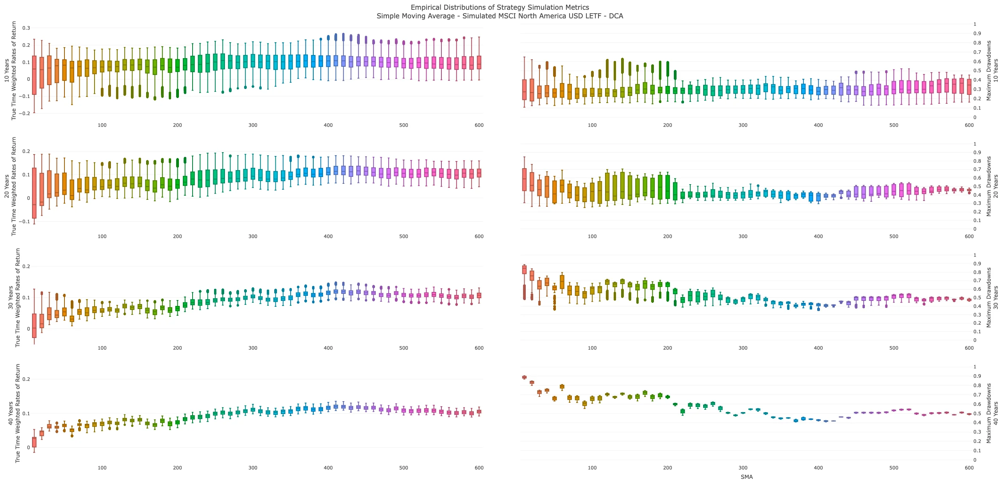
 
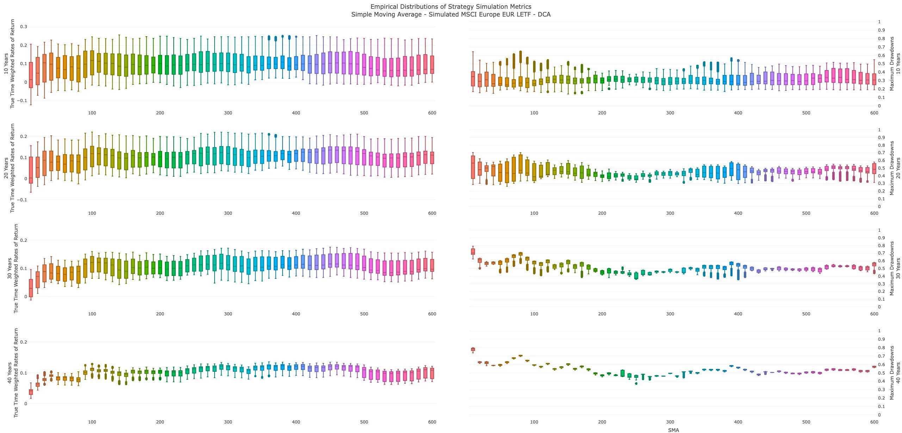
 
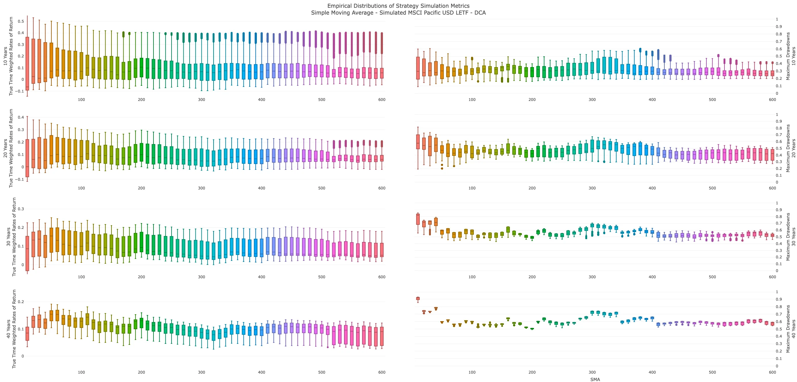
 
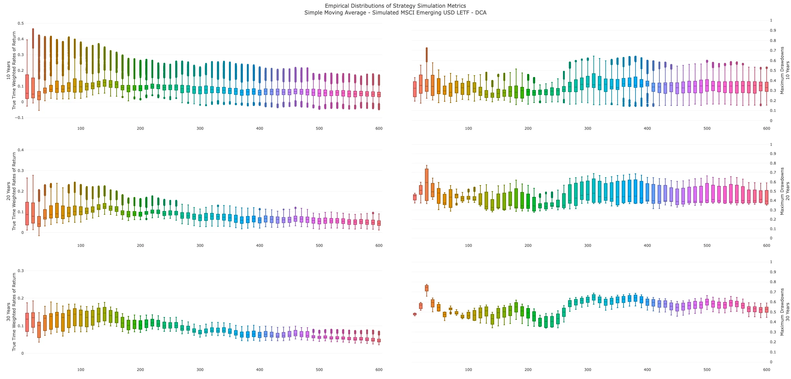

Im Rahmen der regionalen Analyse zeigen sich deutliche 
Unterschiede in Effizienz und Stabilität von SMA-Werten über die Zeit: 
In Nordamerika hätte es ein breites Spektrum von SMA-Werten im Bereich 
von 250 bis 600 Tagen gegeben, dessen höchste Renditen bei 410 Tagen 
gelegen hätten. Auf Seiten des Risikos wären niedrige, stabile Maximum 
Drawdowns im Bereich um 400 Tage aufgetreten – beide Aspekte sprechen 
für die hohe Stabilität langer Trends im US-Markt. Ähnlich ist das 
Ergebnis für Europa, wobei die Region eine höhere Differenzierung zeigt 
und stabile Renditen im Bereich von 240 bis 510 Tagen existiert hätte. 
Hierbei wäre das Optimum bei 290 Tagen anzusiedeln gewesen, während 
niedrige, stabile Maximum Drawdowns eher im Bereich um 250 Tage gelegen 
hätten – sofern wir uns noch einmal vor Augen führen, dass gleitende 
Durchschnitte Volatilitätsregime separieren sollen, fügen sich diese 
Resultate gut in die Volatilitätshistorie Europas ein.

Erneut wirken der Pazifikraum und die Schwellenländer wie eine 
andere Welt, denn ihre SMA-Spektren wären deutlich in kurzen Horizonten 
zu verorten gewesen: Im Pazifik hätte das Optimum für Renditen bei 50 
bis 60 Tagen und eine weitere Zone hoher Renditen bei 190 bis 210 Tagen 
gelegen, wobei letztere auch die Zone kleinster Maximum Drawdowns 
bedeutet hätte. Hinsichtlich der Schwellenländer hätten Investoren ein 
dynamisches, aber strukturiertes Muster vorgefunden, denn stabile 
Medianrenditen wären im Bereich von 40 bis 160 Tagen (Optimum 140 Tage),
 niedrige Drawdowns im Bereich bis zu 200 Tagen (Optimum 140 Tage) 
anzutreffen gewesen, was die starke Korrelation von Risiko und Rendite 
in Zeiten abrupter Trendwechsel und hoher Volatilität widerspiegelt.

Insofern ist deutlich, dass die *Goldlöckchen-Zonen* von 
SMA-Werten keine universelle Größe darstellen, sondern eine Ableitung 
der Marktcharakteristika in Abhängigkeit des Zeitraums sind – jetzt böte
 es sich abermals an, die Eigenschaft gleitender Durchschnitte zur 
Separation von Volatilitäts- und Renditeregimen anzusehen, aber das 
Thema ist Teil der *Principia Amumbo*... Nur so viel: Je höher 
die Volatilität des Marktes und je kürzer die Trendpersistenz, umso 
kürzer sind die SMA-Werte, wobei die Indexwährung eine kritische Rolle 
spielt (siehe Unterschiede der Empirical-Werte bei USD- und 
EUR-Produkten in den Ergebnistabellen). Ähm, die beste Lösung ziehen, 
ist ja keine Kunst...

**Trend-Tango der Märkte à la Jackson Pollock**

Natürlich ist das keine Kunst, aber bitte denkt daran, dass wir in
 diesem Beitrag keine Inferenz oder Prädiktion betreiben, sondern uns 
lediglich ansehen, wie eine Strategie in der hypothetischen, jedoch 
plausiblen Vergangenheit abgeliefert hätte. Abgesehen davon handelt es 
sich bei unserer Auswahl an SMA-Werten um *konditionale Optima* – wir setzen bei der Auswahl ja bei Medianen von Rendite und Risiko an, was in der Regel eine Abweichung von den *Absolutoptima* bedeutet. Zur Verdeutlichung habe ich mir erlaubt, eine Evaluation der SMA-Werte für jede Region aufzusetzen:
 
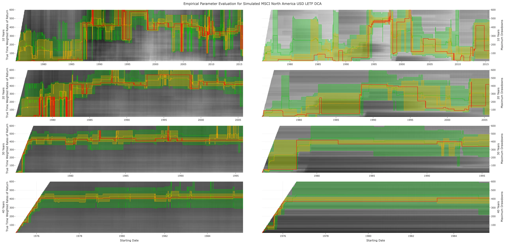
 
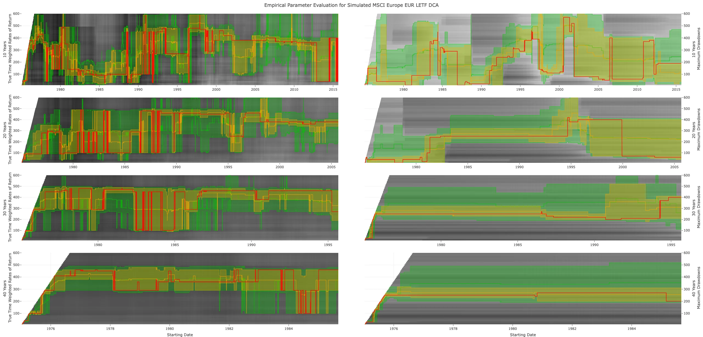
 
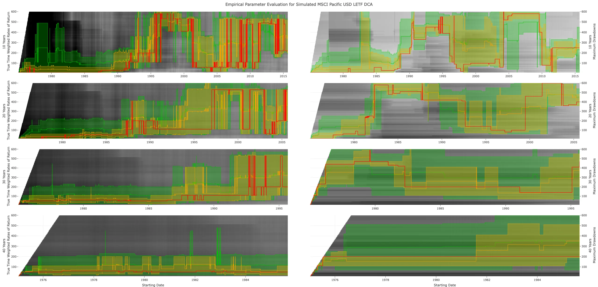
 
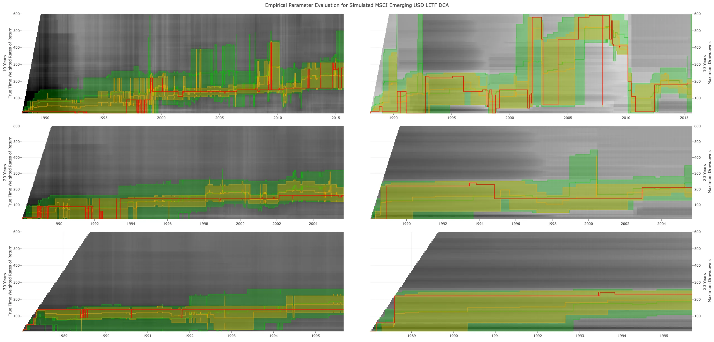

Alter, was geht jetzt? Im Grunde ist es relativ simpel: In den 
Grafiken wird gezeigt, welche SMA-Werte im Verlauf der Zeit zu den 
höchsten Renditen (linke Seite) oder den geringsten Maximum Drawdowns 
(rechte Seite) geführt hätten. Hierbei steht die rote Linie für die 
Optima, die gelbe Fläche zeigt die SMA-Werte im obersten bzw. untersten 
Dezil (10%) an und die grüne Fläche das höchste bzw. niedrigste Quartil 
(25%). Ich hoffe es wird deutlich, dass 1.) die Länge der Investition zu
 einer Stabilisierung des günstigen Wertebereichs führt, 2.) das 
Spektrum des Risikos in der Regel breiter als das Spektrum der Rendite 
ist, und 3.) die Selektion über Mediane stabile Ergebnisse für beide 
Metriken geliefert hätte, jedoch nur in Ausnahmen *Absolutoptima* darstellen. Aha, stabil und effektiv, aber wie hätten sich die SMA-Strategien nun geschlagen?

**Burger Power, Euro Freeze, Bubble Glamour - Globaler Vola-Zoo für Liebhaber**

Sagen wir es mal so: Eigentlich gut, aber es hängt davon ab, was 
wir uns ansehen! Es ist sicherlich keine Überraschung, dass 
SMA-Strategien bessere Ergebnisse als Buy-and-Hold-Strategien geboten 
hätten, aber wie sieht der Vergleich der Regionen-SMAs mit dem World-SMA
 aus? Nunja, es gibt starke Unterschiede...

Im Hinblick auf Nordamerika (SMA 285 Handelstage) wären mittlere 
Renditen im Bereich von 12.1% bis 12.5% p.a. (LS) bzw. 10.9% bis 12.0% 
p.a. (DCA) realisierbar gewesen, was eine 0.2 bis 1.3 Prozentpunkte p.a.
 niedrigere Rendite als die globale Referenz (SMA 255 Handelstage) für 
Einmalanlagen bedeutet hätte. Selbst der Einsatz von Sparplänen hätte 
lediglich eine Reduktion der Differenzen (-0.2 bis 0.7 Prozentpunkte 
p.a.), jedoch keine Umkehr der Tendenz erreicht. Zentral für diese 
Unterschiede sind Momenta, wie der Aufstieg und Abstieg der 
Pazifik-Region, die Nordamerika erst in den langen Horizonten 
kompensiert hätte, wie die robuste Streuung zeigt (LS: NA 8.6 bis 0.7 pp
 vs. World 6.4 bis 0.7 pp; DCA: NA 6.1 bis 1.0 pp vs. World 6.1 bis 1.4 
pp).

Sofern wir den Blick auf Europa (SMA 200 Handelstage) richten, 
hätten die Mediane der Renditen im Bereich von 12.5% bis 13.9% p.a. (LS)
 bzw. 10.1% bis 12.4% p.a. (DCA) gelegen, was in beiden Fällen für 
Horizonte von 10 bis 20 Jahren unter der Referenz, später jedoch knapp 
über dem Niveau gehebelter World-Produkte gelegen hätte (Differenz: LS 
-0.7 bis 0.7 pp; DCA -0.2 bis 0.6 pp). Allerdings trügt die Stabilität 
der Mediane, da sich die Streuung (IQR) deutlich über dem World-Niveau 
bewegt hätte (LS: 4.8 bis 12.5 pp; DCA: 1.5 bis 9.7 pp) – oder in 
Anlehnung an John Malkovich als Marvin Boggs: *„Stabiler Kontinent? Am Arsch!“*

Im Pazifikraum (SMA 140 Handelstage) hätten sich mittlere Renditen
 von 9.8% bis 13.8% p.a. (LS) bzw. 9.9% bis 13.0% p.a. (DCA) ergeben, 
womit die Region auf kurze Sicht 1.7 bis 3.4 Prozentpunkte p.a. unter 
der Referenz, jedoch auf lange Sicht 0.3 bis 0.6 Prozentpunkte p.a. 
darüber gelegen hätte. Im Wesentlichen sind die hohen Renditen ein Echo 
der Bubble-Ära, die jedoch ebenso extreme Streuungen von bis zu 24 
Prozentpunkten erzeugt hätte. Ähnlich volatil, aber strukturierter 
hätten sich die Schwellenländer (SMA 95 Handelstage) präsentiert: So 
hätten die Renditen bei 12.8% bis 15.6% p.a. (LS) und 12.4% bis 14.6% 
p.a. (DCA) gelegen, was Abweichungen von -2.1 bis 0.4 Prozentpunkten 
p.a. von der globalen Referenz bedeutet hätte. Die Intensität der 
Streuung (LS: 4.2 bis 4.9 pp; DCA: 2.5 bis 4.5 pp) ist typisch für 
Märkte mit abrupten Regime- und Vola-Wechseln.

Nunja, aber wie sieht es bei der Reduktion der Maximum Drawdowns 
aus? Wie schlagen sich die Regionen in diesem Kontext? Tja, schauen wir 
die Region Nordamerika an, so wäre das Risiko auf 40.1% bis 43.5% (LS) 
bzw. 29.8 % bis 41.8 % (DCA) reduziert worden, womit Nordamerika leicht 
über dem globalen Niveau gelegen hätte. Ein höheres Niveau hätte sich in
 Europa (LS: 43.8% bis 46.3%; DCA: 29.5 % bis 46.2%) ergeben, was eine 
Folge längerer Krisen war. Im Vergleich dazu sind der Pazifikraum (LS: 
48.5% bis 51.2%; DCA: 30.3% bis 50.7%) und die Schwellenländer (LS: 
32.3% bis 51.9%; DCA: 25.7% bis 43.4%) erneut eine eigene Liga.
 
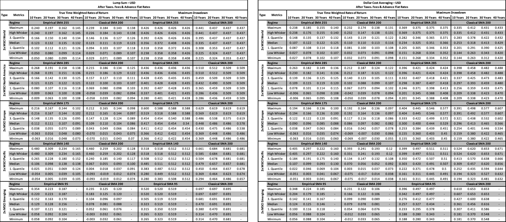
 
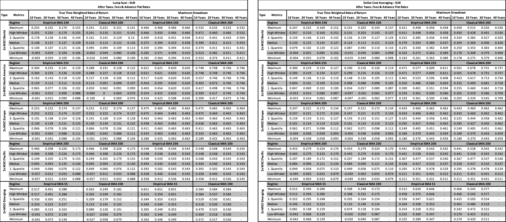

Ähm, was sagt mir das jetzt? Im Wesentlichen zeigen die Ergebnisse, dass SMA-Strategien in der *Goldlöckchen-Zone*
 im Vergleich zum Klassiker (SMA 200 Handelstage) eine Steigerung der 
Rendite von bis zu 2 Prozentpunkten p.a. und eine Reduktion der Maximum 
Drawdowns von 3 bis 4 Prozentpunkten erreicht hätte – entsprechend ist 
die Wahl des Parameters keine Trivialität, sollte jedoch stets in 
Abwägung der regionalen Vola-Historie erfolgen. Im Vergleich zu 
Buy-and-Hold-Anlagen hätte die Verwendung gleitender Durchschnitte zu 
einer starken Reduktion von Drawdowns (Halbierung) ohne Einbußen bei der
 Rendite geführt. Joa, das ist mal eine nette Kiste...

Erneut wird deutlich, dass der Selige Amumbo eine robuste Balance 
von Rendite und Risiko bietet, es jedoch sehr hohe Potenziale in den 
vier Regionen gab – diese spielten sich jedoch in den Extremen der 
Verteilung ab, die aus Platzgründen ausgeblendet wurden. Es ist jedoch 
wahrscheinlich, dass weder Buy-and-Hold-Anlagen noch 
Moving-Average-Strategien in der Lage sind, diese Effekte in voller 
Stärke aufzugreifen – hierfür wäre ein tieferes Verständnis der 
Regionen-Momenta nötig. Ähm, und wie kriegen wir das? Indem wir den 
Blickwinkel ändern…

**Im Fluss der Zeit – Regionalis Motus**

Natürlich sind Tabellen wieder nur eine Seite der Medaille, es 
fehlt die zeitliche Dynamik, weshalb wir uns ansehen, wie sich der 
Selige Amumbo und die vier Regionen im Vergleich zur ungehebelten 
Buy-and-Hold-Anlage in den MSCI World verhalten hätten. Sofern eine 
Linie für die Rendite (True Time Weighted Rates of Return) über der 
Nulllinie liegt, hätte das Asset für dieses Investitionsfenster eine 
höhere Rendite als die Referenz erzielt, während wir für das Risiko 
(Maximum Drawdowns) ein Ergebnis unter der Nullinie anstreben:
 
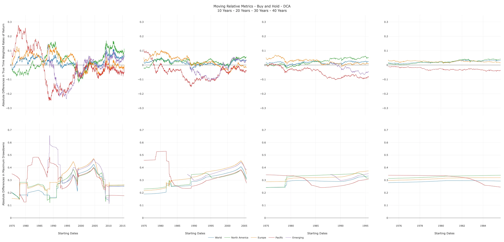
 
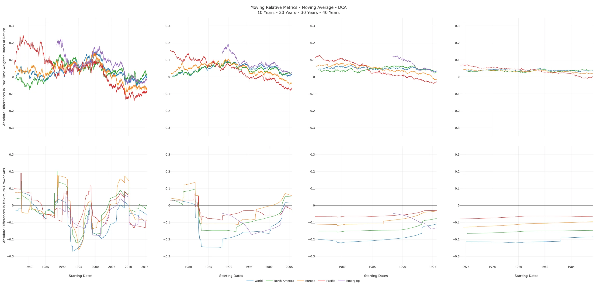

Im Wesentlichen zeigen uns die Spaghetti-Plots, dass die 
Stabilität von Investitionen mit der Länge der Anlagezeit gestiegen 
wäre, und bestätigen, dass SMA-Strategien in der Lage sind, Risiken in 
erheblichem Maße zu reduzieren – beachtet man darüber hinaus, welche 
Reduktion durch Sparpläne im Vergleich zu Einmalanlagen ermittelt wurde,
 steht die Mischung aus gleitenden Durchschnitten und Sparplänen aktuell
 an der Spitze effektiver Strategien für gehebelte Produkte.

Darüber hinaus wird deutlich, dass es für den Seligen Amumbo in 
einer Buy-and-Hold-Strategie selbst bei langen Horizonten (10 bis 30 
Jahre) Phasen gab, die niedrigere Renditen als eine ungehebelte Anlage 
eingebracht hätten – dies sieht für eine SMA-Strategie deutlich anders 
aus, denn selbst bei kurzen Zeiträumen von 10 Jahren gibt es nur wenige 
Phasen, in denen ungehebeltes Buy-and-Hold höhere Renditen geliefert 
hätte. Zusätzlich gibt es eine deutliche Reduktion von Drawdowns. Ähm, 
wie sieht's bei den Regionen aus? Naja, mal gibt's Licht, mal gibt's 
Schatten, denn die Regionen haben eine höhere Volatilität als der Selige
 Amumbo und die Referenz, wie die starken Ausschläge in beide Richtungen
 zeigen. Ähnlich sieht es bei den Drawdowns aus, wo keine Region 
niedrigere Werte als der Selige Amumbo erreicht hätte – ein Ausdruck der
 höheren Volatilität.

Insofern bleibt mir zu bemerken, dass es höchst unwahrscheinlich 
ist, dass gehebelte Regionen als Einzelposition über lange Horizonte 
deutliche Vorteile im Vergleich zum Seligen Amumbo bieten – richten wir 
den Blick auf den Pazifikraum, wird ersichtlich, welche Auswirkung der 
Auf- und Abstieg einer Region auf unsere Depots haben könnte, während 
World-Produkte trotz der Inneffizienz des Pauschalhebels schlicht 
abliefern. Jedoch ist davon auszugehen, dass sich aktive Investoren 
bemüht hätten, die Unterschiede regionaler Momenta abzuschöpfen und die 
Zyklizität ihrer Strategien (z.B. Ausstieg bei SMA-Signal) für eine 
Verlagerung genutzt hätten. Daher gab es zwar das Risiko einer 
selektiven Auswahl von Regionen, aber es ist wahrscheinlich, dass 
Strategien auf Basis von Zyklizität und Momentum eine Überkompensation 
geliefert hätten – es stellt sich jedoch die Frage, ob diese Überlegung 
in Zeiten, in denen der Anteil des US-Segments am globalen Aktienmarkt 
über 70 % beträgt, eine Relevanz hat, oder ob das Momentum des Heiligen 
Amumbos und Nassen Amumbos gegen alle Wahrscheinlichkeiten in den Modus *ad infinitum* schaltet…

Ähm, wovon sprichst du? Ach, ich habe nur überlegt, ob sich die 
höchsten Renditen nicht eher im Excess Momentum verstecken und wie wir 
in diese Bereiche gelangen... Wie stark diese Exzesse ausfielen, soll 
der folgende Telltale-Chart zeigen, der sowohl die Verläufe unserer 
Produkte (solide Linien) als auch ihre Währungspendants (gestrichelte 
Linien) im Verhältnis zum Seligen Amumbo zeigt. Seien wir mal ehrlich zu
 uns, es ist doch relativ wahrscheinlich, dass wir in den 80er und 90er 
Jahren im Heiligen Amumbo Pazifik-Style gesteckt hätten, oder?
 
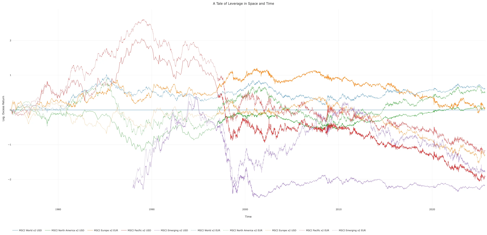

Puh, das war jetzt viel Input! Eigentlich wäre jetzt der Punkt, an
 dem wir uns den Aspekten der Analyse widmen würden, die ich aus 
Platzgründen nicht behandelt habe, oder welche Ansätze und Konzepte zur 
Abschöpfung regionaler Momenta geeignet wären; eventuell sogar für 
gehebelte Aktien, Anleihen und Rohstoffe. Jedoch sollten wir dafür eine 
neue Seite unseres Reisetagebuchs aufschlagen, uns erstmal von den 
Strapazen erholen und mir Zeit für neue Modelle geben! In diesem Sinne: 
Ich klapp' den Bums jetzt zu... Wir lesen uns, sobald es neues Material 
gibt!

**Literatur und Material**

Bertsekas, Dimitri P. (1982): Constrained optimization and Lagrange multiplier methods. New York: Academic Press.

Bertsekas, Dimitri P. (1996): Nonlinear Programming. Belmont: Athena Scientific.

Honaker, James & King, Gary (2010): What to Do about Missing 
Values in Time-Series Cross-Section Data. American Journal of Political 
Science, 54(2): 561–581.

Spear, Mary E. (1952): Charting Statistics. New York: McGraw-Hill Books.

Stineman, Russel W. (1980): A Consistently Well Behaved Method of Interpolation. Creative Computing, 6(7): 54–57.

Wolfe, Philip (1959): The Simplex Method for Quadratic Programming. Econometrica, 27(3): 382–398.

[ChemStats Archiv Github Repository Project Gloverage.](https://github.com/chemicalstats/ChemStats-Archiv)
