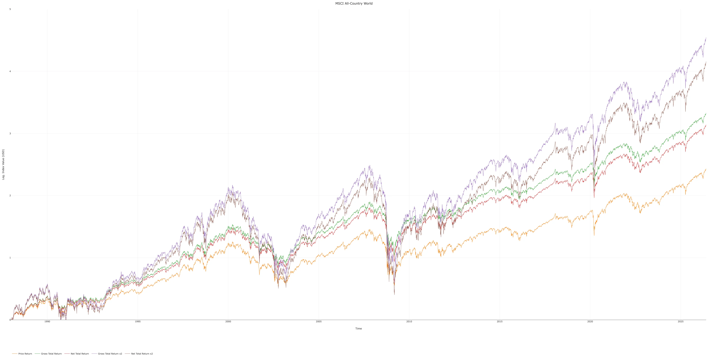
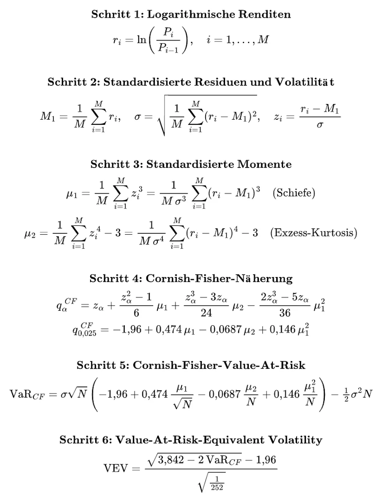
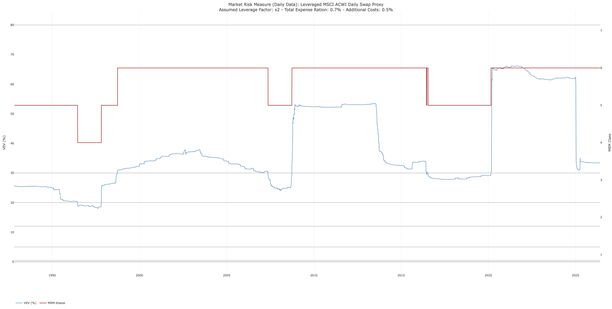
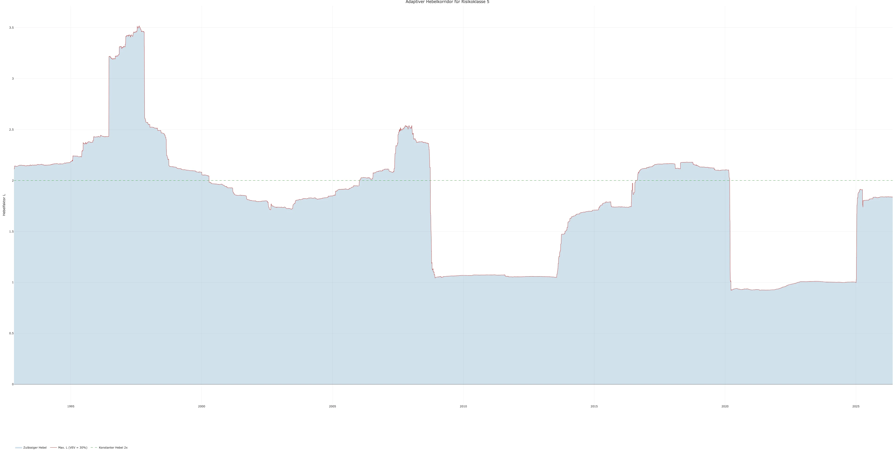
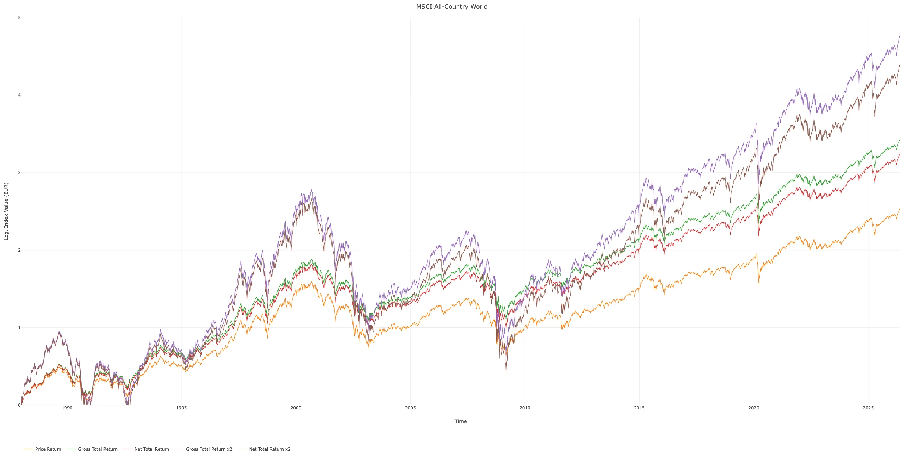
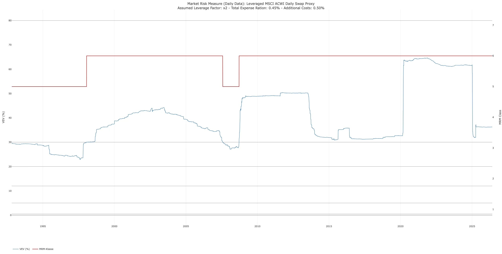
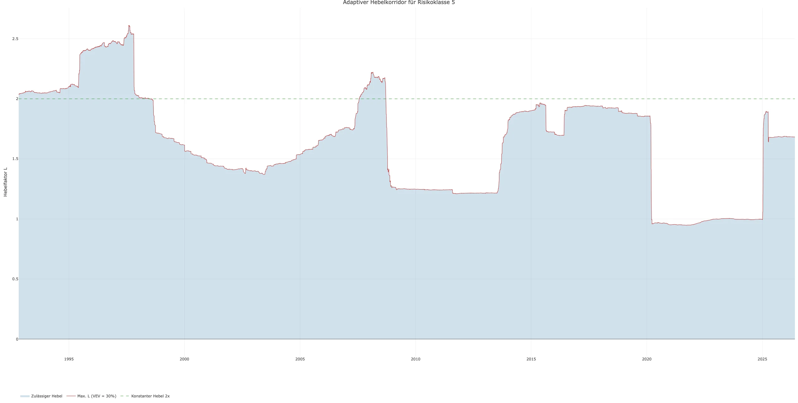
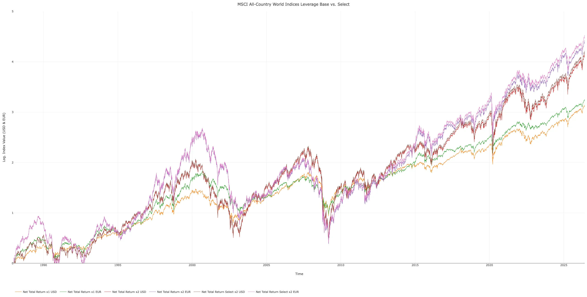
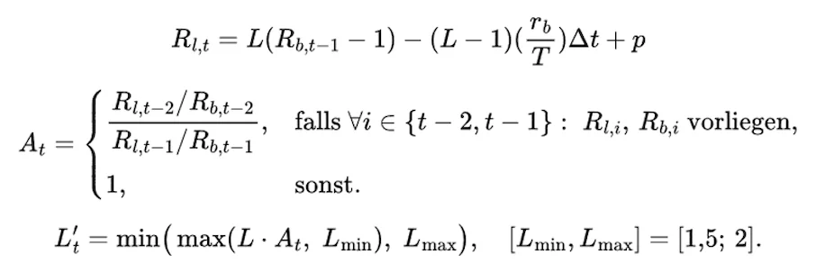
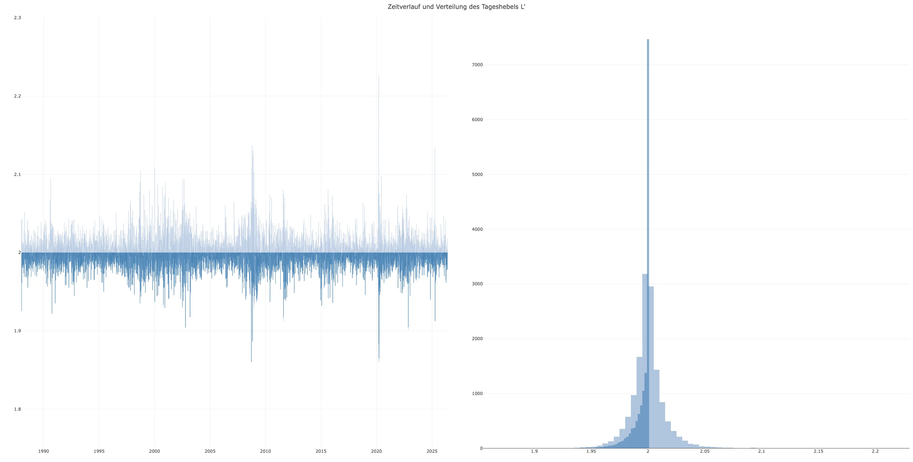

# ChemStats Notizen: Wie viel Hebel für All-Country World im Altersvorsorgedepot?

Liebe Mitreisende auf der Mauerstrasse, liebe Wegelagerer in den Finanzgassen,

nach den letzten Beiträgen habe ich Lust auf kürzere Analysen gekriegt – kleine Schnipsel ohne großartigen Overhead, den gab es bisher zur Genüge. Daher gibt's jetzt eher leichte Kost.

**ZL;NG**

- Kontext: Scalable hat Pläne für einen gehebelten MSCI All-Country World
- Gedankenspiel: Weltweiter, breiter Hebel im Altersvorsorgedepot möglich?
- Analyse: Risikoklasse des Produkts zu hoch, selbst adaptiver Hebel hilft nicht
- Nachträge: Simulationen für Euro-Indizes, Select-Euro-Indizes und Produktangaben

Kürzlich tauchte die Meldung auf, dass ein Legal Entity Identifier für einen [Scalable MSCI AC World Leveraged Daily Swap Xtrackers UCITS ETF](https://lei-luxembourg.com/company.html?lei=254900NW0MAOB3TRMY48) registriert wurde, was erstmal nur grob heißt, dass Scalable Capital/DWS die Option haben, ein reguliertes Investment-Vehikel aufzusetzen. Wie in jüngster Zeit häufiger, ergaben sich daraus längere Diskurse über dieses Produkt, das – allein aus der Namensgebung abgeleitet – ein gehebelter Exchange Traded Fund auf Basis der MSCI All-Country World Index-Reihe zu sein scheint. Und es gab Gedankenspiele darüber, wie wahrscheinlich dieses Hebelprodukt im Rahmen eines Altersvorsorgedepots bespart werden kann...

Gehen wir diese Überlegung mal analytisch an: Leider ist der Zugriff auf historische Zeitreihen von MSCI-Indizes kürzlich stark eingeschränkt worden, weshalb wir auf unseren Basis-Ansatz zur Rückrechnung der Aktienmarkt-Indizes (Price Return ab 01-01-1988, Net Total Return und Gross Total Return ab 29-12-2000) nutzen – wer sich in die Methodik einlesen will, findet sie in den Beiträgen der Reihe ["Eine kleine Reise in gehebelte Welten"](https://redd.it/1n6je6h); ist jedoch relativ komplex. Naja, ziehen wir den Stiefel durch, sieht es für USD-Indizes jedenfalls so aus:

Soweit, so gewöhnlich, oder? Aber es gibt zwei Segmente zu Beginn der Zeitreihe, die ich kurz ansprechen möchte: Aufgrund des Startzeitpunkts (01-01-1988) wird die Simulation der Indizes über die ersten Monate von den starken Nachwehen des Schwarzen Montags (19-10-1987) geprägt; hohe Volatilität, leichter Abwärtsspin und der MSCI All-Country World in allen Spielarten erlebt eine Liquidation – Wipeout, Game Over, aber es ist ein rein statistisches Phänomen durch den Startzeitpunkt, hätten wir wenige Tage später losgelegt, wäre nichts passiert. Ähnlich ist die Phase des ersten Golfkriegs gelagert, weil die Indizes durch ihren Startpunkt nicht ausreichend Höhe für die Rücksetzer aufgebaut und erneut eine Liquidation erlebt hätten. Ich habe mich dafür entschieden, die Wipeouts in der Zeitreihe zu lassen, weil es nur eine kleine Anzahl an Tagen betrifft und wir den Fokus auf Volatilität legen, nicht auf eine Investment-Simulation.

Soweit, so gut! Bislang gibt es lediglich eine LEI, weshalb wir uns in hypothetischen Gefilden bewegen – bitte beachtet, dass es bloße Gedankenspiele sind! Wenn wir davon ausgehen, dass Scalable Capital und die DWS Group auf den gehebelten MSCI All-Country World Net Total Return in der USD-Variante und nicht auf eine Eigenkreation setzen, ist lediglich eine Annahme über die Kosten und etwaige Friktionen (z.B. Swap Spreads, u.ä.) zu treffen. Im Sinne des Pragmatik gehen wir von einem Total Expense Ratio von 0.7% p.a. und weiteren Friktionen von 0.5% p.a. aus – somit läge das Produkt leicht über dem Seligen Amumbo (WKN: ETF888) und es wäre berücksichtigt, dass globale LETFs zu Beginn ihrer Handelbarkeit stärkere Abweichungen zu ihrem Referenzwert aufweisen.

Ähm, ist das nicht eine Verzerrung der Analyse? Nein, so ziemlich alles im Bereich latenter Kosten und Friktionen hat keine Relevanz auf die Berechnung der Risikoklasse, da sie auf der Volatilität, Schiefe und Wölbung empirischer Renditeverteilungen beruht – grob ausgedrückt: Es gibt eine Verschiebung des Mittelwertes durch Kosten und Friktionen, aber die Momente höherer Ordnung bleiben unberührt. Achja, und der hypothetische Kursverlauf ist natürlich in Euro umgerechnet, weil wir das Produkt in Euro kaufen würden. Alles klart, weiter geht's...

Beachtet bitte, dass wir die EU-Regulatorik zu *Packaged Retail and Insurance-based Investment Products,* also Produkten für Privat- und Kleinanleger, krass vereinfacht angehen. Wir halten keine Regulatory Master Class ab und es ist möglich, dass diese Verkürzung zu Fehlern der Auslegung führt – gebt mir gerne Bescheid, wenn ihr was findet!

Welche Regeln sieht die [EU-Verordnung über Basisinformationsblätter für verpackte Anlageprodukte für Kleinanleger und Versicherungsanlageprodukte](https://eur-lex.europa.eu/legal-content/DE/ALL/?uri=celex:32014R1286) konkret für unser hypothetisches Produkt vor? Zunächst sind gehebelte Exchange Traded Funds in der Kategorie 2 (z.B. Produkte mit nicht-linearer oder komplexerer Auszahlungsstruktur) verortet, was heißt, dass historische Renditeparameter und Value-at-Risk-Analysen für die Risikoeinstufung relevant sind – keine Kreditrisiken (CRM), lediglich das Marktrisiko (MRM) und es ist die Kursentwicklung des Produkts (P), nicht die Entwicklung des Referenz- oder Basisindex relevant. Sofern wir von täglichen Daten ausgehen, ist ein Beobachtungszeitraum (M) von 5 Jahren (ca. 1260 Tage bei Annahme von 252 Handelstagen pro Jahr) vorgegeben:

Im ersten Schritt erfolgt die Logarithmierung der täglichen Renditen, bevor wir ihre Standardabweichung sowie die Schiefe und Exzess-Wölbung standardisierter Tagesrenditen ermitteln. Darauf folgt die Anwendung der Cornish-Fisher-Näherung (Cornish & Fisher 1938), um das einseitige 97.5%-Konfidenzniveau für die Value-at-Risk-Analyse zu bestimmen, wobei N die empfohlene Haltedauer in Handelstagen gemäß Angaben des Anbieters ist - wir folgen realen LETFs und gehen von einem Tag aus. Die Verordnung sieht die Cornish-Fisher-Näherung vor, da Renditen von Finanzprodukten in der Regel nicht normalverteilt sind, weshalb das Normalverteilungsquantil des Value-at-Risk um die Effekte von Schiefe und Wölbung korrigiert werden muss. Vom Cornish-Fisher-VaR ist es anschließend nur noch ein Einsetzen zur Value-At-Risk-Equivalent Volatility (VEV) – ein Begriff, der vermutlich eher aus regulatorischer Pedantik als aus sprachlicher Eleganz entstanden ist... In seltenen Fällen ist die Wurzel im Zähler nicht definiert, was durch Verwendung der historischen Volatilität in annualisierter Form kompensiert werden darf. Was bleibt ist die VEV auf einer Skala für das Marktrisiko einzuordnen, die von Klasse 1 (VEV < 0.5%) bis Klasse 7 (VEV ≥ 80%) reicht. Es wird später vielleich wichtig sein, aber es gibt Option, dass Anbieter bei zu kurzen Realzeitreihen auf Proxies ausweichen oder plausible Zeiträume für die Analyse auswählen können, was direkte Auswirkungen auf Risikoklassen haben kann.

Soweit, so gut, aber wie hilft uns das weiter? Nunja, wir greifen uns dieses Vorgehens und nutzen rollierende Fenster von 5 Jahren, die wir täglich verschieben, um den Verlauf der Risikoklassifizierung für unseren hypothetischen LETF analysieren zu können. In der folgenden Grafik steht die blaue Linie für den Verlauf der VEV (linke Achse), während die rote Linie als Stufenfunktion die Risikoklasse (rechte Achse) ausgibt:

Wie ersichtlich ist, gibt es über die Zeit zahlreiche Wechsel, aber je länger das Produkt auf dem Markt gewesen wäre, um so stabiler wäre die Klassifizierung geworden. Unter Nutzung der längsten Zeitreihe wäre das Produkt mit hoher Wahrscheinlichkeit knapp 59.5% der Zeit in Klasse 6 und nur 25.5% in Klasse 5 eingestuft gewesen. Schränken wir die Analyse auf den Zeitraum ab 2000 ein, ergibt sich sogar ein Anteil von ca. 75.7% für Risikoklasse 6. Natürlich ist es reine Spekulation, welche Merkmale das reale Produkt aufweisen oder welche Referenz als Basis dienen wird – sofern sich das Produkt jedoch grob wie unsere Simulation verhalten würde, wäre die Zulässigkeit für ein Altersvorsorgungsdepot (Risikoklasse 5 als Maximum) sehr fraglich...

Aber vielleicht gibt's ja eine dicke Überraschung: Was wäre, wenn Scalable Capital und die DWS Group im Wissen um das große Interesse an gehebelten Produkten auf breite, globale Indizes keinen fixen Hebel, sondern eine adaptive Lösung ins Produkt einbauen würden, um die Risikoklasse 5 zu halten? In der folgenden Grafik seht ihr, welches Spektrum an Hebelfaktoren hierfür geeignet gewesen wären:

Zumindest seit 2000 hätte ein adaptiver Hebel die längste Zeit deutlich unter einem Faktor von x2 verbracht; zeitweise hätte der Hebel sogar ausgesetzt werden müssen, um die Risikoklasse zu halten. Ein Wort zur Güte: Unser Fokus lag auf der Risikoklasse und der Zulässigkeit eines hypothetischen Produkts für eine Vorsorgestruktur mit staatlicher Förderung, was sich deutlich von Aspekten wie Rendite und Drawdowns abgrenzt – letztere haben wir ausgeblendet, was nicht heißt, dass ein reales Produkt nicht gut bis sehr gut abliefern kann. Und letztlich gibt es etliche Stellschrauben, in denen die Simulation vom Realprodukt abweichen kann.

So, das wär's jetzt... Lasst es euch gutgehen!

**Nachtrag – Wundertüte aus der Industrie**

Tja, da setzt man sich hin, legt eine kleine Analyse vor und glaubt, dass Ruhe im Kasten ist, schon zieht die Industrie den Joker aus dem Ärmel... Scheinbar wollen Scalable Capital und die DWS Group ihr baldiges Hebel-Schlachtschiff (WKN: DBX2SC) auf den Euro-Index laufen lassen, was aktuell ein günstiges Zinsdifferential bei der Fremdkapitalleihe bedeutet (SOFR: 3.64% p.a. vs. €STR: 2.18% p.a.) – dazu gibts Wechselkursvolatilität, aber das blenden wir kurz mal aus. Jedenfalls gab es Anfragen, ob ich die Analyse für die Euro-Basis wiederholen könnte, was ich gerne tue.

Mittlerweile gibt es das Verkaufsprospekt, worin sich viele Passagen wie der folgende Passus finden, die sich interessant lesen:

*"Das Anlageziel besteht darin, eine gehebelte Rendite des MSCI ACWI Index (der „Referenzindex") zu erzielen, indem Swaps (wie nachstehend definiert) auf eine gehebelte Version des Referenzindex, den MSCI ACWI Leveraged 2X Select Index Daily (der „Leveraged Swap Index "), eingegangen werden. Es wird erwartet, dass unter den meisten Umständen der angestrebte Hebel 200% (2-fach) betragen wird, jedoch kann dieser angestrebte Hebel zwischen 150% (1,5-fach) und 200% (2-fach) variieren. Die Anteilsinhaber werden im Voraus über jede Änderung des angestrebten Hebels informiert.*

*[...]*

*Der Leveraged Swap Index basiert auf dem Referenzindex und spiegelt die täglichen Bewegungen des Referenzindex mit einem Hebelfaktor von 2 wider, die durch kurzfristige Kredite erzielt werden, abzüglich der Kosten einer solchen Kreditaufnahme.*

*[...]*

*Die Verzinsung basiert auf einem in EUR besicherten Tagesgeldsatz („€STR"). Der €STR ist ein von der Europäischen Zentralbank berechneter Tagesgeldreferenzsatz, der die Kosten der unbesicherten Tagesgeldaufnahme von Banken im Euroraum widerspiegelt."*

Okay, wie es aussieht, soll der Hebelfaktor in Abhängigkeit vom Marktumfeld über das Spektrum von 1.5x bis 2x variabel ausgestaltet werden können – was sinnvoll wäre, wenn das Produkt den speziellen Vorgaben des Altersvorsorgedepots genügen soll, denn wir haben ja bereits gesehen, dass eine USD-Basis die Vorgaben wahrscheinlich verfehlen würde. Ebenso zu beachten, ist das kleine Wort *Select* in der Angabe des Leveraged Swap Index, dessen Effekt ich aktuell nicht einordnen kann, da ich hierzu noch keine Methodologie von MSCI Inc. gefunden habe. Gehen wir daher weiter und rechnen den Kram nochmal für die Euro-Variante des MSCI All-Country World und den Prospekt-Angaben zur TER (zzgl. optimistischer 0.5% p.a. Tracking Difference):

Joa, sofern es bei dem Schnellschuss kein groben Schnitzer gegeben hat, wäre das Produkt zu satten 95.7% der Zeit in Risikoklasse 6 eingeordnet worden – gegenüber 75.7% beim Dollar-Pendant. Aktuell stehen 36.3% VEV in Euro gegen 33.0% in US-Dollar, beides in Klasse 6 zu verorten. Das spiegelt sich bei der Analyse des adaptiven Hebel, da ein Halten von Risikoklasse 5 seit 2000 im Median einen Hebel von 1.47x bedeutet hätte. An 96% der Tage wäre weniger als 2.0×, an 52% sogar weniger als 1.5× erlaubt gewesen – und an 16% der Tage ist selbst der *ungehebelte* Index bereits Risikoklasse 6 (Minimum: 0.95×, November 2021).

Methodisch ist der Zinssatz irrelevant für die Berechnung der VEV, da er lediglich den Mittelwert verschiebt; die Exzess-Streuung über die Aktienvolatilität hinaus wird jedoch hart von der Wechselkursvolatilität getrieben. Was heißt das jetzt? Ehrlich gesagt kein Plan... Schmeiße ich die Angaben des Prospekts, vorliegende Zeitreihen zu MSCI All-Country World und Wechselkursen USD-EUR in den Simulator, kriege ich die Erwartung des Prospekts nicht abgebildet; alles hätte in der Simulation deutlich über den Zielgrößen gelegen. Aber wie gesagt, Ich weiß auch leider nicht, ob der Index (*MSCI All-Country World Leveraged 2x Select Index Daily, Index Code 762399)* in seiner Methodologie noch Aspekte beinhaltet, die ihn vom Original-Index abheben (z.B. Vola Suppression) – zumindest der Heilige Amumbo hat kein *Select*-Element im Indextitel. Würde es ein Custom Index sein, der eine langsame Adaptivität des Hebels bieten würde, wäre es jedenfalls auch jenseits eines Altersvorsorgedepots ein relativ großer Schritt in Richtung Vol Targeting. Kriegt DWS das Teil in Risikoklasse 5, würde ich mich vielleicht sogar auf die Suche nach ihrer Spezialsauce machen, die sie ja schon für den gehebelten S&P500 (WKN: DBX0B5) anzuwenden scheinen.

Aber warten wir mal ab und trinken Tee...

**Nachtrag vom Nachtrag – Selektiv gehebelt, keine Silberkugel**

So, die Tasse ist leer, das Produktblatt liegt endlich vor und es liefert die Grundlagen für die Select-Variante des MSCI All-Country World Net Total Return in Euro – weist jedoch ebenso eine Risikoklasse von 5 aus, die wir bisher auf Basis fixer und adaptiver Hebel auf Base-Varianten nicht erreicht haben. Gehen wir das mal durch, um den Post endlich abzuschließen...

Methodisch ist ein Select-Index nur eine kleine Adaption des Hebels über einen Faktor, der sich aus den Verhältnissen von Hebelindex zum Basisindex von Vorgestern zu Gestern ergibt. Scalable Capital und die DWS Group dürfen im Kontext der UCITS-Regulatorik einen Höchsthebel von 2 für das Produkt wählen dürfen – legen selbst jedoch ein Mindesthebel von 1.5 fest:

Naja, klingt wie Vol Targeting, Reflexive Leverage und Risk Control, ist es jedoch nicht. Was geliefert wird, ist die gespiegelte Vortagesrendite, was heißt, dass ein Tag positiver Rendite zur Absenkung des Hebel am nächsten Tag führt, während ein Tag negativer Rendite den Hebel am nächsten Tag steigen lässt. Lassen wir das mal sacken, weil ich glaube, es ist nicht jedem klar, was das heißt.

Gehen wir mal davon aus, dass ein Markt einen Tag um 2% steigt, den nächsten Tag um 2% fällt und dieses Spiel über die nächsten 1000 Tage so weiterläuft. In diesem Beispiel läge ein fixer Hebel von 2x am Ende bei 44.90, ein Select-Hebel bei 99.81 – oder anders ausgedrückt: Der Select-Mechanismus ist pure Antizyklik zur effektiven Abschwächung der Volatilitätserosion, aber leider nur in dieser Labor-Szene, denn Märkte weisen Trend und Autokorrelation auf. Wirft man einen Positiven-Drift von 0.3% in den Simulator, landet der Select-Hebel 1.75% hinter dem fixen Zweierhebel. Was sagt uns das? Es ist daraus ableitbar, dass 1.) alle Produkte auf Basis von Select-Indizes implizite Mean Reversion betreiben, 2.) der Select-Effekt strukturell blind für Volatilität ist, 3.) lediglich Impuse in Indexratios eine Reaktion auslösen und 4.) er eine Korrektur der Pfadabhängigkeit erzeugen und eine Verdoppelung des kumulierten Renditeverlauf des Referenzindex anstreben soll – letzteres wäre eine Abweichung bisherigen Design von UCITS-LETFs und sehr effektiv für Langfristiganlagen, sofern es klappt. In der Praxis ist der Unterschied zu einem Fixhebel über den Zeitraum der Simulation (01-01-1988 bis 30-06-2025) jedoch marginal:

| Metrik | Fixer Hebel | Select-Hebel |
|--------|-------------|--------------|
| CAGR | 11.16% p.a. | 11.46% p.a. |
| Max. DD | 90.60% | 90.41% |
| Recovery | 8.8 Jahre | 8.6 Jahre |
| Worst Day | -18.56% | -18.34% |

Vermutlich ist es nicht direkt ersichtlich, aber der Select-Effekt über den Adaptionsfaktor (Quotient aus zwei Niveauverhältnissen) steht orthogonal zu Risikometriken, d.h. er wirkt sich nicht aus, weil jede langfristige Abweichung des Hebelindex sich rauskürzt und das Tracking-Ratio nur einen Tag beachtet – oder anders ausgedrückt: Würde man in die Simulation einen Zufallstagesgewinn von 5% einbauen, holt der Faktor 0.08 Prozentpunkte zurück, aber das war's und das Niveauverhätlnis stabilisert sich; umgekehrt sieht es bei Tagesverluste aus.

Interessant ist, welchen Effekt vom UCITS-Limit für Hebel ausgeht, weil es durch den Cap von 2x im früheren Beispiel des Zwei-Prozent-No-Trend-Wechselmarktes zu einer Reduktion des Select-Effekts von 122% auf 49% kommt. In der Realität wirkt der Cap paradoxerweise günstig (−2.82% statt −9.63 %), weil bei leicht positiver Autokorrelation das Hochhebeln nach Verlusten überwiegend schädlich ist – tägliche Aktienrenditen sind eben nicht mean-revertierend und höhere Hebel bei positiver Autokorrelation in Abschwüngen würde heißen, aktiv in den Verlust zu hebeln. Vielleicht nicht die beste Wahl...

Okay, jetzt zum Thema Risiko: Aufgrund der starken Korrelation der Tagesrenditen (~0.99 bis 0.95) war ich wirklich erstaunt, dass Scalable Capital und die DWS Group in Risikoklasse 5 gekriegt haben. In den Simulationen kriege ich es schlicht nicht reproduziert, was unter anderem daran liegt, dass mir keine Daten über die Echtwechselkurse von MSCI Inc. vorliegen und es sicherlich auch Rundungseffekte in den öffentlichen Daten gibt. Natürlich sind EZB-Daten hochqualitativ, aber wir liegen nur 3 bis 4 Prozentpunkte über der Risikoklassengrenze und kleinste Abweichungen haben kumulative Effekte, die den letztlichen Ausschlag geben können. Darüber hinaus gibt es Aspekte, wie die Möglichkeit von Proxy-Daten bei unzureichender Realhistorie, NAV-Glättung und die Wahl des Reporting-Fensters, die letztlich in die Risikoklassen-Definition einfließen können – und leider kriege ich diese Aspekte ohne Zugriff auf interne Infos nicht reproduziert; in jedem Falls scheint das Produkt einen Drahtseilakt an der Risikogrenze zu vollführen.

So, jetzt haben wir es geschafft... Moment, es gibt einige Punkte zur Analgepolitik, die wir uns nicht ansehen konnten, die jedoch relativ wichtig sein dürfte. Bitte beachtet, dass es sich hierbei um meine Auslegung handelt, die deutlich daneben liegen kann:

*"[...] Sollte der angestrebte Hebel weniger als das 2-Fache betragen, wird der Portfoliokonstruktionsberater [Anmerkung: Scalable Capital Bank GmbH] eine Empfehlung bezüglich des Anteils des NAV des Teilfonds abgeben, der für Swap-Vereinbarungen eingesetzt werden sollte. Der verbleibende Teil des NAV wird auf liquide Vermögenswerte und renditestarke Vermögenswerte mit kurzer Laufzeit (z. B. Geldmarktfonds, Einlagenzertifikate, Commercial Paper, Barmittel und kurzfristige Staatsanleihen) verteilt. Der Portfoliokonstruktionsberater wird dementsprechend eine Anlageberatung für den Kauf und Verkauf von Instrumenten auf der Grundlage ständiger Überwachung und aktualisierter Kenntnisse des Teilfondsportfolios erbringen. Der Portfoliokonstruktionsberater kann bei der Anlageberatung die Marktnachfrage und die Bereitschaft der Kunden zur Nutzung von Hebeln in Marktumfeldern berücksichtigen. [...]"*

Daraus leite ich ab, dass die Anteile des Nettoinventarwerts, die bei einer Unterschreitung des Hebelfaktors von 2x nicht in Swap-Kontrakten gebunden sind, in Sachen wie liquide, kurzfrsitige Anlagen wie Geldmarktfonds und Anleihen gesteckt werden können. Es versteht sich von selbst, dass sich daraus eine weitere Reduktion der Volatilität ergeben würde – sie wäre historisch klein ausgefallen, da es lediglich fünf bis zehn Tage in der Gesamtsimulation gab, in denen der Hebel unter 1.9x fiel; insofern wäre der Anteil sonstiger Anlagen im NAV bei unter 5% zu verorten gewesen. Nichtsdestotrotz wäre es ein kleiner Effekt, den wir nicht berücksichtigen konnten.

*"[...] Um die Vorgeschlagene Zusammensetzung [Anmerkung: Bezeichnung für Swap-Vereinbarungen] zu erreichen, analysiert der Portfoliokonstruktionsberater Daten, um ein Leverage-Multiple (Vielfaches des Hebels) zu ermitteln, das seiner Meinung nach eine angemessene risikobereinigte Rendite generiert. Es wird davon ausgegangen, dass der Hebel in den meisten Fällen das 2-Fache beträgt. [...]"*

Hm, klingt vielleicht altmodisch, aber Meinung über risikobereinigte Renditen und Abbidlung von Referenz- bzw. Leverage-Index, die einer deutlichen Methodik folgen, beißt sich in meiner Welt – insbesondere, wenn das Produkt Anleger im Vorfeld über Veränderungen im Hebel informieren will. Aber warten wir mal ab, vielleicht gibt's bald wieder neue Infos zu verarbeiten.

So, jetzt haben wir es wirklich geschafft... Was bleibt? Keine Silberkugel, kein Rohrkrepierer, eher eine gehebelte All-World-Variante mit Extraschritten, um Volatilitätserosion zu dämpfen. Und natürlich gibt es noch 'zig Aspekte, die wir nicht beachtet haben, aber so ist das Leben. Cheers!

**Literatur und Material**

Cornish, E. A. & Fisher, R. A. (1938): Moments and Cumulants in the Specification of Distributions. Revue de l'Institut International de Statistique, 5(4): 307-320.

[DWS Investment S.A. (2026): XTrackers Prospekt [Juli 2026].](https://etf.dws.com/download/asset/7ba0fddd-5b91-44c9-9f95-c9256d6a8b69)

Europäisches Parlament & Rat. (2014): Verordnung (EU) Nr. 1286/2014 des Europäischen Parlaments und des Rates vom 26. November 2014 über Basisinformationsblätter für verpackte Anlageprodukte für Kleinanleger und Versicherungsanlageprodukte. Amtsblatt der Europäischen Union, L 352, 1–2.

Europäische Kommission. (2017): Berichtigung der Delegierten Verordnung (EU) 2017/653 der Kommission vom 8. März 2017 zur Ergänzung der Verordnung (EU) Nr. 1286/2014 des Europäischen Parlaments und des Rates über Basisinformationsblätter für verpackte Anlageprodukte für Kleinanleger und Versicherungsanlageprodukte durch technische Regulierungsstandards in Bezug auf die Darstellung, den Inhalt, die Überprüfung und die Überarbeitung dieser Basisinformationsblätter sowie die Bedingungen für die Erfüllung der Verpflichtung zu ihrer Bereitstellung. Amtsblatt der Europäischen Union, L 120, 31.

[MSCI Inc. (2026): MSCI ACWI Leveraged 2x Select Index Daily (Net) – Parameter Sheet for Customization/Calculation Methodology.](https://www.msci.com/indexes/documents/methodology/762399_Summary_20260706.pdf)

[ChemStats Archiv Github Repository Project Snippets (Notes Retirement Savings)](https://github.com/chemicalstats/ChemStats-Archiv/tree/main/05%20Project%20Snippets)
